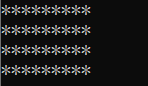
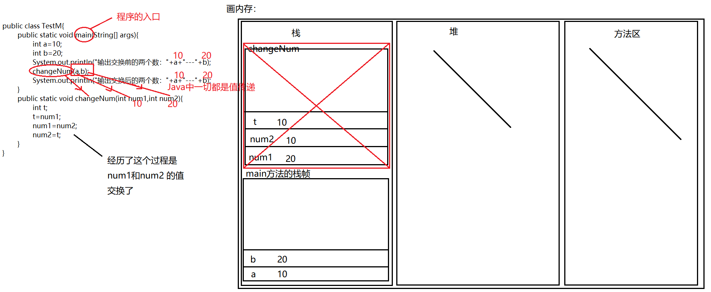
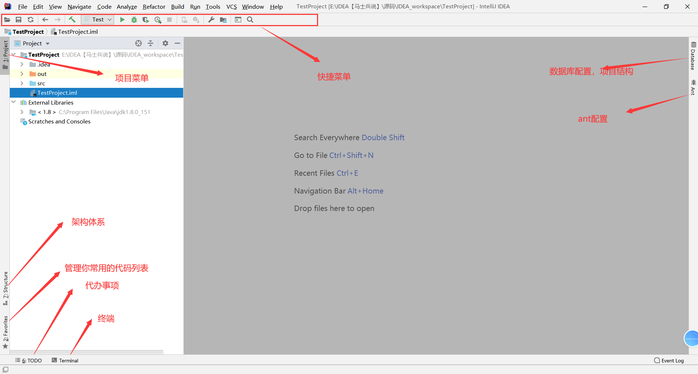
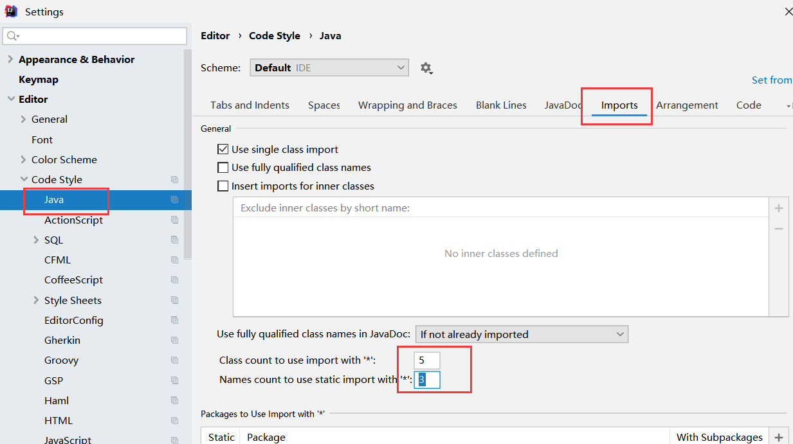
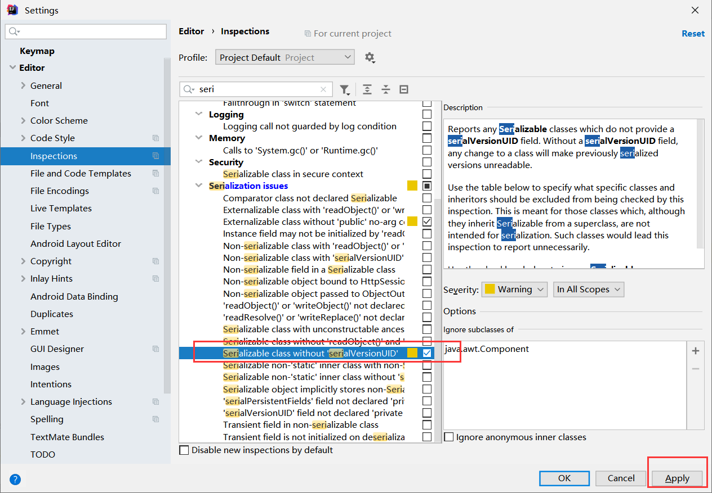
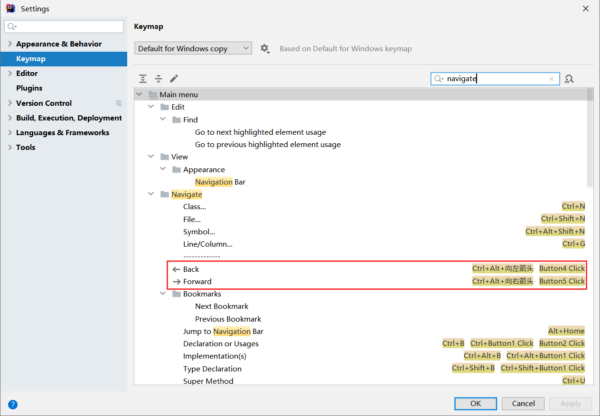

# 第一章_初识JAVA

## 计算机语言的发展史

计算机编程语言的发展，是随着计算机本身硬件发展而发展的。硬件速度越快、体积越小、成本越低，应用到人类社会的场景就会越多，那么所需要的算法就会越复杂，也就要求计算机编程语言越高级。最初重达几十吨但一秒只能运算5000次的ENIAC(世界上第一台计算机)，只能做非常小的应用，比如：某些情况的弹道计算。现在任何一个人的手机运算能力都可以秒杀那个年代地球上所有计算机运算能力的总和。计算机编程语言的发展历经了从低级到高级发展。发展的核心思想就是“让人更容易编程”。越容易使用的语言，就有越多人使用；越多人使用，就有越多协作；越多协作，就可以创造越复杂的物体；计算机语言经历了三代：第一代是机器语言，第二代是汇编语言，第三代是高级语言。


### 1. 第一代：机器语言（相当于人类的原始阶段）
机器语言是机器指令的集合，机器指令展开来讲就是一台机器可以正确执行的命令。电子计算机的机器指令是一列二进制数字。计算机将之转变为一列高低电平，以使计算机的电子器件受到驱动，从而进行运算。上面所说的计算机，指的是可以执行机器指令，进行运算的机器。这是早期计算机的概念。早期的程序设计均使用机器语言。程序员们将用 0、1 数字编程的程序代码打在纸袋或卡片上，1打孔，0不打孔，再将程序通过纸带机或卡片机输入计算机，从而进行运算。
应用8086CPU完成运算s=768+12288-1280，机器码如下:

假如将程序错写成以下的错误，请你找出错误:

书写和阅读机器码程序不是一件简单的工作，要记住所有抽象的二进制码。上面只是一个非常简单的小程序，就暴露出机器码的晦涩难懂和不易查错。写如此小的一个程序尚且如此，实际上一个有用的程序至少要有几十行的机器码。那么，情况将会怎么样呢？
在显示器输出“welcome to masm”，机器码如下：

看到这样的程序，你有什么感想？如果程序里有一个“1”被误写成为“0”，又如何去查找错误呢？

### 2. 第二代：汇编语言（相当于人类的手工业阶段）
为了编程的方便，以及解决更加复杂的问题。程序员开始改进机器语言，使用英文缩写的助记符来表示基本的计算机操作。这些助记符构成了汇编语言的基础。如下是一些常见的汇编语言助记符(单词)比如：mov，add，sub之类，这样人更容易使用了。识别几百、几千个单词，感觉要比几百几千个数字，美妙多了。汇编语言相当于人类的手工业社会，需要技术极其娴熟的工匠，但是开发效率也非常低。汇编语言虽然能编写高效率的程序，但是学习和使用都不是易事，并且很难调试。另一个复杂的问题，汇编语言以及早期的计算机语言（Basic、Fortran等）没有考虑结构化设计原则，而是使用goto语句来作为程序流程控制的主要方法。这样做的后果是：一大堆混乱的调转语句使得程序几乎不可能被读懂。对于那个时代的程序员，能读懂上个月自己写的代码都成为一种挑战。 汇编语言仍然应用于工业电子编程领域、软件的加密解密、计算机病毒分析等。
下面以Masm软件为例，编写一个简单的“hello world!”程序。


### 3. 第三代：高级语言（相当于人类的工业阶段）
对于简单的任务，汇编语言可以胜任。但是随着计算机的发展，渗透到了工作生活的更多的方面，一些复杂的任务出现了，汇编语言就显得力不从心（应该说是程序员使用汇编语言解决复杂问题出现了瓶颈）。于是，出现了高级语言。像我们熟知的C、C++、Java等等都是高级语言。
高级语言允许程序员使用接近日常英语的指令来编写程序。例如下图所示:


## JAVA简史

### 1. SUN公司

美国SUN(Stanford University Network)公司
在中国大陆的正式中文名为“太阳计算机系统（中国）有限公司”
在台湾中文名为“升 阳电脑公司”。

### 2. Java为什么被发明

Green项目。
应用环境：像电视盒这样的消费类电子产品
要求： 语言本身是中立的，也就是跨平台
        1996年Java第一次发布就引起了人们的极大兴趣。关注Java的人士不仅限于计算机出版界，  还有诸如《纽约时报》《华盛顿邮报》《商业周刊》这样的主流媒体。Java 是第一种也是唯一种在National Public Radio上占用了10分钟时间来进行介绍的程序设计语言，并且还得到了$100000000的风险投资基金。这些基金全部用来支持用这种特别的计算机语言开发的产品。重温那些令人兴奋的日子是很有意思的。我们将简要地介绍一下Java语言的发展历史：
        Java的历史要追溯到1991年，由Patrick Naughton 及其伙伴James Gosling (一个全能的计算机奇才)带领的Sun公同的工程师小组想要设计一种小型的计算机语言，主要用于像有线电视转换盒这类的消费设备。由于这些消费设备的处理能力和内存都很有限，所以语言必须非常小且能够生成非常紧凑的代码。另外，由于不同的厂商会选择不同的中央处理器(CPU)，因此这种语言的关键是不能与任何特定的体系结构捆绑在一起。这个项目被命名为"Green"。
        所有就要求有这样的一种代码： 代码短小、紧凑且与平台无关。但是，Sun公司的人都有UNIX的应用背景。因此，所开发的语言以C++为基础。 是Gosling率先创造了这个语言，把这种语言称为“Oak"(这么起名的原因大概是因为他非常喜欢自己办公室外的橡树)。Sun 公司的人后来发现Oak是一种已有的计算机语言的名字，于是，将其改名为Java。


### 3. Java的发明人

James  Gosling


### 4. 经历阶段

1991年，James Gosling在SUN公司的工程师小组想要设计这样一种小型计算机语言。该语言主要用于像电视盒这样的消费类电子产品。另外，由于不同的厂商选择不同的CPU和操作系统，因此，要求该语言不能和特定的体系结构绑在一起，要求语言本身是中立的，也就是跨平台的。所以，将这个语言命名为“Green”，类似于绿色软件的意思。后来，改名为Oak，橡树的意思。改名后发现已经有一种语言叫这个名字了，再改名叫Java。Java语言发展到今天经历了一系列的过程：
- 1991年，SUN公司的Green项目，Oak
- 1995年，推出Java测试版
- 1996年，JDK1.0
- 1997年，JDK1.1
- 1998年，JDK1.2，大大改进了早期版本缺陷，是一个革命性的版本，更名为Java2。
- 2004年，J2SE 5.0 (1.5.0)  Tiger老虎 成为Java语言发展史上的又一里程碑。为了表示该版本的重要性，J2SE1.5更名为Java SE 5.0
- 2005年，Java的各种版本已经更名，以取消其中的数字"2"： J2ME更名为Java ME， J2SE更名为Java SE， J2EE更名为Java EE；
- 2006年，J2SE 6.0 (1.6.0)  Mustang野马
- 2009年，甲骨文(oracle)收购SUN，交易高达价格74亿
- 2011年，JavaSE7.0   Dolphin海豚
- 2014年，JavaSE8.0
- 2017年，JAVA 9.0
- 2018年3月，JAVA 10
- 2018年9月，JAVA 11
- 2019年3月，JAVA 12
- 2019年9月，JAVA 13
- 2020年3月，JAVA 14
> 注意：SUN公司已经被oracle公司收购，目前每半年更新一次java的版本。但是，企业中的主流仍然以7和8为主。对于初学者，应该以企业主流应用版本为核心进行学习，没有必须在此处追求最新版本。


### 5. 不同版本JDK说明

- JDK Version 1.1
   于1997-02-19发行。
   引入的新特性包括：
   引入JDBC（Java Database Connectivity）；
   支持内部类；
   引入Java Bean；
   引入RMI（Remote Method Invocation）；
   引入反射（仅用于内省）。
- J2SE Version 1.2
   开发代号为Playground（操场），于1998-12-08发行。
   引入的新特性包括：
   引入集合（Collection）框架；
   对字符串常量做内存映射；
   引入JIT（Just In Time）编译器；
   引入对打包的Java文件进行数字签名；
   引入控制授权访问系统资源的策略工具；
   引入JFC（Java Foundation Classes），包括Swing 1.0、拖放和Java 2D类库；
   引入Java 插件；
   在JDBC中引入可滚动结果集、BLOB、CLOB、批量更新和用户自定义类型；
   在Applet中添加声音支持。
- J2SE Version 1.3
  开发代号为Kestrel（红隼），于2000-05-08发行。
   引入的新特性包括：
   引入Java Sound API；
   jar文件索引；
   对Java的各个方面都做了大量优化和增强。
- J2SE Version 1.4
   开发代号为Merlin（隼），于2004-02-06发行（首次在JCP下发行）。
   引入的新特性包括:
   XML处理；
   Java打印服务；
   引入Logging API；
   引入Java Web Start；
   引入JDBC 3.0 API；
   引入断言；
   引入Preferences API；
   引入链式异常处理；
   支持IPv6；
   支持正则表达式；
   引入Image I/O slot machine API。
- Java Version SE 5.0
   开发代号为Tiger（老虎），于2004-09-30发行。
   引入的新特性包括:
   引入泛型；
   增强循环，可以使用迭代方式；
   自动装箱与自动拆箱；
   类型安全的枚举；
   可变参数；
   静态引入；
   元数据（注解）；
   引入Instrumentation。
- Java Version SE 6
   开发代号为Mustang（野马），于2006-12-11发行。
   引入的新特性包括：
   支持脚本语言；
   引入JDBC 4.0 API；
   引入Java Compiler API；
   可插拔注解；
   增加对Native PKI(Public Key Infrastructure)、Java GSS(Generic Security Service)、Kerberos和LDAP(Lightweight Directory Access   Protocol)的支持；
   继承Web Services；
   做了很多优化。
- Java Version SE 7
   开发代号是Dolphin（海豚），于2011-07-28发行。
   引入的新特性包括：
   switch语句块中允许以字符串作为分支条件；
   在创建泛型对象时应用类型推断；
   在一个语句块中捕获多种异常；
   支持动态语言；
   支持try-with-resources；
   引入Java NIO.2开发包；
   数值类型可以用2进制字符串表示，并且可以在字符串表示中添加下划线；
   钻石型语法；
   null值的自动处理。
- Java Version SE 8
   开发代号是Spider（蜘蛛），于2014-03-18发行。
   支持 lambda支持；
   增强日期与时间API的功能；
   对垃圾回收的性能也进行了改进；
   并且移除了permgen区。
   Lambdas表达式与Functional接口
   接口的默认与静态方法
   方法引用
   重复注解
   更好的类型推测机制
   扩展注解的支持


## JAVA体系结构

### JavaSE（Java  Standard  Edition）：标准版，定位在个人计算机上的应用
这个版本是Java平台的核心，它提供了非常丰富的API来开发一般个人计算机上的应用程序，包括用户界面接口AWT及Swing，网络功能与国际化、图像处理能力以及输入输出支持等。在上世纪90年代末互联网上大放异彩的Applet也属于这个版本。Applet后来为Flash取代，Flash即将被HTML5取代。

### JavaEE（Java  Enterprise Edition）：企业版，定位在服务器端的应用
JavaEE是JavaSE的扩展，增加了用于服务器开发的类库。如：JDBC是让程序员能直接在Java内使用的SQL的语法来访问数据库内的数据；Servlet能够延伸服务器的功能，通过请求-响应的模式来处理客户端的请求；JSP是一种可以将Java程序代码内嵌在网页内的技术；

### JavaME（Java  Micro  Edition）：微型版，定位在消费性电子产品的应用上
JavaME是JavaSE的内伸，包含J2SE的一部分核心类，也有自己的扩展类,增加了适合微小装置的类库：javax.microedition.io.*等。该版本针对资源有限的电子消费产品的需求精简核心类库，并提供了模块化的架构让不同类型产品能够随时增加支持的能力。


## JAVA的特性和优势

- 跨平台/可移植性
这是Java的核心优势。Java在设计时就很注重移植和跨平台性。比如：Java的int永远都是32位。不像C++可能是16，32，可能是根据编译器厂商规定的变化。这样的话程序的移植就会非常麻烦。

- 安全性
Java适合于网络/分布式环境，为了达到这个目标，在安全性方面投入了很大的精力，使Java可以很容易构建防病毒，防篡改的系统。

- 面向对象
面向对象是一种程序设计技术，非常适合大型软件的设计和开发。由于C++为了照顾大量C语言使用者而兼容了C，使得自身仅仅成为了带类的C语言，多少影响了其面向对象的彻底性！Java则是完全的面向对象语言。

- 简单性
Java就是C++语法的简化版，我们也可以将Java称之为“C++-”。跟我念“C加加减”，指的就是将C++的一些内容去掉；比如：头文件，指针运算，结构，联合，操作符重载，虚基类等等。同时，由于语法基于C语言，因此学习起来完全不费力。

- 高性能
Java最初发展阶段，总是被人诟病“性能低”；客观上，高级语言运行效率总是低于低级语言的，这个无法避免。Java语言本身发展中通过虚拟机的优化提升了几十倍运行效率。比如，通过JIT(JUST IN TIME)即时编译技术提高运行效率。 将一些“热点”字节码编译成本地机器码，并将结果缓存起来，在需要的时候重新调用。这样的话，使Java程序的执行效率大大提高，某些代码甚至接待C++的效率。
因此，Java低性能的短腿，已经被完全解决了。业界发展上，我们也看到很多C++应用转到Java开发，很多C++程序员转型为Java程序员。

- 分布式
Java是为Internet的分布式环境设计的，因为它能够处理TCP/IP协议。事实上，通过URL访问一个网络资源和访问本地文件是一样简单的。Java还支持远程方法调用(RMI,Remote Method Invocation)，使程序能够通过网络调用方法。

- 多线程
多线程的使用可以带来更好的交互响应和实时行为。 Java多线程的简单性是Java成为主流服务器端开发语言的主要原因之一。

- 健壮性
Java是一种健壮的语言，吸收了C/C++ 语言的优点，但去掉了其影响程序健壮性的部分（如：指针、内存的申请与释放等）。Java程序不可能造成计算机崩溃。即使Java程序也可能有错误。如果出现某种出乎意料之事，程序也不会崩溃，而是把该异常抛出，再通过异常处理机制加以处理。

总结：<strong style="color:#DD5145">一句话：java很好！</strong>
但是，并不是说学习了java，以后所有的东西都要用java开发了：某些领域其他语言有更出色的表现，比如，Objective C和后来的Swift在iOS设备上就有着无可取代的地位。浏览器中的处理几乎完全由JavaScript掌控。Windows程序通常都用C++或C#编写。Java在服务器端编程和跨平台客户端应用领域则很有优势。
只能说，<strong style="color:#DD5145">不同的语言之间，平分秋色！</strong>

## 核心机制

### 垃圾收集机制

垃圾收集的目的在除不再使用的对象，当对象建立的时候垃圾收集期，就开始监控对象的动态情况，垃圾收集主要是对内存的释放。创建对象的时候申请一个空间

    1.不再使用的内存空间应回收---》垃圾收集；
    2.Java消除了程序员回收无用内存空间的职责；提供一种系统级线程跟踪存储空间的分配情况。在JVM的空闲时，检查并释放可被释放的存储器空间；相比c++,开发人员负责要自己收回无用内存。
    3.垃圾收集在Java程序运行过程中自动进行，程序员无法精确控制和干预；
    4.GC的自动回收，提高了内存空间的利用效率，也提高了编程人员的效率，很大程度上减少了因为没有释放空间而导致的内存泄露。

后续：
更高级：
1. 垃圾收集器有几种
2. 垃圾收集器底层原理剖析
3. 垃圾收集器算法，优化     

### 跨平台原理

JAVA跨平台原理的解释：

C语言的跨平台解释：

- 总结
JVM(Java Virtual Machine)就是一个虚拟的用于执行bytecode字节码的”虚拟计算机”。他也定义了指令集、寄存器集、结构栈、垃圾收集堆、内存区域。JVM负责将Java字节码解释运行，边解释边运行，这样，速度就会受到一定的影响。
不同的操作系统有不同的虚拟机。Java 虚拟机机制屏蔽了底层运行平台的差别，实现了“一次编译，随处运行”。 Java虚拟机是实现跨平台的核心机制。如图所示：

我们说的语言跨平台是编译后的文件跨平台，而不是源程序跨平台。
接下来我们再比较下两种方式的差异：第一，C语言是编译执行的，编译器与平台相关，编译生成的可执行文件与平台相关；第二，Java是解释执行的，编译为中间码的编译器与平台无关，编译生成的中间码也与平台无关（一次编译，到处运行），中间码再由解释器解释执行，解释器是与平台相关的，也就是不同的平台需要不同的解释器.

## 常用DOS命令

### 1. DOS操作系统

--Microsoft公司推出的操作系统。（在windows之前的操作系统）
--DOS是英文"Disk Operating System"的缩写,其中文含意是"磁盘操作系统".
--DOS是单用户、单任务的操作系统.（只能执行一个任务）


### 2. DOS命令
--在windows中，我们通过鼠标菜单等来操作系统，而在dos操作系统中，要通过dos命令来操作系统。
--是DOS操作系统的命令，是一种面向磁盘的操作命令，
--不区分大小写。

### 3. 命令学习：
windows给我们保留了类似dos系统的操作界面，可以直接操作磁盘！
dos 也是一种操作系统，是在windows出现以前用的，后来windows出来后基本没人用了，但是当windows崩溃的时候，还是要的dos方式解决，它是一种纯命令方式，cmd其实就是在windows状态下进入dos方式。


### 4. 具体dos命令：
1. 切换盘符： c:  d:  e:   大小写没有区分
2. 显示详细信息：dir


3. 改变当前目录：cd


4. . 当前目录  ..  代表上一层目录


5. 清屏：cls
6. 切换历史命令：上下箭头 
7. 补全命令： tab按键
8. 创建目录：md 删除目录：rd


9. 复制文件命令：copy:


10. 删除文件：del
del后面如果接的是文件夹/目录：那么删除的就是这个文件夹下的文件，而不是文件夹


## JAVA环境准备-->JDK

### 1. 下载JDK

https://www.oracle.com/java/technologies/downloads/


### 2. 安装JDK


### 3. 卸载JDK

控制面板卸载即可


### 4. 验证JDK是否安装成功

1. 方式1：去安装目录下看一眼：


2. 方式2：通过控制命令台查看：


3. 方式3：通过控制面板查看：


### 5. JDK和JRE：

JDK： Java Development kit   ---->编写Java程序的程序员使用的软件
JRE : Java Runtime Enviroment  ----》运行Java程序的用户使用的软件

## 安装notepad++，配置path环境变量

### 1. 安装记事本：notepad

### 2. 安装：一直下一步


### 3. 打开记事本进行设置：

设置--》首选项：


设置--》语言格式设置：


### 4. 打开notepad++:

1. 方式1：通过快捷方式：


2. 方式2：通过可执行文件：


3. 方式3：利用控制命令台：


4. 方式4：在任意的路径下去执行notepad++.exe这个命令：
但是发现报错：


需要配置系统环境变量：


找系统环境变量：


将notepad++.exe所在的路径配置到path环境变量中去：


这样我就可以在任意的路径下去执行这个命令：（注意：控制命令台需要重启）


path环境变量作用：
将命令所在的路径配置到path中去，就相当于在计算机中“注册”了一样，以后找这个命令，会直接去你配置的路径下寻找。
达到了一个效果：在任意的路径下去执行某个命令---》path环境针对整个操作系统而言。

## 第一段程序

### 1. 用notepad编写代码：

```java
public class HelloWorld{
        public static void main(String[] args){
                System.out.println("hi 这是一段Java程序。。。");
        }
}
```
记得保存  ctrl+s

### 2. 进行编译：


发现出错了，分析出错原因：


解决办法：
将javac.exe所在的路径 配置到 环境变量path中去，这样我就可以在任意的路径下去执行这个命令：


配置好环境变量以后发现代码可以成功编译：


验证：


### 3. 进行解释/翻译/执行:


上面执行过程成功的原因：


## 程序中常见问题

### 1. 最低级的错误：单词拼写错误

### 2. 要求源文件名字和类名必须一模一样：


出错：


### 3. 所有的标点必须是英文状态下的：

中文状态：【】（）{} ！；：“‘《》？
英文状态：[]       ()  {}  !  ;   :   "  '  <> ?

### 4. 成对编程：

[] {} () <> ""  ''

### 5. 注意缩进 ：只要遇到{}就进行缩进  --->为了格式好看

缩进：tab 
向前缩进： shift+tab

### 6. 编译：

javac  HelloWorld.java

### 7. 执行：

java HelloWorld 

### 8. java中大小写严格区分，大小敏感：

HelloWorld   Helloworld
a   A  
public PUBLIC

### 9. 我们要写代码：就当做有一个“框子”

```java
public class HelloWorld{
  public static void main(String[] args){
  }
}
```

### 10. 一个源文件中可以有多个类，只能有一个类被public修饰，源文件的名字必须跟public修饰的那个类名保持一致。


多个类会产生独立的字节码文件：


执行的时候执行各自独立的字节码文件即可：


## 编译方式

### 1. 方式1


### 2. 方式2：


### 3. 方式3：


### 4. 方式4：

在notepad中右键文件 --》打开文件夹所在命令行


## 5. 扩展：classpath环境变量

### 1. 系统有一个环境变量叫：classpath，现在我们将classpath环境变量显式的写出来：


classpath作用：只要你配置到classpath中的路径，在执行java的字节码文件的时候，就会去这个配置的路径下找 对应的字节码文件：

现在我不配置.\了 我配置：


自从我配置了这个环境变量以后，可以在任意的路径下去执行字节码文件：

### 总结：

classpath作用：针对java执行字节码文件而产生的环境变量，只要配置了字节码文件所在的路径以后，那么以后你在任意位置都可以执行对应的字节码文件

## 扩展：JAVA_HOME环境变量

后续我们会用到一个软件：tomcat，在执行startup.bat的时候会出现闪退问题：
解决：
必须要配置一个环境变量叫：JAVA_HOME 


我再次启动才会成功：

然后我们的path环境变量中刚好可以借助JAVA_HOME里面的内容，通过%%做引入
%JAVA_HOME%\bin


## API


其实API没有什么神奇的，就是一个电子文档而已，帮助我们查看JAVA中涉及到的一些技能点：


## 代码量统计工具


## 注释

为了方便程序的阅读，Java语言允许程序员在程序中写上一些说明性的文字，用来提高程序的可读性，这些文字性的说明就称为注释。
注释不会出现在字节码文件中，即Java编译器编译时会跳过注释语句。
在Java中根据注释的功能不同，主要分为单行注释、多行注释和文档注释。
- 单行注释
单行注释使用“//”开头，“//”后面的单行内容均为注释。
- 多行注释
多行注释以“/*”开头以“*/”结尾，在“/*”和“*/”之间的内容为注释，我们也可以使用多行注释作为行内注释。但是在使用时要注意，多行注释不能嵌套使用。
- 文档注释
文档注释以“/**”开头以“*/”结尾， 注释中包含一些说明性的文字及一些JavaDoc标签（后期写项目时，可以生成项目的API）

### 反编译工具的使用

- 编译
代码----->class

- 反编译
cass---->源代码

- 反编译工具
jd-gui.exe


### 本章最后一段代码

```java
public class HiWorld{
  public static void main(String[] args){
    //进行自我介绍：
    System.out.print("姓名：");
    System.out.print("\t丽丽\n");
    System.out.print("职业：");
    System.out.print("\t学生");
    /*
    (1)System.out.print和System.out.println区别联系：
    System.out.print ： 将双引号中内容原样输出，不换行
    System.out.println ：将双引号中内容原样输出，换行
    (2)转义字符：
    \就是转义字符：作用：将后面普通的字母转换为特殊含义
    \n  : 换行
    \t  : 距离前面有一个制表符位置
    */
    
    System.out.println();//换行
    System.out.println("1111111111111111111");
    System.out.println("11111111\t2222");
  }
}
```

### 扩展面试题：JDK，JRE，JVM的区别

#### JDK,JRE,JVM的关系:


#### 先说JDK和JRE:

初学JAVA很容易被其中的很多概念弄的傻傻分不清楚，首先从概念上理解一下吧，JDK（Java Development Kit）简单理解就是Java开发工具包，JRE(Java Runtime Enviroment)是Java的运行环境，JVM( java virtual machine)也就是常常听到Java虚拟机。JDK是面向开发者的，JRE是面向使用JAVA程序的用户，上面只是简单的区别

通过上图发现发现有两个JRE文件夹，如果细看里面的内容基本上是一样的，如果是只是Java程序使用者，那么只会有最外层的那个JRE目录，JDK中是JRE自带的，你如果安装了JDK必然里面会有一个JRE.那么问题来了，为什么会有两套JRE呢？
从侧面证明:
利用javac.exe进行编译:


然后我将C:\Program Files\Java\jdk1.8.0_151\lib\tools.jar改个名字,再去编译:


证明:dt.jar和tools.jar是两个java最基本的包，里面包含了从java最重要的lang包到各种高级功能如可视化的swing包，是java必不可少的。而path下面的bin里面都是java的可执行的编译器及其工具，如java，javadoc等,报错的原因就是输入的javac的命令不是去JDK中bin目录去找的javac.exe，而是去JDK中lib目录中的tools.jar中com.sun.tools.javac.Main中执行，因此javac.exe只是一个包装器（Wrapper），存在的目的是为了让开发者免于输入过长的指命。<strong style="color:#DD5145">这个时候发现JDK里的工具几乎是用Java所编写，同属于Java应用程序，因此要使用JDK所附的工具来开发Java程序，所以自身需要附一套JRE才能运行。</strong>上图中与jdk同级目录下的JRE就是用来运行一般Java程序用的。
两套JRE运行的时候究竟运行哪一个呢，<strong style="color:#DD5145">这个时候JDK中java.exe先从自身目录中找，然后父级目录中找，如果都没有就去注册表中找</strong>


#### 再说JRE和JVM:

JVM -- java virtual machineJVM就是我们常说的java虚拟机，它是整个java实现跨平台的最核心的部分，所有的java程序会首先被编译为.class的类文件，这种类文件可以在虚拟机上执行，class文件并不直接与机器的操作系统相对应，而是经过虚拟机间接与操作系统交互，由虚拟机将程序解释给本地系统执行，类似于C#中的CLR。
<strong style="color:#DD5145">JVM不能单独搞定class的执行，解释class的时候JVM需要调用解释所需要的类库lib。在JDK下面的的jre目录里面有两个文件夹bin和lib,在这里可以认为bin里的就是jvm，lib中则是jvm工作所需要的类库</strong>，而jvm和 lib和起来就称为jre。


JVM+Lib=JRE，<strong style="color:#DD5145">如果讲的具体点就是bin目录下的jvm.dll文件， jvm.dll无法单独工作</strong>，当jvm.dll启动后，会使用explicit的方法(就是使用Win32 API之中的LoadLibrary()与GetProcAddress()来载入辅助用的动态链接库)，而这些辅助用的动态链接库(.dll)都必须位 于jvm.dll所在目录的父目录之中。因此想使用哪个JVM，只需要设置PATH，指向JRE所在目录下的jvm.dll。


# 第二章_数据类型

## 标识符

### 1. 标识符：读音   biao <strong style="color:orange">zhi</strong> fu

### 2. 什么是标识符？ 

  包，类，变量，方法.....等等,只要是起名字的地方,那个<strong style="color:#DD5145">名字</strong>就是标识符

### 3. 标识符定义规则：

1. 四个可以（组成部分）：数字，字母，下划线_，美元符号$
注意：字母概念比较宽泛，指的是英文字母，汉字，日语，俄语......
但是我们一般起名字尽量使用英文字母
2. 两个不可以：不可以以数字开头，不可以使用java中的关键字
3. 见名知意：增加可读性
4. 大小写敏感：  int a ;  int A;
5. 遵照驼峰命名：
        类名：首字母大写，其余遵循驼峰命名
        方法名，变量名：首字母小写，其余遵循驼峰命名
        包名：全部小写，不遵循驼峰命名
6. 长度无限制，但是不建议太长  asdfasdfasdfasdfasdfasdfasdfasdfasdfasdfasfd

## 关键字

关键字：被JAVA语言赋予了特殊含义，用作专门用途的单词
特点：JAVA中所有关键字都为小写
官网: https://docs.oracle.com/javase/tutorial/java/nutsandbolts/_keywords.html


## 变量和常量

举例：
丽丽的年龄：去年17岁，今年18岁，明年19岁
年龄：17--》18---》19  --》值不断变化  

年龄---》变量
常量：  17  ，  18  ，  19    ----》 常量中的字面常量 

### 字面常量

常量分为两种：
常量通常指的是一个固定的值，例如：1、2、3、’a’、’b’、true、false、”helloWorld”等。
在Java语言中，主要是利用关键字final来定义一个常量。 常量一旦被初始化后不能再更改其值。
为了更好的区分和表述，一般将1、2、3、’a’、’b’、true、false、”helloWorld”等称为<strong style="color:#DD5145">字面常量</strong>，而使用final修饰的PI等称为<strong style="color:#DD5145">符号常量（字符常量）</strong>。


字面常量的类型：


注意：逻辑常量就两个值，一个是true，一个是false

### 变量

变量本质上就是代表一个”可操作的存储空间”，空间位置是确定的，但是里面放置什么值不确定。我们可通过变量名来访问“对应的存储空间”，从而操纵这个“存储空间”存储的值。Java是一种强类型语言，每个变量都必须声明其数据类型。变量的数据类型决定了变量占据存储空间的大小。 比如，int a=3; 表示a变量的空间大小为4个字节。变量作为程序中最基本的存储单元，其要素包括变量名，变量类型和作用域。变量在使用前必须对其声明, 只有在变量声明以后，才能为其分配相应长度的存储空间。

#### 1. 变量声明格式：
type  varName [=value][,varName[=value]...]; //[ ]中的内容为可选项，即可有可无
数据类型  变量名  [=初始值] [,变量名  [=初始值]…];
案例：
int     age   = 19 , age2 = 90  ;
int  age,age2;
#### 2. 变量的声明：
1. 如果你只定义一个变量，没有给变量进行赋值的话，那么其实这个变量相当于没有定义：


2. 变量如果没有进行赋值的话，那么使用的时候会出错，告诉你：尚未初始化变量：


#### 3. 变量的赋值：


我们自己定义的时候直接就可以用一句话定义：
int age = 10;

变量的值可以更改：
```java
public class TestVar01{
  public static void main(String[] args){
    //变量的声明（定义变量）（以年龄为案例讲解）
    //java是一个强类型的语言，只要声明变量就必须定义类型：定义整数类型
    int age ; //定义一个整数类型的变量，变量名字为age 
    //对变量进行赋值操作：
    age = 10; //变量名字为age，具体的值为10 
    age = 12;
    age = 20;
    age = age + 4;
    age = 9;
    age = 9;
    System.out.println(age);
  }
}
```
变量不可以重复定义：


#### 4. 变量的使用：

```java
public class TestVar01{
  public static void main(String[] args){
    //变量的声明（定义变量）（以年龄为案例讲解）
    //java是一个强类型的语言，只要声明变量就必须定义类型：定义整数类型
    int age ; //定义一个整数类型的变量，变量名字为age 
    //对变量进行赋值操作：
    age = 10; //变量名字为age，具体的值为10 
    age = 12;
    age = 20;
    age = age + 4;
    age = 9;
    age = 9;
    System.out.println(age);
    System.out.println(age-2);
    System.out.println(age+10);
    int num = age + 66;
    System.out.println(num);
  }
}
```

#### 扩展：

```java
public class TestVar02{
  public static void main(String[] args){
    int a = 10;
    int b = 20;
    int c = a + b ;
  }
}
```
现在对上述代码进行“反编译过程”“反汇编过程”


#### 5. 变量的内存：


#### 6. 习题：

```java
public class TestVar03{
  public static void main(String[] args){
    int num1 = 10;
    int num2 = 20;
    num1 = num2;
    num2 = num2 + 10;
    num1 = num2 - 10;
    num2 = num1;
    System.out.println("num1="+num1);
    System.out.println("num2="+num2);
  }
}
```
内存分析：

基本数据类型

结果：


#### 7. 变量的作用域：
作用域指的就是作用范围，变量在什么范围中有效
作用范围就是离它最近的{}

备注：一会我们写的代码，不要去运行，会出错
```java
/*
局部变量：定义在方法中
成员变量：定义在类中，方法外
*/
public class TestVar04{
  int b = 20;
  public static void main(String[] args){
    System.out.println(a);//no
    int a = 10;
    System.out.println(a);//yes
    System.out.println(b);//yes
    {
      int c = 40;
      System.out.println(c);//yes
      int a = 50;//属于变量的重复定义
    }
    System.out.println(c);//no
  }
  
  public void eat(){
    System.out.println(b);//yes
    System.out.println(a);//no
    int a = 30;//不是变量的重复定义
    System.out.println(a);//yes
  }
}
```

## 基本数据类型

Java是一种强类型语言，每个变量都必须声明其数据类型。 
Java的数据类型可分为两大类：基本数据类型（primitive data type）和引用数据类型（reference data type）。


> PS:巧妙记忆：除了基本数据类型以外的所有类型都属于引用数据类型，本章重点：基本数据类型

### 整数类型

#### 整数类型常量

十进制整数，如：99, -500, 0
八进制整数，要求以 0 开头，如：015
十六进制数，要求 0x 或 0X 开头，如：0x15
二进制：要求0b或者0B开头，如：0b11


几进制：就是逢几进1的问题：

平时实际生活中用的最多的是：十进制
计算机用二进制最多


##### 扩展：进制转换问题

###### 1. 二进制转换为十进制：
二进制： 1101

    1*2^3  +   1*2^2   +  0*2^1  +     1*2^0
=    8         +      4       +     0       +      1
=  13 


###### 2. 十进制转换为二进制：
十进制  13   


##### 3. 八进制转换十进制：
八进制： 16

1*8^1 +   6*8^0
=   8     +  6
=14


##### 4. 十进制转换为八进制：
十进制14：


##### 5. 八进制转换为十六进制：

把十进制当做一个中转站：

八进制---》十进制---》十六进制

实际上根本不用自己转换这么麻烦：我们可以直接用系统中提供给我们的计算器：


#### 整数类型变量

整型数据类型：


比如：byte的右侧表数范围127怎么算出来的？
byte: 1字节 =  8位 
二进制：01111111
   1*2^6  + 1*2^5  +  1*2^4 + 1*2^3  + 1*2^2 +   1*2^1 +   1*2^0
= 64     +     32       +     16      +8         +4             +    2       +1
= 127

代码：
```java
public class TestVar05{
  public static void main(String[] args){
    //定义整数类型的变量：
    //给变量赋值的时候，值可以为不同进制的：
    int num1 = 12 ;//默认情况下赋值就是十进制的情况
    System.out.println(num1);
    int num2 = 012;//前面加上0，这个值就是八进制的
    System.out.println(num2);
    int num3 = 0x12;//前面加上0x或者0X，这个值就是十六进制的
    System.out.println(num3);
    int num4 = 0b10;//前面加上0b或者0B,这个值就是二进制的
    System.out.println(num4);
    
    //定义byte类型的变量：
    byte b = 126;//定义了一个byte类型的变量，名字叫b，赋值为12
    System.out.println(b);
    //注意：超范围的赋值会报错。
    short s = 30000;
    System.out.println(s);
    int i = 1234;
    System.out.println(i);
    //整数类型默认就是int类型的，所以12345678910是一个int类型的数，对于int类型来说，它超出范围了
    //要想把一个数给long类型变量，那么后面加上L(推荐)或者l就可以了
    long num5 = 12345678910L;
    System.out.println(num5);
    //注意：只有这个数超出int类型的范围了后面才需要加上L，否则无需加L也可以赋值给long类型：
    long num6 = 12;
    System.out.println(num6);
  }
}
```


### 浮点类型

#### 浮点类型常量

1. 十进制数形式，例如:                              
3.14       314.0      0.314
2. 科学记数法形式，如
314e2      314E2 (E的大小写没有区分)    314E-2
double  f = 314e2;  //314*10^2-->31400.0
double  f2 = 314e-2; //314*10^(-2)-->3.14

#### 浮点类型变量

float类型又被称作单精度类型，尾数可以精确到7位有效数字，在很多情况下，float类型的精度很难满足需求。
而double表示这种类型的数值精度约是float类型的两倍，又被称作双精度类型，绝大部分应用程序都采用double类型。
float类型的数值有一个后缀F或者f ，没有后缀F/f的浮点数值默认为double类型。
也可以在浮点数值后添加后缀D或者d， 以明确其为double类型。


PS：有效数字指的是从左开始第一个不为0的数到最后一个数

代码：
```java
public class TestVar06{
  public static void main(String[] args){
    //浮点类型的常量有两种形式：
    //十进制形式：
    double num1 = 3.14;
    System.out.println(num1);
    //科学计数法形式：
    double num2 = 314E-2;
    System.out.println(num2);
    
    //浮点类型的变量：
    //注意：浮点型默认是double类型的，要想将一个double类型的数赋给float类型，必须后面加上F或者f
    float f1 = 3.14234567898623F;
    System.out.println(f1);
    //注意：double类型后面可以加D或者d，但是一般我们都省略不写
    double d1 = 3.14234567898623D;
    System.out.println(d1);
    
    //注意：我们最好不要进行浮点类型的比较：
    float f2 = 0.3F;
    double d2 = 0.3;
    System.out.println(f2==d2);
    /*
    区别：
    = 赋值运算：  将等号右侧的值赋给等号左侧
    == 判断==左右两侧的值是否相等  ：结果要么相等 要么不相等
    ==运算符的结果就是要么是true，要么是false
    */
  }
}
```

### 字符类型

#### 1. Java中使用单引号来表示字符常量，字符型在内存中占2个字节。

char 类型用来表示在Unicode编码表中的字符。Unicode编码被设计用来处理各种语言的文字，它占2个字节，可允许有65536个字符。

#### 2. 转义字符：


#### 3. ASCII表：


#### 4. Unicode编码表：
https://www.cnblogs.com/csguo/p/7401874.html

代码1：
```java
public class TestVar07{
  public static void main(String[] args){
    //定义字符类型的变量：
    char ch1 = 'a';
    System.out.println(ch1);
    char ch2 = 'A';
    System.out.println(ch2);
    char ch3 = '4';
    System.out.println(ch3);
    char ch4 = '中';
    System.out.println(ch4);
    char ch5 = '?';
    System.out.println(ch5);
    //java中无论：字母，数字，符号，中文都是字符类型的常量，都占用2个字节。
    char ch6 = ' ';
    System.out.println(ch6);
    //字符类型：单引号引起来的单个字符
    System.out.println("--------------------------------");
    /*
    转义字符：
    \将后面的普通字符转换为特殊含义
    */
    char ch7 = '\n';
    System.out.println("aaa"+ch7+"bbb");
    
    System.out.println("aaa\nbbb");// \n  换行
    
    System.out.println("aaaaaaa\tbbb");  //  \t  制表符
    
    System.out.println("aaa\bbbb");//aabbb  \b  向前退一格
    System.out.println("aaa\rbbb");//bbb   \r 将光标到本行开头 ：回车
    
    System.out.println("\"java\""); // \" 将双引号原样输出  \' 将单引号原样输出 \\ 将\原样输出
  }
}
```

代码2：
```java
public class TestVar08{
  public static void main(String[] args){
    char ch1 = 'A';
    System.out.println(ch1);//A
    System.out.println(ch1+90);//155
    System.out.println(155-ch1);//90
    //char类型我们看到的样子就是它本身的字面常量,但是底层在进行计算的时候，实际上是按照一个码进行计算的。
    //这个码就是ASCII
    //之前说char类型是按照Unicode码表进行存储的 (Unicode兼容了ASCII码，Unicode的前128位置ASCII)
    
    char ch2 = '中';
    System.out.println(ch2);// 中
    System.out.println(ch2+90);// 20103
    System.out.println(20103-ch2);// 90
    
    //转换：
    int num1 = (int)ch2;
    System.out.println(num1);//20013
    
    char ch = (char)20013;
    System.out.println(ch);
    
    int num2 = '中';
    char ch5 = 20013;
    System.out.println(ch5);
    
    //面试题：
    char ch6 = '2'+2;
    System.out.println(ch6);//'4'--->4
  }
}
```

#### 编码和字符集

##### 1. 什么是编码？


##### 2. 通过生活案例：


##### 3. 由权威机构形成的编码表才可以称之为：字符集

ASCII
                                        <strong>英文字符集</strong>    
                                        <strong>用一个字节的7位表示</strong>

IOS8859-1
                                        <strong>西欧字符集</strong>
                                        <strong>用一个字节的8位表示</strong>

GB2312
                                        <strong>简体中文字符集</strong>
                                        <strong>最多使用两个字节编码</strong>

PS：中文：2个字节

GB2312兼容了ASCII中的字符：

GBK
                                        <strong>GB2312的升级，加入了繁体字</strong>
                                        <strong>最多使用两个字节编码</strong>

<strong>疑问：</strong>


首位如果是0：一个字节代码代表一个字符

首位如果是1：那么一个字节不够，要加上后面的字节才能完整的表示一个字符。


Unicode
                                            国际通用字符集，融合了目前人类使用的所有字符。为每个字符分配唯一的字符码。

退出了UTF标准：

三种编码方案：  UTF-8，UTF-16,UTF-32 


以UTF-8为案例讲解：

中文： 珊     ---》Unicode  ： 29642


底层存储：


UTF-8标准最多可以用6个字节表示：


#### 解释乱码问题


用记事本选择编码方法的时候一般要选择为ANSI---》获取当前操作系统的编码格式：GBK

### 布尔类型

boolean类型有两个常量值，true和false，在内存中占一位（不是一个字节），不可以使用 0 或非 0 的整数替代 true 和 false ，这点和C语言不同。 boolean 类型用来判断逻辑条件，一般用于程序流程控制 。
```java
public class TestVar09{
  public static void main(String[] args){
    //创建一个布尔类型的变量：
    boolean flag1 = true;
    System.out.println(flag1);
    boolean flag2 = false;
    System.out.println(flag2);
    boolean flag3 = 5==9;
    System.out.println(flag3);
    boolean flag4 = 5<9;
    System.out.println(flag4);
  }
}
```

### 基本数据类型的转换

#### 1. 什么是类型转换：
在赋值运算或者算数运算的时候，要求数据类型一致，就要进行类型的转换。

#### 2. 类型转换的种类：
自动转换，强制转换

#### 3. 内存演示：


#### 4. 代码:

```java
public class TestVar10{
  public static void main(String[] args){
    //类型转换的两种形式：
    double d = 6;//int-->double  自动类型转换
    System.out.println(d);
    int i = (int)6.5;//double--->int  强制类型转换 （强转）
    System.out.println(i);
    
    //在同一个表达式中，有多个数据类型的时候，应该如何处理：
    //多种数据类型参与运算的时候，整数类型，浮点类型，字符类型都可以参与运算，唯独布尔类型不可以参与运算。
    //double d2 = 12+1294L+8.5F+3.81+'a'+true;
    double d2 = 12+1294L+8.5F+3.81+'a';
    System.out.println(d2);
    /*
    类型级别：(从低到高的)
    byte,short,char-->int--->long--->float--->double
    级别用来做什么？当一个表达式中有多种数据类型的时候，要找出当前表达式中级别最高的那个类型，然后
    其余的类型都转换为当前表达式中级别最高的类型进行计算。
    double d2 = 12+1294L+8.5F+3.81+'a';
              = 12.0+1294.0+8.5+3.81+97.0
    */
    int i2 = (int)(12+1294L+8.5F+3.81+'a');
    System.out.println(i2);
    /*
    在进行运算的时候：
    左=右  : 直接赋值
    左<右  ：强转
    左>右  ：直接自动转换
    */
    
    //以下情况属于特殊情形：对于byte，short，char类型来说，只要在他们的表数范围中，赋值的时候就不需要进行
    //强转了直接赋值即可。
    byte b = 12;
    System.out.println(b);
    byte b2 = (byte)270;
    System.out.println(b2);
  }
}
```

### 练习：final，字符常量，Scanner的使用

```java
import java.util.Scanner;//形象理解：在java.util下将Scanner拿过来用
public class TestVar11{
  public static void main(String[] args){
    //实现功能：求圆的周长和面积
    //【1】提取变量：提取变量，就是为了一劳永逸，以后只要改变变量的值，下面只要用到这个变量的地方，取值也都发生变化了
    //【2】一个变量被final修饰，这个变量就变成了一个常量，这个常量的值就不可变了
    //     这个常量就是我们所说的 字符常量  ---》pi
    //     约定俗成的规定：字符常量的名字全部大写
    //【3】使用扫描器：Scanner的使用--》注意通过形象的理解去使用
    final double PI = 3.14;
    //拿来一个扫描器：
    Scanner sc = new Scanner(System.in);
    //给一个友好性的提示：
    System.out.print("请录入一个半径：");
    //让扫描器扫描键盘录入的int类型的数据：
    int r = sc.nextInt();
    
    //求周长：
    double c = 2*PI*r;
    System.out.println("周长为："+c);
    
    //求面积：
    //PI = 9.29;报错：TestVar11.java:12: 错误: 无法为最终变量pi分配值
    double s = PI*r*r;
    System.out.println("面积为："+s);
  }
}
```

### 练习：加深对Scanner的使用


```java
import java.util.Scanner;
public class TestVar12{
  public static void main(String[] args){
    //键盘录入学生的信息：年龄，身高，姓名，性别：
    //键盘录入年龄：(接收int类型数据)
    Scanner sc = new Scanner(System.in);
    System.out.print("请录入年龄：");
    int age = sc.nextInt();
    //键盘录入身高：（接收double类型数据）
    System.out.print("请录入身高：");
    double height = sc.nextDouble();
    //键盘录入姓名：(接收String类型数据--》字符串)
    System.out.print("请录入姓名：");
    String name = sc.next();
    //键盘录入性别：(接受char类型)
    System.out.print("请录入性别：");
    String sexStr = sc.next();
    char sex = sexStr.charAt(0);
    //上面两句可以合为一句表示：char sex = sc.next().charAt(0);
    System.out.println("该学生的信息为:姓名是："+name+",年龄是："+age+",身高为："+height+",性别是："+sex);
  }
}
```

# 第三章_运算符

## Java中的运算符

### 1. Java 语言支持如下运算符：
算术运算符   
                                                        +，-，*，/，%，++（自增），--（自减）
赋值运算符 
                                                        =  
扩展赋值运算符
                                                        +=，-=，*=，/=
关系运算符
                                                         >，<，>=，<=，==，!=
逻辑运算符
                                                    &，|，    &&，||，!，^
位运算符
                                                         &，|，^，~ ， >>，<<，>>> (了解！！！)
条件运算符
                                                         ？：
### 2. 相关概念辨析
+        运算符  操作符         Operator
5+6    表达式                     expression
5  6     操作数                     Operand
int m =5+6;    语句         Sentence

## 算术运算符

### /和%

#### 1. /   除法运算符 ： 表示两个数相除运算  
     %   取余运算符： 用来求余数的

```java
public class TestOpe01{
  public static void main(String[] args){
    //打印结果：
    System.out.println(12/3);
    System.out.println(12%5);
    System.out.println(12/3.0);
    System.out.println(12%5.0);
  }
}
```

#### 2. 练习：

```java
import java.util.Scanner;
public class TestOpe02{
  public static void main(String[] args){
    //实现功能：任意给出一个四位数，求出每位上的数字并输出
    
    //1.任意给出一个四位数：
    Scanner input = new Scanner(System.in);
    System.out.println("请录入一个四位数：");
    int num = input.nextInt();
    
    
    //2.求出每位上的数字：
    //个位数：
    int num1 = num%10;
    //十位数：
    int num2 = num/10%10;//1234--->123--->3
    //百位数：
    int num3 = num/100%10;//1234--->12--->2
    //千位数：
    int num4 = num/1000;//1234--->1
    
    
    //3.输出每位上的数字：
    System.out.println("个位上的数为："+num1);
    System.out.println("十位上的数为："+num2);
    System.out.println("百位上的数为："+num3);
    System.out.println("千位上的数为："+num4);
  }
}
```

### +

#### 1. +的作用：
1. 表示正数
2. 表示相加操作
3. 进行字符串的拼接

#### 2. 代码练习：

```java
public class TestOpe03{
  public static void main(String[] args){
    //表示正数：
    System.out.println(+5);//5
    //相加操作：
    System.out.println(5+6);//11
    System.out.println(5+'6');//59
    //字符串的拼接：
    //规则：+左右两侧的任意一侧有字符串，那么这个加号就是字符串拼接的作用，结果一定是字符串
    int num = 56;
    System.out.println("num="+num);//"num=56" ---> num=56
    System.out.println(5+6+"7");//11+"7"--->"117"  --->117
    System.out.println(5+'6'+"7");//59 +"7"--->"597" --->597
    System.out.println("5"+6+"7");//"56"+"7"  --->"567"--->567
    System.out.println("5"+'6'+"7");//"56"+"7"--->"567"--->567
    System.out.println("5"+'6'+'7');//"56"+'7'--->"567"---567
  }
}
```

### ++

#### 1. ++：

```java
public class TestOpe04{
  public static void main(String[] args){
    int a = 5;
    a++;//理解为：相当于  a=a+1 操作  
    System.out.println(a);//6
    
    a = 5;
    ++a;//理解为：相当于  a=a+1 操作  
    System.out.println(a); //6
    
    //总结：++单独使用的时候，无论放在前还是后，都是加1操作
    
    //将++参与到运算中：
    //规则：看++在前还是在后，如果++在后：先运算，后加1   如果++在前，先加1，后运算
    a = 5;
    int m = a++ + 7;//先运算  m=a+7  再加1：  a = a+1 
    System.out.println(m);//12
    System.out.println(a);//6
    
    a = 5;
    int n = ++a + 7;//先加1  a=a+1  再运算：  n = a+7 
    System.out.println(n);//13
    System.out.println(a);//6
  }
}
```

无论这个变量是否参与到运算中去，只要用++运算符，这个变量本身就加1操作
只是说如果变量参与到运算中去的话，对运算结果是产生影响：
看++在前还是在后，如果++在后：先运算，后加1   如果++在前，先加1，后运算


#### 2. 练习：

```java
public class TestOpe05{
  public static void main(String[] args){
    int a = 5;
    System.out.println(a++ + a++);
    System.out.println(a++ + ++a);
    System.out.println(++a + a++);
    System.out.println(++a + ++a);
  }
}
```

运算过程：


## 赋值运算符

### 1. =的作用： 将等号右侧的值赋给等号左侧：

``` java
int age = 19;
int age = 10+3+8;
```

### 2. 练习：

``` java
public class TestOpe06{
  public static void main(String[] args){
    //任意给出两个数，交换两个数并输出：
    //1.给出两个数：
    int num1 = 10;
    int num2 = 20;
    
    //2.输出交换前的两个数：
    System.out.println("交换前："+num1+"\t"+num2);
    
    //3.交换
    /*
    错误代码：
    num1 = num2;
    num2 = num1;	
    */		
    //解决办法：
    //引入一个中间变量:
    int t;
    t = num1;
    num1 = num2;
    num2 = t;
    /*
    int t;
    t = num2;
    num2 = num1;
    num1 = t;
    
    */
    
    //4.输出交换后的两个数：
    System.out.println("交换后："+num1+"\t"+num2);
  }
}
```


## 扩展赋值运算符

### 1. 代码：

```java
public class TestOpe07{
        public static void main(String[] args){
                //实现功能：给出三个数，求和：
                //1.给出三个数：
                int num1 = 10;
                int num2 = 20;
                int num3 = 30;
                //2.求和
                //int sum = num1+num2+num3;
                //定义一个变量，用来接收和：
                int sum = 0;
                sum = sum + num1;//等效：  sum += num1;
                sum = sum + num2;// sum += num2;
                sum = sum + num3;//sum += num3;
                //3.将和输出：
                System.out.println("和："+sum);
        }
}
```

内存：


### 2. a+=b  和  a=a+b  区别：

1. a+=b    可读性稍差 编译效率高   底层自动进行类型转换
2. a=a+b     可读性好  编译效率低   手动进行类型转换

### 3. 面试题

1. 请问a+=b相当于a=a+b,那么也相当于  a=b+a吗？


2. 下面的代码哪一句出错：  4
byte a = 10;  --->1
int b = 20;  --->2
a+=b;  ---->3
a = a+b ;---->4

更正：  a = (byte)(a+b);

## 关系运算符

```java
public class TestOpe08{
        public static void main(String[] args){
                //>，<，>=，<=，==，!=
                //关系运算符最终结果：要么是true要么是false
                System.out.println(4>9);//false
                System.out.println(4<9);//true
                System.out.println(4>=9);//false
                System.out.println(4<=9);//true
                System.out.println(4==9);//false
                System.out.println(4!=9);//true
                System.out.println((5<9)!=(6==8));//true
        }
}
```

## 逻辑运算符

        &，|，    &&，||，!，^
逻辑运算符：进行逻辑运算的，运算符左右连接的都是 布尔类型的操作数，最终表达式的结果是布尔值：要么是true，要么false

代码：

```java
public class TestOpe09{
  public static void main(String[] args){
    // 逻辑与 ：& 规律：只要有一个操作数是false，那么结果一定是false
    System.out.println(true&true);
    System.out.println(true&false);
    System.out.println(false&false);
    System.out.println(false&true);
    
    // 短路与：&& 规律：效率高一些，只要第一个表达式是false，那么第二个表达式就不用计算了，结果一定是false
    System.out.println(true&&true);
    System.out.println(true&&false);
    System.out.println(false&&false);
    System.out.println(false&&true);
    
    // 逻辑或：| 规律：只要有一个操作数是true，那么结果一定是true
    System.out.println(true|true);
    System.out.println(true|false);
    System.out.println(false|false);
    System.out.println(false|true);
    
    // 短路或：|| 规律：效率高一些，只要第一个表达式是true，那么第二个表达式就不用计算了，结果一定是true
    System.out.println(true||true);
    System.out.println(true||false);
    System.out.println(false||false);
    System.out.println(false||true);
    
    //逻辑非：   !  规律：相反结果
    System.out.println(!true);//false
    System.out.println(!false);//true
    
    //逻辑异或： ^  规律：两个操作数相同，结果为false，不相同，结果为true
    System.out.println(true^true);
    System.out.println(true^false);
    System.out.println(false^false);
    System.out.println(false^true);
  }
}
```

再做一个加深的练习：看代码 说结果：

```java
public class TestOpe10{
  public static void main(String[] args){
    int i=8;
    System.out.println((5>7)&&(i++==2)); //false
    System.out.println(i);  //8 
    
    
    int a=8;
    System.out.println((5>7)&(a++==2)); //false
    System.out.println(a); //9
    
    
    int m=8;
    System.out.println((5<7)&&(m++==2)); //false
    System.out.println(m); //9
    
    int b=2;
    System.out.println((5<7)&(b++==2)); //true
    System.out.println(b);  //3
    
    int c=2;
    System.out.println((5<7)&(++c==2)); //false
    System.out.println(c);  //3
  }
}
```

## 条件运算符

### 1. 条件运算符：又称：  三元运算符/三目运算符

### 2. 格式：

  ```a?b:c```
其中a是一个布尔类型的表达式，返回结果要么是true要么false，通过a的结果决定最终表达式的结果:
如果a的结果是true，那么表达式最终结果为b
如果a的结果是false，那么表达式最终结果为c

代码：

```java
public class TestOpe11{
  public static void main(String[] args){
    int num = (5>7)?6:9 ;
    System.out.println(num);
    
    String str = (4==4)?"你好":"你不好" ;
    System.out.println(str);
    
    System.out.println((4==4)?"你好":"你不好");
  }
}
```

练习：

```java
import java.util.*;//*代表所有
public class TestOpe12{
        public static void main(String[] args){
                //实现功能：男孩女孩选择晚饭吃什么，如果意见一致，听男生的，如果意见不一致，听女生的
                
                //1.要让男孩女孩选择晚饭吃什么：
                Scanner sc = new Scanner(System.in);
                System.out.println("请选择今晚吃什么：1.火锅 2.烧烤 3.麻辣烫 4.西餐");
                System.out.println("请男孩选择：");
                int boyChoice = sc.nextInt();
                System.out.println("请女孩选择：");
                int girlChoice = sc.nextInt();
                //2.判断：
                System.out.println(boyChoice==girlChoice?"听男孩的":"听女孩的");
        }
}
```

> PS:三目运算符可以代替后续我们要学习的if-else

## 位运算符(了解)

位运算符：&，|，^，~ ， >>，<<，>>>

如何区分逻辑运算符和位运算符：
逻辑运算符：左右连接的是布尔类型的操作数
位运算符：左右连接的是具体的数值

### 1. <<   左移 

3<<2 = 12


面试题： 4乘以8最快的方式：  4<<3 

### 2. >> 有符号右移

6>>2 = 1


-6>>2 = -2


### 3. >>> 无符号右移：

6>>>2  = 1


### 4. & 与

6&3 = 2


### 5. | 或

6|3=7


### 6. ^异或：

6^3 = 5


### 7. ~反：

~6  = -7


> PS：
> byte类型的表数范围的 -128是怎么算出来的 
> 127： 01111111
> -128：  10000000
> 一看就是个负数
> 减1：    01111111
> 取反：   10000000  ---》2^7  = 128
> 加负号：  -128

## 运算符总结


## 运算符的优先级别


不需要去刻意的记优先级关系
赋值<三目<逻辑<关系<算术<单目
理解运算符的结合性

> PS:实际开发中我们不会写特别复杂的表达式，你要想先算谁就用()

案例：
```java
   5<6 | 'A'>'a' && 12*6<=45+23&&!true
=5<6 | 'A'>'a' && 12*6<=45+23&&false
= 5<6 | 'A'>'a' &&72<=68&&false
= true|false&&false&&false
= true&&false&&false
=false&&false
=false
```

# 第四章_流程控制

## 引入

### 1. 流程控制的作用：

流程控制语句是用来控制程序中各语句执行顺序的语句，可以把语句组合成能完成一定功能的小逻辑模块。

### 2. 控制语句的分类：

控制语句分为三类：顺序、选择和循环。
“顺序结构”代表“先执行a，再执行b”的逻辑。
“条件判断结构”代表“如果…，则…”的逻辑。
“循环结构”代表“如果…，则再继续…”的逻辑。
  三种流程控制语句就能表示所有的事情！不信，你可以试试拆分你遇到的各种事情。这三种基本逻辑结构是相互支撑的，它们共同构成了算法的基本结构，无论怎样复杂的逻辑结构，都可以通过它们来表达。所以任何一种高级语言都具备上述两种结构。
本章是大家真正进入编程界的“门票”。 

### 3. 流程控制的流程：


## 分支结构(选择结构)

### if

#### 单分支

#### 1. 语法结构:

```java
if(布尔表达式){
    语句块
}
```

if语句对布尔表达式进行一次判定，若判定为真，则执行{}中的语句块，否则跳过该语句块。流程图如图所示：

#### 2. 代码：

```java
public class TestIf01{
  public static void main(String[] args){
    //实现一个功能：给出三个数（1-6），对三个数求和计算，根据和的大小来分配不同的奖品
    //1.给出三个数：
    int num1 = 6;
    int num2 = 2;
    int num3 = 3;
    //2.求和
    int sum = 0;
    sum += num1;
    sum += num2;
    sum += num3;
    System.out.println("和为："+sum);
    
    //3.根据和判断奖品：
    //如果和大于等于14，那么就是一等奖
    if(sum>=14){
            System.out.println("一等奖");
            System.out.println("恭喜你很幸运，中了一等奖");
    }
    
    if(sum>=10&&sum<14){
            System.out.println("二等奖");
    }
    
    if(sum>=6&&sum<10){
            System.out.println("三等奖");
    }
    
    if(sum<6){
            System.out.println("四等奖");
    }
    
    /*
    if-单分支：
    （1）结构：
            if(条件表达式，这个表达式的结果是布尔值：要么是false，要么是true){
                    //如果上面()中的表达式返回结果是true，那么执行{}中代码
                    //如果上面()中的表达式返回结果是false ，那么不执行{}中代码
                    //PS:{}中的代码是否执行，取决于()中表达式的返回结果
            }
    （2）上面的代码中，我用四个单分支拼凑出四个选择，每个选择是独立的，依次判断执行的
    （3）if后面的()中的条件，要按照自己需求尽量完善
    （4）{}可以省略不写,但是一旦省略，这个if就只负责后面的一句话，所以我们不建议初学者省略
    */
  }
}
```

### 多分支

#### 1. 语法结构：

```java
if(布尔表达式1) {
        语句块1;
} else if(布尔表达式2) {
        语句块2;
}……
else if(布尔表达式n){
        语句块n;
} else {
        语句块n+1;
}
```

当布尔表达式1为真时，执行语句块1；否则，判断布尔表达式2，当布尔表达式2为真时，执行语句块2；否则，继续判断布尔表达式3······；如果1~n个布尔表达式均判定为假时，则执行语句块n+1，也就是else部分。流程图如图所示：


#### 2. 数轴分析：


#### 3. 代码：

```java
public class TestIf02{
  public static void main(String[] args){
    //实现一个功能：给出三个数（1-6），对三个数求和计算，根据和的大小来分配不同的奖品
    //1.给出三个数：
    int num1 = 6;
    int num2 = 4;
    int num3 = 2;
    //2.求和
    int sum = 0;
    sum += num1;
    sum += num2;
    sum += num3;
    System.out.println("和为："+sum);
    
    //3.根据和判断奖品：
    /*
    利用一个多分支
    【1】结构：
    if(){
            
    }else if(){
            
    }else if(){
            
    }...
    else{
            
    }
    【2】else:隐藏了一个条件，跟上面分支条件表达式相反的功能 (详见数轴分析)
    【3】多分支：好处：只要满足一个 分支以后，后面的分支就不需要判断了 --》效率高
    【4】我们写代码的时候，尽量保证else的存在--》else分支相当于“兜底”“备胎”的作用，别的分支都不走，就会走这个分支了
    */
    if(sum>=14){
            System.out.println("一等奖");
    }else if(sum>=10){//隐藏了sum<14
            System.out.println("二等奖");
    }else if(sum>=6){//隐藏了sum<10
            System.out.println("三等奖");
    }else{//隐藏了sum<6
            System.out.println("四等奖");
    }
  }
}
```

### 双分支

#### 1. 语法结构:

```java
if(布尔表达式){
语句块1
}else{
      语句块2
}
```

当布尔表达式为真时，执行语句块1，否则，执行语句块2。也就是else部分。流程图如图所示：


### 随机数

随机数：这个数在生成之前我们不确定这个数是多少，不可知

在java中依靠一个类：Math类帮助我们生成，这个类中有一个方法专门用来生成随机数：

Math.random() -------> [0.0,1.0)
Math.random()*6 ----->[0.0,6.0)
(int)(Math.random()*6)  ----->[0,5]
(int)(Math.random()*6) +1 ----->[1,6]

应用到程序中：

int num1 = (int)(Math.random()*6) +1;
int num2 = (int)(Math.random()*6) +1;
int num3 = (int)(Math.random()*6) +1;

练习：
```[32,98] - [0,66]+32 - (int)(Math.random()*67) + 32 ```

### 分支的嵌套使用

#### 分支结构练习1

练习：
会员购物时，不同积分享受的折扣不同，规则如下：


计算会员购物时获得的折扣，效果如下：


本题主要考的是 程序的优化：

```java
import java.util.Scanner;
public class TestIf04{
  public static void main(String[] args){
    //1.给出积分：
    Scanner sc = new Scanner(System.in);
    System.out.print("请输入会员积分：");
    
    //先判断键盘录入的数据是不是int类型的
    if(sc.hasNextInt()==true){//是int类型数据：
      //将这个int类型的数据接收：
      int score = sc.nextInt();
      //判断这个积分是否是正数：
      if(score>=0){
        String discount = "";
        //2.根据积分判断折扣：
        if(score>=8000){
          discount = "0.6";
        }else if(score>=4000){
          discount = "0.7";
        }else if(score>=2000){
          discount = "0.8"; 
        }else{
          discount = "0.9"; 
        }
        System.out.println("该会员享受的折扣为："+discount);
      }else{//score<0
        System.out.println("对不起，你录入的积分是负数！不符合需求！");
      }	
    }else{//不是int类型的数据
      System.out.println("你录入的积分不是整数！");
    }
  }
}
```

#### 分支结构练习2

练习：
小朋友搬桌子：
年龄大于7岁，可以搬桌子；
如果年龄大于5岁，性别是男，可以搬桌子；
否则不可以搬动桌子，提示：你还太小了

本题主要考的是：逻辑

方式1：性别用0或者1接收：

```java
import java.util.Scanner;
public class TestIf05{
  public static void main(String[] args){
    //1.录入小朋友的年龄：
    Scanner sc = new Scanner(System.in);
    System.out.println("请录入小朋友的年龄：");
    int age = sc.nextInt();
    
    //2.根据年龄判断：
    if(age>=7){
      System.out.println("yes");
    }else if(age>=5){
      //录入小朋友的性别；
      System.out.println("请录入小朋友的性别：男：1  女 ：0");
      int sex = sc.nextInt();
      if(sex==1){//男生
        System.out.println("yes");
      }else{//女孩
        System.out.println("no");
      }
    }else{//age<5
      System.out.println("no");
    }
  }
}
```

方式2：性别用男或者女接收：

```java
import java.util.Scanner;
public class TestIf06{
  public static void main(String[] args){
    //1.录入小朋友的年龄：
    Scanner sc = new Scanner(System.in);
    System.out.println("请录入小朋友的年龄：");
    int age = sc.nextInt();
    
    //2.根据年龄判断：
    if(age>=7){
            System.out.println("yes");
    }else if(age>=5){
      //录入小朋友的性别；
      System.out.println("请录入小朋友的性别：");
      String str = sc.next();
      char sex = str.charAt(0);
      if(sex=='男'){
        System.out.println("yes");
      }else{
        System.out.println("no");
      }
    }else{//age<5
      System.out.println("no");
    }
  }
}
```

### switch

#### 1. switch多分支结构(多值情况)

语法结构：
```java
switch (表达式) {
    case 值1:
         语句序列1;
         [break];
    case 值2:
         语句序列2;
         [break];
        … … …      … …
    [default:默认语句;]
}
```

switch语句会根据表达式的值从相匹配的case标签处开始执行，一直执行到break语句处或者是switch语句的末尾。如果表达式的值与任一case值不匹配，则进入default语句（如果存在default语句的情况）。根据表达式值的不同可以执行许多不同的操作。switch语句中case标签在JDK1.5之前必须是整数（long类型除外）或者枚举，不能是字符串，在JDK1.7之后允许使用字符串(String)。大家要注意，当布尔表达式是等值判断的情况，可以使用if-else if-else多分支结构或者switch结构，如果布尔表达式区间判断的情况，则只能使用if-else if-else多分支结构。switch多分支结构的流程图如图所示：


```java
public class TestSwitch{
  public static void main(String[] args){
    /*
    实现一个功能：
    根据给出的学生分数，判断学生的等级：
    >=90  -----A
    >=80  -----B
    >=70  -----C
    >=60  -----D
    <60   -----E
    
    用if分支：
    if(score>=90){
            
    }else if(score>=80){
            
    }
    */
    //1.给出学生的成绩：
    int score = 167;
    //2.根据成绩判断学生的等级：
    switch(score/10){
      case 10 : 
      case 9 : System.out.println("A级");break;
      case 8 : System.out.println("B级");break;
      case 7 : System.out.println("C级");break;
      case 6 : System.out.println("D级");break;
      default:System.out.println("成绩错误");break;
      case 5 :  
      case 4 :  
      case 3 :  
      case 2 :  
      case 1 :  
      case 0 : System.out.println("E级");break;
    }
    /*
    【1】语法结构：
    switch(){
      case * :
      case * :
      .......
    }
    【2】switch后面是一个()，()中表达式返回的结果是一个等值，这个等值的类型可以为：
    int,byte,short,char,String,枚举类型
    【3】这个()中的等值会依次跟case后面的值进行比较，如果匹配成功，就执行:后面的代码
    【4】为了防止代码的“穿透”效果：在每个分支后面加上一个关键词break，遇到break这个分支就结束了
    【5】类似else的“兜底”“备胎”的分支：default分支
    【6】default分支可以写在任意的位置上，但是如果没有在最后一行，后面必须加上break关键字，
    如果在最后一行的话，break可以省略
    【7】相邻分支逻辑是一样的，那么就可以只保留最后一个分支，上面的都可以省去不写了
    【8】switch分支和if分支区别：
    表达式是等值判断的话--》if ，switch都可以
    如果表达式是区间判断的情况---》if最好
    【9】switch应用场合：就是等值判断，等值的情况比较少的情况下
    */
  }
}
```

## 循环结构

### while

#### 1. 语法结构：

```java
while (布尔表达式) {
            循环体;
}
```

在循环刚开始时，会计算一次“布尔表达式”的值，若条件为真，执行循环体。而对于后来每一次额外的循环，都会在开始前重新计算一次。
语句中应有使循环趋向于结束的语句，否则会出现无限循环–––"死"循环。
while循环结构流程图如图所示:


#### 2. 练习：1+2+3+4+5

```java
public class TestWhile{
  public static void main(String[] args){
    //功能：1+2+3+4+5
    //1.定义变量：
    int num1 = 1;
    int num2 = 2;
    int num3 = 3;
    int num4 = 4;
    int num5 = 5;
    //2.定义一个求和变量，用来接收和：
    int sum = 0;
    sum += num1;
    sum += num2;
    sum += num3;
    sum += num4;
    sum += num5;
    
    //3.输出和
    System.out.println(sum);
  }
}
```

上述代码缺点：变量的定义个数太多了
解决：

```java
public class TestWhile{
  public static void main(String[] args){
    //功能：1+2+3+4+5
    //1.定义变量：
    int num = 1;
    //2.定义一个求和变量，用来接收和：
    int sum = 0;
    sum += num;
    num++;
    sum += num;
    num++;
    sum += num;
    num++;
    sum += num;
    num++;
    sum += num;
    num++;
    
    //3.输出和
    System.out.println(sum);
  }
}
```

上述代码缺点：重复写的代码太多了
解决：---》引入java中循环结构：

```java
public class TestWhile{
  public static void main(String[] args){
    //功能：1+2+3+4+5
    //1.定义变量：
    int num = 1;[1]条件初始化
    //2.定义一个求和变量，用来接收和：
    int sum = 0;              
    while(num<=5){[2]条件判断
            sum += num;[3]循环体
            num++;[4]迭代
    }      
    //3.输出和
    System.out.println(sum);
  }
}
```

#####  总结：
1. 循环作用：将部分代码重复执行。
                                循环只是提高了程序员编写代码的效率，但是底层执行的时候依然是重复执行。
2. 循环四要素：


初始化谁，就判断谁，判断谁，就迭代谁
执行过程：[1][2][3][4] [2][3][4] [2][3][4]。。。。

3. 循环的执行过程：


4. 验证循环的执行过程：


#### 练习

1. 1+2+3+4+5+。。。。+100
2. 2+4+6+8+。。。。+998+1000
3. 5+10+15+20+。。。+100
4. 99+97+95+。。5+3+1
5. 1*3*5*7*9*11*13

```java
public class TestWhile02{
  public static void main(String[] args){
    /*
    【1】1+2+3+4+5+。。。。+100
    int i = 1;
    int sum = 0;
    while(i<=100){
      sum += i;
      i++;
    }
    System.out.println(sum);
    【2】2+4+6+8+。。。。+998+1000
    int i = 2;
    int sum = 0;
    while(i<=1000){
      sum += i;
      i = i+2;
    }
    System.out.println(sum);
    【3】5+10+15+20+。。。+100
    int i = 5;
    int sum = 0;
    while(i<=100){
      sum += i;
      i = i+5;
    }
    System.out.println(sum);
    
    【4】99+97+95+。。5+3+1
    int i = 99;
    int sum = 0;
    while(i>=1){
      sum += i;
      i = i-2;
    }
    System.out.println(sum);
    【5】1*3*5*7*9*11*13
    
    */
    int i = 1;
    int result = 1;
    while(i<=13){
      result *= i;
      i = i+2;
    }
    System.out.println(result);
  } 
}
```

### do-while

1. 语法结构：

```java
do {
            循环体;
    } while(布尔表达式) ;
```

do-while循环结构会先执行循环体，然后再判断布尔表达式的值，若条件为真，执行循环体，当条件为假时结束循环。do-while循环的循环体至少执行一次。do-while循环结构流程图如图
所示：

```java
public class TestDoWhile{
  public static void main(String[] args){
    //1+2+3+4+...100
    //while方式:
    /*
    int i = 101;
    int sum = 0;
    while(i<=100){
      sum += i;
      i++;
    }
    System.out.println(i);//101
    System.out.println(sum);//0
    */
    //do-while方式：
    
    int i = 101;
    int sum = 0;
    do{
            sum += i;
            i++;
    }while(i<=100);//一定要注意写这个分号，否则编译出错
    System.out.println(i);//102
    System.out.println(sum);//101
    /*
    【1】while和do-while的区别:
            while:先判断，再执行
            do-while:先执行，再判断---》至少被执行一次，从第二次开始才进行判断
    【2】什么场合使用do-while:
    
    while(考试是否通过){
            考试；
    }
    ---》不合适
    do{
            考试；
    }while(考试是否通过);
    ---》合适
    */
  }
}
```

### for

#### 1. 语法结构：

```java
for (初始表达式; 布尔表达式; 迭代因子) {
          循环体;
}
```

for循环语句是支持迭代的一种通用结构，是最有效、最灵活的循环结构。for循环在第一次反复之前要进行初始化，即执行初始表达式；随后，对布尔表达式进行判定，若判定结果为true，则执行循环体，否则，终止循环；最后在每一次反复的时候，进行某种形式的“步进”，即执行迭代因子。
1. 初始化部分设置循环变量的初值
2. 条件判断部分为任意布尔表达式
3. 迭代因子控制循环变量的增减
for循环在执行条件判定后，先执行的循环体部分，再执行步进。
for循环结构的流程图如图所示：


#### 2. 代码：

```java
public class TestFor01{
  public static void main(String[] args){
    //1+2+3+..+100
    //while:
    /*int i = 1;
    int sum = 0;
    while(i<=100){
            sum += i;
            i++;
    }
    System.out.println(sum);
    */
    
    //for:
    int sum = 0;
    int i;
    for(i = 1;i<=100;i++){
      sum += i;
    }
    System.out.println(sum);
    System.out.println(i);
    
    /*
    【1】for的结构：
    for(条件初始化;条件判断;迭代){
      循环体；
    }
    
    【2】i的作用域：作用范围：离变量最近{}  --->可以自己去控制
    【3】for循环格式特别灵活：格式虽然很灵活，但是我们自己写代码的时候不建议灵活着写。
    for(;;){}  -->死循环
    
    int i = 1;
    for(;i<=100;){
      sum += i;
      i++;
    }
    
    【4】死循环：
    for(;;){}
    
    while(true){}
    
    do{
            
    }while(true);
    
    【5】循环分为两大类：
    第一类：当型   while(){}   for(;;){}
    第二类：直到型  do{}while();
    
    【6】以后常用：for循环 
    【7】do-while,while,for循环谁的效率高？  一样高 
    */
  }
}
```

### 关键字

在任何循环语句的主体部分，均可用break控制循环的流程。<strong style="color:#DD5145">break</strong>用于强行退出循环，不执行循环中剩余的语句。
<strong style="color:#DD5145">continue</strong> 语句用在循环语句体中，用于终止某次循环过程，即跳过循环体中尚未执行的语句，接着进行下一次是否执行循环的判定。
<strong style="color:#DD5145">return</strong>的作用,结束当前所在方法的执行.

### 循环练习

1. 练习1：

```java
public class TestFor09{
  public static void main(String[] args){
    /* 输出1-100中被5整除的数,每行输出6个*/
    //引入一个计数器：
    int count = 0;//初始值为0
    for(int i=1;i<=100;i++){
      if(i%5==0){//被5整除的数
        System.out.print(i+"\t");
        count++;//每在控制台输出一个数，count就加1操作
        if(count%6==0){
          System.out.println();//换行
        }
      }
    }
  }
}
```

2. 练习2：

```java
import java.util.Scanner;
public class TestFor10{
  public static void main(String[] args){
    /*
        实现一个功能： 
    【1】请录入10个整数，当输入的数是666的时候，退出程序。
    【2】判断其中录入正数的个数并输出。
    【3】判断系统的退出状态：是正常退出还是被迫退出。
    */
    //引入一个计数器：
    int count = 0;
    //引入一个布尔类型的变量：
    boolean flag = true; //---》理解为一个“开关”，默认情况下开关是开着的
    Scanner sc = new Scanner(System.in);
    for(int i=1;i<=10;i++){//i:循环次数
      System.out.println("请录入第"+i+"个数：");
      int num = sc.nextInt();
      if(num>0){//录入的正数
        count++;
      }
      if(num==666){
        flag = false;//当遇到666的时候，“开关”被关上了
        //退出循环：
        break;
      }
    }
    
    System.out.println("你录入的正数的个数为："+count);
    
    if(flag){//flag==true
      System.out.println("正常退出！");
    }else{//flag==false
      System.out.println("被迫退出！");
    }
  }
}
```

### 循环的嵌套使用

#### 双重循环

##### 乘法口诀

乘法口诀：
```
1*1=1
1*2=2   2*2=4
1*3=3   2*3=6   3*3=9
1*4=4   2*4=8   3*4=12  4*4=16
1*5=5   2*5=10  3*5=15  4*5=20  5*5=25
1*6=6   2*6=12  3*6=18  4*6=24  5*6=30  6*6=36
1*7=7   2*7=14  3*7=21  4*7=28  5*7=35  6*7=42  7*7=49
1*8=8   2*8=16  3*8=24  4*8=32  5*8=40  6*8=48  7*8=56  8*8=64
1*9=9   2*9=18  3*9=27  4*9=36  5*9=45  6*9=54  7*9=63  8*9=72  9*9=81
```

代码：

```java
public class TestFor11{
  public static void main(String[] args){
    //1*6=6   2*6=12  3*6=18  4*6=24  5*6=30  6*6=36
    /*
    System.out.print("1*6=6"+"\t");
    System.out.print("2*6=12"+"\t");
    System.out.print("3*6=18"+"\t");
    System.out.print("4*6=24"+"\t");
    System.out.print("5*6=30"+"\t");
    System.out.print("6*6=36"+"\t");
    
    for(int i=1;i<=6;i++){
      System.out.print(i+"*6="+i*6+"\t");
    }
    //换行
    System.out.println();
    
    //1*7=7   2*7=14  3*7=21  4*7=28  5*7=35  6*7=42  7*7=49
    for(int i=1;i<=7;i++){
      System.out.print(i+"*7="+i*7+"\t");
    }
    //换行
    System.out.println();
    
    //1*8=8   2*8=16  3*8=24  4*8=32  5*8=40  6*8=48  7*8=56  8*8=64
    for(int i=1;i<=8;i++){
      System.out.print(i+"*8="+i*8+"\t");
    }
    //换行
    System.out.println();
    */
    
    for(int j=1;j<=9;j++){
      for(int i=1;i<=j;i++){
        System.out.print(i+"*"+j+"="+i*j+"\t");
      }
      //换行
      System.out.println();
    }
  }
}
```

```
1*9=9   2*9=18  3*9=27  4*9=36  5*9=45  6*9=54  7*9=63  8*9=72  9*9=81
1*8=8   2*8=16  3*8=24  4*8=32  5*8=40  6*8=48  7*8=56  8*8=64
1*7=7   2*7=14  3*7=21  4*7=28  5*7=35  6*7=42  7*7=49
1*6=6   2*6=12  3*6=18  4*6=24  5*6=30  6*6=36
1*5=5   2*5=10  3*5=15  4*5=20  5*5=25
1*4=4   2*4=8   3*4=12  4*4=16
1*3=3   2*3=6   3*3=9
1*2=2   2*2=4
1*1=1
```

代码：

```java
public class TestFor12{
  public static void main(String[] args){
    /*
    //1*8=8   2*8=16  3*8=24  4*8=32  5*8=40  6*8=48  7*8=56  8*8=64
    for(int i=1;i<=8;i++){
      System.out.print(i+"*8="+i*8+"\t");
    }
    //换行
    System.out.println();
    
    //1*7=7   2*7=14  3*7=21  4*7=28  5*7=35  6*7=42  7*7=49
    for(int i=1;i<=7;i++){
      System.out.print(i+"*7="+i*7+"\t");
    }
    //换行
    System.out.println();
      
    //1*6=6   2*6=12  3*6=18  4*6=24  5*6=30  6*6=36
    for(int i=1;i<=6;i++){
      System.out.print(i+"*6="+i*6+"\t");
    }
    //换行
    System.out.println();
    */
    
    for(int j=9;j>=1;j--){
      for(int i=1;i<=j;i++){
        System.out.print(i+"*"+j+"="+i*j+"\t");
      }
      //换行
      System.out.println();
    }
  } 
}
```

##### 打印各种形状

1. 长方形：



```java
for(int j=1;j<=4;j++){//j:控制行数
  //*********
  for(int i=1;i<=9;i++){//i:控制*的个数
    System.out.print("*");
  }
  //换行：
  System.out.println();
}
```

2. 距离前面有一定空隙的长方形：


```java
for(int j=1;j<=4;j++){//j:控制行数
  //加入空格：
  for(int i=1;i<=5;i++){//i:控制空格的个数
    System.out.print(" ");
  }
  //*********
  for(int i=1;i<=9;i++){//i:控制*的个数
    System.out.print("*");
  }
  //换行：
  System.out.println();
}
```

3. 平行四边形：


```java
for(int j=1;j<=4;j++){//j:控制行数
  //加入空格：
  for(int i=1;i<=(9-j);i++){//i:控制空格的个数
    System.out.print(" ");
  }
  //*********
  for(int i=1;i<=9;i++){//i:控制*的个数
    System.out.print("*");
  }
  //换行：
  System.out.println();
}
```

4. 三角形：


```java
for(int j=1;j<=4;j++){//j:控制行数
  //加入空格：
  for(int i=1;i<=(9-j);i++){//i:控制空格的个数
    System.out.print(" ");
  }
  //*********
  for(int i=1;i<=(2*j-1);i++){//i:控制*的个数
    System.out.print("*");
  }
  //换行：
  System.out.println();
}
```

5. 菱形：


```java
//上面三角形：
  for(int j=1;j<=4;j++){//j:控制行数
    //加入空格：
    for(int i=1;i<=(9-j);i++){//i:控制空格的个数
      System.out.print(" ");
    }
    //*********
    for(int i=1;i<=(2*j-1);i++){//i:控制*的个数
      System.out.print("*");
    }
    //换行：
    System.out.println();
  }
  
  //下面三角形：
  for(int j=1;j<=3;j++){//j:控制行数
    //加入空格：
    for(int i=1;i<=(j+5);i++){//i:控制空格的个数
      System.out.print(" ");
    }
    //*********
    for(int i=1;i<=(7-2*j);i++){//i:控制*的个数
      System.out.print("*");
    }
    //换行：
    System.out.println();
  }
```

6. 空心菱形：


```java
//上面三角形：
  for(int j=1;j<=4;j++){//j:控制行数
    //加入空格：
    for(int i=1;i<=(9-j);i++){//i:控制空格的个数
            System.out.print(" ");
    }
    //*********
    for(int i=1;i<=(2*j-1);i++){//i:控制*的个数
      if(i==1||i==(2*j-1)){
        System.out.print("*");
      }else{
        System.out.print(" ");
      }
    }
    //换行：
    System.out.println();
  }
  
  //下面三角形：
  for(int j=1;j<=3;j++){//j:控制行数
    //加入空格：
    for(int i=1;i<=(j+5);i++){//i:控制空格的个数
      System.out.print(" ");
    }
    //*********
    for(int i=1;i<=(7-2*j);i++){//i:控制*的个数
      if(i==1||i==(7-2*j)){
        System.out.print("*");
      }else{
        System.out.print(" ");
      }
}
    //换行：
    System.out.println();
  }
```

#### 三重循环

1. 二重循环可以帮我们解决：二元一次方程组的问题：

```java
public class TestFor15{
  public static void main(String[] args){
    for(int a=1;a<=5;a++){
      for(int b=3;b<=6;b++){
        if(a+b==7){
          System.out.println(a+"----"+b);
        }
      }
    }
  }
}
```

2. 三重循环可以帮我们解决：三元一次方程组的问题：

```java
public class TestFor16{
  public static void main(String[] args){
    /*
      百钱买百鸡：
      公鸡5文钱一只，母鸡3文钱一只，小鸡3只一文钱，
      用100文钱买一百只鸡,其中公鸡，母鸡，小鸡都必须要有，问公鸡，母鸡，小鸡要买多少只刚好凑足100文钱。
      数学：
      设未知数：
      公鸡：x只
      母鸡：y只
      小鸡：z只
      x+y+z=100只
      5x+3y+z/3=100钱
      麻烦方式：
      for(int x=1;x<=100;x++){
        for(int y=1;y<=100;y++){
          for(int z=1;z<=100;z++){
            if((x+y+z==100)&&(5*x+3*y+z/3==100)&&(z%3==0)){
              System.out.println(x+"\t"+y+"\t"+z);
            }
          }
        }
      }
    */
    //优化：
    for(int x=1;x<=19;x++){
      for(int y=1;y<=31;y++){
        int z = 100-x-y;
        if((5*x+3*y+z/3==100)&&(z%3==0)){
          System.out.println(x+"\t"+y+"\t"+z);
        } 
      }
    }
  }
}
```

# 第五章_方法的定义/调用/重载

## 方法的定义和调用

1. 什么是方法？

方法(method)就是一段用来完成特定功能的代码片段，类似于其它语言的函数(function)。
方法用于定义该类或该类的实例的行为特征和功能实现。 方法是类和对象行为特征的抽象。方法很类似于面向过程中的函数。面向过程中，函数是最基本单位，整个程序由一个个函数调用组成。面向对象中，整个程序的基本单位是类，方法是从属于类和对象的。

2. 方法声明格式：

```
[修饰符1  修饰符2  …]  返回值类型    方法名(形式参数列表){
        Java语句；… … …
}
```

3. 方法的调用方式：

对象名.方法名(实参列表)

4. 方法的详细说明

形式参数：在方法声明时用于接收外界传入的数据。
实参：调用方法时实际传给方法的数据。
返回值：方法在执行完毕后返还给调用它的环境的数据。
返回值类型：事先约定的返回值的数据类型，如无返回值，必须显示指定为为void。

5. 代码：

```java
public class TestMethod01{
  //方法的定义：（写方法）
  public static int add(int num1,int num2){
    int sum = 0;
    sum += num1;
    sum += num2;
    return sum;//将返回值返回到方法的调用处
  }
  
  public static void main(String[] args){
    //10+20:
    //方法的调用：（用方法）
    int num = add(10,20);
    System.out.println(num);
    /*
    int num1 = 10;
    int num2 = 20;
    int sum = 0;
    sum += num1;
    sum += num2;
    System.out.println(sum);
    */
    //30+90:
    int sum = add(30,90);
    System.out.println(sum);
    /*
    int num3 = 30;
    int num4 = 90;	
    int sum1 = 0 ;
    sum1 += num3;
    sum1 += num4;
    System.out.println(sum1);
    */
    //50+48:
    System.out.println(add(50,48));
  }
}
```

6. 总结：

1. 方法是：对特定的功能进行提取，形成一个代码片段，这个代码片段就是我们所说的方法
2. 方法和方法是并列的关系，所以我们定义的方法不能写到main方法中
3. 方法的定义--》格式：
        ```
        修饰符 方法返回值类型 方法名(形参列表){
                方法体;
                return 方法返回值;
        }
        ```

4. 方法的作用：提高代码的复用性
5. 总结方法定义的格式：
    1. 修饰符: 暂时使用public static --->面向对象一章讲解
    2. 方法返回值类型  : 方法的返回值对应的数据类型
      数据类型： 可以是基本数据类型（byte,short,int,long,float,double,char,boolean） 也可以是引用数据类型 
    3. 方法名 :见名知意，首字母小写，其余遵循驼峰命名，  eg: addNum ,一般尽量使用英文来命名  
    4. 形参列表 :方法定义的时候需要的形式参数 ：  int  num1, int num2 -->相当于告诉方法的调用者：需要传入几个参数，需要传入的参数的类型
        实际参数：方法调用的时候传入的具体的参数：  10,20  -->根据形式参数的需要传入的

    5. 方法体：具体的业务逻辑代码
    6. return 方法返回值;

方法如果有返回值的话： return+方法返回值，将返回值返回到方法的调用处
方法没有返回值的话：return可以省略不写了，并且方法的返回值类型为：void

```java
public class TestMethod02{
  public static void add(int num1,int num2){
    int sum = 0;
    sum += num1;
    sum += num2;	
    System.out.println(sum);
    //return; 
  }
  
public static void main(String[] args){
    //10+20:
    //方法的调用：（用方法）
    add(10,20); 
    //30+90:
    add(30,90);
    //50+48:
    //System.out.println(add(50,48));//报错：TestMethod02.java:22: 错误: 此处不允许使用 '空' 类型
  }
}
```

什么时候有返回值，什么时候没有返回值？ 看心情--》看需求

6. 方法的定义需要注意什么？
    1. 形参列表要怎么写：定义几个参数，分别是什么类型的  ---》不确定因素我们会当做方法的形参
    2. 方法到底是否需要返回值 ，如果需要的话，返回值的类型是什么


7. 方法的调用需要注意什么？
    1. 实际参数要怎么传入：传入几个参数，传入什么类型的
    2. 方法是否有返回值需要接受

### 练习

1. 基本功能：

```java
import java.util.Scanner;
public class TestMethod03{
    public static void main(String[] args){
      //功能：我心里有一个数，你来猜，看是否猜对
      //1.你猜一个数
      Scanner sc = new Scanner(System.in);
      System.out.println("请你猜一个数：");
      int yourGuessNum = sc.nextInt();
      //2.我心里有一个数
      int myHeartNum = 5;
      //3.将两个数比对：
      System.out.println(yourGuessNum==myHeartNum?"猜对了":"猜错了");
      }
}
```

对猜数功能提取为一个方法：

```java
import java.util.Scanner;
public class TestMethod03{
  public static void main(String[] args){
    //功能：我心里有一个数，你来猜，看是否猜对
    //1.你猜一个数
    Scanner sc = new Scanner(System.in);
    System.out.println("请你猜一个数：");
    int yourGuessNum = sc.nextInt();
    
    //调用猜数的方法：
    guessNum(yourGuessNum);
  }

  //方法的定义：功能：实现猜数功能：
  public static void guessNum(int yourNum){
    //我心里有一个数(1-6)
    int myHeartNum = (int)(Math.random()*6)+1;
    //将两个数比对：
    System.out.println(yourNum==myHeartNum?"猜对了":"猜错了");	
  }
}
```

### 面试题：两个数交换是否成功

1. 面试题：请问下面代码中两个数是否交换成功：

```java
public class TestM{
  public static void main(String[] args){
    int a=10;
    int b=20;
    System.out.println("输出交换前的两个数："+a+"---"+b);
    changeNum(a,b);
    System.out.println("输出交换后的两个数："+a+"---"+b);
  }
  public static void changeNum(int num1,int num2){
    int t;
    t=num1;
    num1=num2;
    num2=t;
  }
}
```

结果：没有交换成功：


原因：



## 方法的重载

1. 什么是方法的重载：
方法的重载是指一个类中可以定义多个方法名相同，但参数不同的方法。 调用时，会根据不同的参数自动匹配对应的方法。

注意本质：重载的方法，实际是完全不同的方法，只是名称相同而已！

2. 构成方法重载的条件：
❀不同的含义：形参类型、形参个数、形参顺序不同
❀    只有返回值不同不构成方法的重载
如：int a(String str){}与 void a(String str){}不构成方法重载
❀    只有形参的名称不同，不构成方法的重载
如：int a(String str){}与int a(String s){}不构成方法重载

3. 代码：
```java
public class TestMethod05{
    public static void main(String[] args){
      //10+20:
      int sum = add(10,20);
      System.out.println(sum);
      
      //20+40+80:
      //System.out.println(add(add(20,40),80));
      System.out.println(add(20,40,80));
      //30+60+90+120:
      //System.out.println(add(add(30,60),add(90,120)));
      System.out.println(add(30,60,90,120));
      //9.8+4.7:
      //System.out.println(add(9.8,4.7));
      System.out.println(add(9.8,4.7));
    }
        
    //定义一个方法：两个数相加：两个int类型数据相加
    public static int add(int num1,int num2){
      return num1+num2;
    }
    
    //定义一个方法：三个数相加：
    public static int add(int num1,int num2,int num3){
      return num1+num2+num3;
    }
    
    //定义一个方法：四个数相加：
    public static int add(int num1,int num2,int num3,int num4){
      return num1+num2+num3+num4;
    }
    //定义一个方法：两个数相加：两个double类型的数据相加
    public static double add(double num1,double num2){
      return num1+num2;
    }
}
```
总结：
1. 方法的重载：在同一个类中，方法名相同，形参列表不同的多个方法，构成了方法的重载。
2. 方法的重载只跟：方法名和形参列表有关，与修饰符，返回值类型无关。
3. 注意：形参列表不同指的是什么？
    1. 个数不同
add()   add(int num1)   add(int num1,int num2)
    2. 顺序不同
add(int num1,double num2)   add(double num1,int num2)
    3. 类型不同
add(int num1)   add(double num1)

4. 请问下面的方法是否构成了方法的重载？
    1. add(int a)  和  add(int b)   --->不构成,相当于方法的重复定义
    2. public static int add(int a) 和  public static void add(int b)  --->不构成


4. 扩充：
```java
public class TestMethod06{
  public static void main(String[] args){
    add(5);
    //级别：byte,short,char-->int-->long-->float--->double
  }
  
  public static void add(double num1){
    System.out.println("------2");
  }
  public static void add(float num1){
    System.out.println("------3");
  }
  public static void add(long num1){
    System.out.println("------4");
  }
  /*
  public static void add(int num1){
    System.out.println("------1");
  }
  */
}
```

# 第六章_数组

## 数组的引入

1. 习题引入：
```java
import java.util.Scanner;
public class TestArray01{
  public static void main(String[] args){
    //功能：键盘录入十个学生的成绩，求和，求平均数：
    //定义一个求和的变量：
    int sum = 0;
    Scanner sc = new Scanner(System.in);
    for(int i=1;i<=10;i++){//i:控制循环次数
      System.out.print("请录入第"+i+"个学生的成绩：");
      int score = sc.nextInt();
      sum += score;
    }
    
    System.out.println("十个学生的成绩之和为："+sum);
    System.out.println("十个学生的成绩平均数为："+sum/10);
    
    //本题的缺点：
    //求第6个学生的成绩：？？？？？---》不能
  }
}
```
缺点：就是不能求每个学生的成绩具体是多少

解决：将成绩进行存储  ----》 引入 ： 数组 

感受到数组的作用：数组用来存储数据的，在程序设计中，为了处理方便，数组用来将相同类型的若干数据组织起来。
这个若干数据的集合我们称之为数组。

## 数组的学习

1. 数组的定义
数组是相同类型数据的有序集合。数组描述的是相同类型的若干个数据，按照一定的先后次序排列组合而成。其中，每一个数据称作一个元素，每个元素可以通过一个索引（下标）来访问它们。
数组的四个基本特点：
1.长度是确定的。数组一旦被创建，它的大小就是不可以改变的。
2.其元素的类型必须是相同类型，不允许出现混合类型。
3.数组类型可以是任何数据类型，包括基本类型和引用类型。
4.数组有索引的：索引从0开始，到 数组.length-1 结束 
5.数组变量属于引用类型，数组也是对象。
PS:数组变量属于引用类型，数组也是对象，数组中的每个元素相当于该对象的成员变量。数组本身就是对象，Java中对象是在堆中的，因此数组无论保存原始类型还是其他对象类型，数组对象本身是在堆中存储的。

2. 数组的学习：
```java
public class TestArray02{
  public static void main(String[] args){
    //数组的作用：用来存储相同类型的数据
    //以int类型数据为案例：数组用来存储int类型数据
    //1.声明(定义数组)
    int[] arr; //定义一个int类型的数组，名字叫arr
    //int arr2[];
    //如果数组只声明，没有后续操作，那么这个数组相当于没定义
    //int[] arr3 = null;//空 辨别：数组赋值为null和什么都没有赋值  不一样的效果 
    
    //2.创建
    arr = new int[4];//给数组开辟了一个长度为4的空间
    //编译期声明和创建会被合为一句话: int[] arr = new int[4];
    
    //3.赋值
    arr[0] = 12;
    arr[3] = 47;
    arr[2] = 98;
    arr[1] = 56;
    arr[2] = 66;
    /*
    arr[4] = 93;
    出现异常：Exception in thread "main" java.lang.ArrayIndexOutOfBoundsException: 4
    Array 数组
    Index 索引
    OutOf 超出
    Bounds 界限
    Exception 异常
    ---》数组索引越界异常  
    */

    //4.使用
    System.out.println(arr[2]);
    System.out.println(arr[0]+100);
    //通过数组一个属性来获取  length 长度
    System.out.println("数组的长度是："+arr.length);
  }
}
```

### 内存分析


## 完善引入的习题_数组的遍历

1. 代码：
```java
import java.util.Scanner;
public class TestArray03{
  public static void main(String[] args){
      //功能：键盘录入十个学生的成绩，求和，求平均数：
      //定义一个int类型的数组，长度为10 ：
      int[] scores = new int[10];
      //定义一个求和的变量：
      int sum = 0;
      Scanner sc = new Scanner(System.in);
      for(int i=1;i<=10;i++){//i:控制循环次数
        System.out.print("请录入第"+i+"个学生的成绩：");
        int score = sc.nextInt();
        scores[i-1] = score;
        sum += score;
      }
      
      System.out.println("十个学生的成绩之和为："+sum);
      System.out.println("十个学生的成绩平均数为："+sum/10);
      
        
      //求第6个学生的成绩： 
      //System.out.println(scores[5]);
      /*
      System.out.println(scores[0]);
      System.out.println(scores[1]);
      System.out.println(scores[2]);
      System.out.println(scores[3]);
      //....
      System.out.println(scores[9]);
      */
      //将数组中的每个元素进行查看--》数组的遍历：
      //方式1：普通for循环---》正向遍历：
      for(int i=0;i<=9;i++){
        System.out.println("第"+(i+1)+"个学生的成绩为："+scores[i]);
      }
      
      //方式2：增强for循环:
      //对scores数组进行遍历，遍历出来每个元素都用int类型的num接收：
      int count = 0;
      for(int num:scores){
        count++;
        //每次都将num在控制台输出
        System.out.println("第"+count+"个学生的成绩为："+num);
      }
      
      /*
      增强for循环：
      优点：代码简单
      缺点：单纯的增强for循环不能涉及跟索引相关的操作
      */
      
      //方式3：利用普通for循环： 逆向遍历：
      for(int i=9;i>=0;i--){
        System.out.println("第"+(i+1)+"个学生的成绩为："+scores[i]);
      }
    }
}
```

2. 用IDEA验证数组的确将数据进行存储了：


## 数组的三种初始化方式

数组的初始化方式总共有三种：静态初始化、动态初始化、默认初始化。

- 静态初始化
除了用new关键字来产生数组以外，还可以直接在定义数组的同时就为数组元素分配空间并赋值。

eg:
int[] arr = {12,23,45};
int[] arr = new int[]{12,23,45};
注意：
1. new int[3]{12,23,45};-->错误
2. int[] arr ;
   arr = {12,23,45};  --->错误

- 动态初始化
数组定义与为数组元素分配空间并赋值的操作分开进行。

eg:
int[] arr ;
arr = new int[3]
arr[0] = 12;
arr[1] = 23;
arr[2] = 45;
默认初始化
数组是引用类型，它的元素相当于类的实例变量，因此数组一经分配空间，其中的每个元素也被按照实例变量同样的方式被隐式初始化。

int[] arr = new int[3];   ---> 数组有默认的初始化值


## 数组的应用题

### 最值问题

1. 实现一个功能：给定一个数组int[] arr = {12,3,7,4,8,125,9,45}; ，求出数组中最大的数。
思路图：


```java
public class TestArray04{
  public static void main(String[] args){
    //实现一个功能：给定一个数组int[] arr = {12,3,7,4,8,125,9,45}; ，求出数组中最大的数。
    //1.给定一个数组
    int[] arr = {12,3,7,4,8,125,9,45,666,36};
    
    //2.求出数组中的最大值：
    //先找一个数上擂台，假定认为这个数最大：
    int maxNum = arr[0];
    for(int i=0;i<arr.length;i++){
      if(arr[i]>maxNum){
        maxNum = arr[i];
      }
    }
    System.out.println("当前数组中最大的数为："+maxNum);
  }
}
```
2. 将求最大值的方法提取出来：
```java
public class TestArray04{
  public static void main(String[] args){
    //实现一个功能：给定一个数组int[] arr = {12,3,7,4,8,125,9,45}; ，求出数组中最大的数。
    //1.给定一个数组
    int[] arr = {12,3,7,4,8,725,9,45,666,36};
    
    //2.求出数组中的最大值：
    //调用方法：
    int num = getMaxNum(arr);
    System.out.println("当前数组中最大的数为："+num);
  }
      
  /*
  想提取一个方法：求数组中的最大值
  求哪个数组中的最大值 ---》不确定因素：哪个数组 (形参)---》返回值：最大值
  */
  public static int getMaxNum(int[] arr){
    //先找一个数上擂台，假定认为这个数最大：
    int maxNum = arr[0];
    for(int i=0;i<arr.length;i++){
      if(arr[i]>maxNum){
        maxNum = arr[i];
      }
    }
    return maxNum;
  }
}
```
3. 画内存：
方法的实参传递给形参的时候一定要注意：一切都是值传递：
如果是基本数据类型，那么传递的就是字面值
如果是引用数据类型，那么传递的就是地址值


### 查询问题

1. 查询指定位置的元素
```java
public class TestArray05{
  public static void main(String[] args){
    //查询指定位置的元素
    //给定一个数组：
    int[] arr = {12,34,56,7,3,10};
    //查找索引为2的位置上对应的元素是什么？
    System.out.println(arr[2]);
  }
}
```
上面代码体现了数组的一个优点：
在按照位置查询的时候，直接一步到位，效率非常高

2. 查询指定元素的位置--》找出元素对应的索引 
```java
public class TestArray06{
  public static void main(String[] args){
    //查询指定元素的位置--》找出元素对应的索引 
    //给定一个数组：
    int[] arr = {12,34,56,7,3,56};
    //           0  1  2  3 4  5
    
    //功能：查询元素888对应的索引：
    int index = -1; //这个初始值只要不是数组的索引即可
    for(int i=0;i<arr.length;i++){
      if(arr[i]==12){
        index = i;//只要找到了元素，那么index就变成为i
        break;//只要找到这个元素，循环就停止
      }
    }
    if(index!=-1){
      System.out.println("元素对应的索引："+index);
    }else{//index==-1
      System.out.println("查无次数！");
    }
  }
}
```
3. 将查指定元素对应的索引的功能提取为方法：
```java
public class TestArray06{
    public static void main(String[] args){
      //查询指定元素的位置--》找出元素对应的索引 
      //给定一个数组：
      int[] arr = {12,34,56,7,3,56};
      //           0  1  2  3 4  5
      
      //功能：查询元素888对应的索引：
      //调用方法：
      int index = getIndex(arr,999);
      //后续对index的值进行判断：
      if(index!=-1){
        System.out.println("元素对应的索引："+index);
      }else{//index==-1
        System.out.println("查无次数！");
      }
    }
        
    /*
    定义一个方法：查询数组中指定的元素对应的索引：
    不确定因素：哪个数组，哪个指定元素  （形参）
    返回值：索引
    
    */
    public static int getIndex(int[] arr,int ele){
      int index = -1; //这个初始值只要不是数组的索引即可
      for(int i=0;i<arr.length;i++){
        if(arr[i]==ele){
          index = i;//只要找到了元素，那么index就变成为i
          break;//只要找到这个元素，循环就停止
        }
      }
      return index;
    }
}
```

### 添加元素

1. 实现一个功能：
添加逻辑：


```java
public class TestArray07{
  public static void main(String[] args){
    //功能：给定一个数组,在数组下标为2的位置上添加一个元素91
    
    //1.给定一个数组：
    int[] arr = {12,34,56,7,3,10,55,66,77,88,999,89};
    //           0  1   2 3 4 5
    //2.输出增加元素前的数组：
    System.out.print("增加元素前的数组：");
    for(int i=0;i<arr.length;i++){
      if(i!=arr.length-1){
        System.out.print(arr[i]+",");
      }else{//i==arr.length-1 最后一个元素不用加,
        System.out.print(arr[i]);
      }
    }
    
    //3.增加元素
    /*
    arr[5] = arr[4];
    arr[4] = arr[3];
    arr[3] = arr[2];
    */
    int index = 1;//在这个指定位置添加 元素
    for(int i=arr.length-1;i>=(index+1);i--){
      arr[i] = arr[i-1];
    }
    arr[index] = 666;
    
    
    //4.输出增加元素后的数组：
    System.out.print("\n增加元素后的数组：");
    for(int i=0;i<arr.length;i++){
      if(i!=arr.length-1){
        System.out.print(arr[i]+",");
      }else{//i==arr.length-1 最后一个元素不用加,
        System.out.print(arr[i]);
      }
    }
  }	
}
```
2. 将添加功能提取为一个 方法：
```java
import java.util.Scanner;
public class TestArray07{
  public static void main(String[] args){
    //功能：给定一个数组,在数组下标为2的位置上添加一个元素91
    
    //1.给定一个数组：
    int[] arr = {12,34,56,7,3,10,55,66,77,88,999,89};
    //           0  1   2 3 4 5
    //2.输出增加元素前的数组：
    /*
    System.out.print("增加元素前的数组：");
    for(int i=0;i<arr.length;i++){
      if(i!=arr.length-1){
        System.out.print(arr[i]+",");
      }else{//i==arr.length-1 最后一个元素不用加,
        System.out.print(arr[i]);
      }
    }
    */
    
    //从键盘接收数据：
    Scanner sc = new Scanner(System.in);
    System.out.println("请录入你要添加元素的指定下标：");
    int index = sc.nextInt();
    System.out.println("请录入你要添加的元素：");
    int ele = sc.nextInt();
    
    //3.增加元素
    //调用方法：
    insertEle(arr,index,ele);
    
    //4.输出增加元素后的数组：
    System.out.print("\n增加元素后的数组：");
    for(int i=0;i<arr.length;i++){
      if(i!=arr.length-1){
        System.out.print(arr[i]+",");
      }else{//i==arr.length-1 最后一个元素不用加,
        System.out.print(arr[i]);
      }
    }
  }	
        
  /*
  提取一个添加元素的方法：
  在数组的指定位置上添加一个指定的元素。
  在哪个数组的哪个位置添加哪个元素！
  不确定因素：形参：哪个数组，哪个位置，哪个元素
  返回值：无
  
  */
  public static void insertEle(int[] arr,int index,int ele){
    for(int i=arr.length-1;i>=(index+1);i--){
      arr[i] = arr[i-1];
    }
    arr[index] = ele;
  }
}
```

### 删除元素

1. 实现一个功能：删除指定位置上的元素
逻辑：


```java
import java.util.Arrays;
public class TestArray08{
  public static void main(String[] args){
    //功能：给定一个数组,删除下标为2元素
    
    //1.给定一个数组：
    int[] arr = {12,34,56,7,3,10,34,45,56,7,666};
    //           0  1   2 3 4 5
    //2.输出删除前的数组：
    System.out.println("删除元素前的数组："+Arrays.toString(arr));
    
    //3.删除
    /*
    arr[2] = arr[3];
    arr[3] = arr[4];
    arr[4] = arr[5];
    */
    int index = 0;
    for(int i=index;i<=arr.length-2;i++){
      arr[i] = arr[i+1];
    }
    arr[arr.length-1] = 0;
    
    //4.输出删除后的数组：
    System.out.println("删除元素后的数组："+Arrays.toString(arr));
  }
}
```
2. 实现一个功能：删除指定元素
```java
import java.util.Arrays;
public class TestArray09{
  public static void main(String[] args){
    //功能：给定一个数组,删除元素3：
    
    //1.给定一个数组：
    int[] arr = {12,34,56,7,3,10,34,45,56,7,666};
      
    //2.输出删除前的数组：
    System.out.println("删除元素前的数组："+Arrays.toString(arr));
    
    
    //找到要删除的元素对应的索引即可：
    int index = -1 ;
    for(int i=0;i<arr.length;i++){
      if(arr[i]==1200){
        index = i;
        break;
      }
    }
    
    //3.删除
    
    if(index!=-1){
      for(int i=index;i<=arr.length-2;i++){
        arr[i] = arr[i+1];
      }
      arr[arr.length-1] = 0;
    }else{//index==-1
      System.out.println("根本没有你要删除的元素！");
    }
    
    //4.输出删除后的数组：
    System.out.println("删除元素后的数组："+Arrays.toString(arr));
  }
}
```

## 详述main方法

1. main方法：程序的入口，在同一个类中，如果有多个方法，那么虚拟机就会识别main方法，从这个方法作为程序的入口
2. main方法格式严格要求：
```java
public static void main(String[] args){}

public static --->修饰符 ，暂时用这个 -->面向对象一章
void --->代表方法没有返回值 对应的类型void
main --->见名知意名字
String[] args  --->形参  ---》不确定因素
```
3. 问题：程序中是否可以有其他的方法也叫main方法？
可以，构成了方法的重载。
```java
public class TestArray10{
  public static void main(String[] args){
              
  }
  public static void main(String str){
          
  }
}
```
4. 形参为String[] 那么实参到底是什么？
```java
public class TestArray10{
  public static void main(String[] args){
    //从侧面验证：
    //int[] arr1; //如果对数组只声明，没有后续操作，那么相当于 白定义了。
    //int[] arr2 = null; 
    //System.out.println(arr2.length);//Exception in thread "main" java.lang.NullPointerException
    //int[] arr3 = new int[0];
    //System.out.println(arr3.length);
    //int[] arr4 = new int[4];
    //System.out.println(arr4.length);
    
    //System.out.println(args.length);//0
    //从这个结果证明，参数是String[],实参是  new String[0] 
    //默认情况下，虚拟机在调用main方法的时候就是传入了一个长度为0的数组
    
    System.out.println(args.length);
    for(String str:args){
      System.out.println(str);
    }
  }
}
```
手动传入实参：
有特殊符号的时候可以加上“”

没有特殊符号用空格隔开即可：


## 可变参数

```java
public class TestArray12{
  /*
  1.可变参数：作用提供了一个方法，参数的个数是可变的 ,解决了部分方法的重载问题
  int...num
  double...num
  boolean...num
  
  
  2.可变参数在JDK1.5之后加入的新特性
  3.方法的内部对可变参数的处理跟数组是一样
  4.可变参数和其他数据一起作为形参的时候，可变参数一定要放在最后
  5.我们自己在写代码的时候，建议不要使用可变参数。
  */
  public static void main(String[] args){
    //method01(10);
    //method01();
    //method01(20,30,40);
    method01(30,40,50,60,70);
    //method01(new int[]{11,22,33,44});
  }
  public static void method01(int num2,int...num){
    System.out.println("-----1");
    for(int i:num){
            System.out.print(i+"\t");
    }
    System.out.println();
    
    System.out.println(num2);
  }
}
```

## Arrays工具类

为了方便我们对数组进行操作，系统提供一个类Arrays，我们将它当做工具类来使用。
```java
import java.util.Arrays;
public class TestArray13{
  public static void main(String[] args){
    //给定一个数组：
    int[] arr = {1,3,7,2,4,8};
    //toString:对数组进行遍历查看的，返回的是一个字符串，这个字符串比较好看
    System.out.println(Arrays.toString(arr));
    
    //binarySearch:二分法查找：找出指定数组中的指定元素对应的索引：
    //这个方法的使用前提：一定要查看的是一个有序的数组：
    //sort：排序 -->升序
    Arrays.sort(arr);
    System.out.println(Arrays.toString(arr));
    System.out.println(Arrays.binarySearch(arr,4));
    
    int[] arr2 = {1,3,7,2,4,8};
    //copyOf:完成数组的复制：
    int[] newArr = Arrays.copyOf(arr2,4);
    System.out.println(Arrays.toString(newArr));
    
    //copyOfRange:区间复制：
    int[] newArr2 = Arrays.copyOfRange(arr2,1,4);//[1,4)-->1,2,3位置
    System.out.println(Arrays.toString(newArr2));
    
    //equals:比较两个数组的值是否一样：
    int[] arr3 = {1,3,7,2,4,8};
    int[] arr4 = {1,3,7,2,4,8};
    System.out.println(Arrays.equals(arr3,arr4));//true
    System.out.println(arr3==arr4);//false ==比较左右两侧的值是否相等，比较的是左右的地址值，返回结果一定是false
    
    //fill：数组的填充：
    int[] arr5 = {1,3,7,2,4,8};
    Arrays.fill(arr5,10);
    System.out.println(Arrays.toString(arr5));
  }
}
```

## 数组的复制操作


原理:


## 二维数组

1. 引入：本质上全部都是一维数组：

2.基本代码：

```java
public class TestArray15{
  public static void main(String[] args){
    //定义一个二维数组：
    int[][] arr = new int[3][];//本质上定义了一个一维数组，长度为3
    
    int[] a1 = {1,2,3};
    arr[0] = a1;
    
    arr[1] = new int[]{4,5,6,7};
    
    arr[2] = new int[]{9,10};
  }
}
```
对应内存：


3. 四种遍历方式：
```java
public class TestArray15{
  public static void main(String[] args){
    //定义一个二维数组：
    int[][] arr = new int[3][];//本质上定义了一个一维数组，长度为3
    
    int[] a1 = {1,2,3};
    arr[0] = a1;
    
    arr[1] = new int[]{4,5,6,7};
    
    arr[2] = new int[]{9,10};
    
    //读取6这个元素：
    //System.out.println(arr[1][2]);
    
    //对二维数组遍历：
    //方式1：外层普通for循环+内层普通for循环：
    for(int i=0;i<arr.length;i++){
      for(int j=0;j<arr[i].length;j++){
        System.out.print(arr[i][j]+"\t");
      }
      System.out.println();
    }
    
    //方式2：外层普通for循环+内层增强for循环：
    for(int i=0;i<arr.length;i++){
      for(int num:arr[i]){
        System.out.print(num+"\t");
      }
      System.out.println();
    }
    
    //方式3：外层增强for循环+内层增强for循环：
    for(int[] a:arr){
      for(int num:a){
        System.out.print(num+"\t");
      }
      System.out.println();
    }
    
    //方式4：外层增强for循环+内层普通for循环：
    for(int[] a:arr){
      for(int i=0;i<a.length;i++){
        System.out.print(a[i]+"\t");
      }
      System.out.println();
    }
  }
}
```

## 二维数组的初始化方式

数组的初始化方式总共有三种：静态初始化、动态初始化、默认初始化。

- 静态初始化
除了用new关键字来产生数组以外，还可以直接在定义数组的同时就为数组元素分配空间并赋值。

eg:
```java
int[][] arr = {{1,2},{4,5,6},{4,5,6,7,8,9,9}};
int[][] arr =new int[][] {{1,2},{4,5,6},{4,5,6,7,8,9,9}};
```
- 动态初始化
数组定义与为数组元素分配空间并赋值的操作分开进行。
eg:
```java
int[][] arr = new int[3][]; //本质上定义了一维数组长度为3，每个“格子”中放入的是一个数组
arr[0] = new int[]{1,2};
arr[1] = new int[]{3,4,5,6};
arr[2] = new int[]{34,45,56};
```
eg:
```java
int[][] arr = new int[3][2]; 
public class TestArray16{
  public static void main(String[] args){
    int[][] arr = new int[3][2];
    //本质上：定义一维数组，长度为3，每个数组“格子”中，有一个默认的长度为2的数组：

    arr[1] = new int[]{1,2,3,4};

    //数组遍历：
    for(int[] a:arr){
      for(int num:a){
        System.out.print(num+"\t");
      }
      System.out.println();
    }
  }
}
```
- 默认初始化
数组是引用类型，它的元素相当于类的实例变量，因此数组一经分配空间，其中的每个元素也被按照实例变量同样的方式被隐式初始化。

# 第七章_IDEA的使用

## IDEA

### IDE

集成开发环境（<strong style="color:#DD5145">IDE，Integrated Development Environment</strong> ）是用于提供程序开发环境的应用程序，一般包括代码编辑器、编译器、调试器和图形用户界面等工具。集成了代码编写功能、分析功能、编译功能、调试功能等一体化的开发软件服务套。所有具备这一特性的软件或者软件套（组）都可以叫集成开发环境。如微软的Visual Studio系列，Borland的C++ Builder、Delphi系列等。该程序可以独立运行，也可以和其它程序并用。IDE多被用于开发HTML应用软件。例如，许多人在设计网站时使用IDE（如HomeSite、DreamWeaver等），因为很多项任务会自动生成。编程开发软件将编辑、编译、调试等功能集成在一个桌面环境中,这样就大大方便了用户。

- 优点
节省时间和精力。IDE的目的就是要让开发更加快捷方便，通过提供工具和各种性能来帮助开发者组织资源，减少失误，提供捷径。
建立统一标准。当一组程序员使用同一个开发环境时，就建立了统一的工作标准，当IDE提供预设的模板，或者不同团队分享代码库时，这一效果就更加明显了。
管理开发工作。首先，IDE提供文档工具，可以自动输入开发者评论，或者迫使开发者在不同区域编写评论。其次，IDE可以展示资源，更便于发现应用所处位置，无需在文件系统里面艰难的搜索。

- 缺点
学习曲线问题。IDE基本上是比较复杂的工具，为了更好的熟练使用，需要一定的时间和耐心。
初学者的困难。对初学者来说，使用IDE来学习开发有相当的难度，不适合学习一种新语言时使用。
无法修复坏代码或设计。开发者不能完全依赖工具的便捷，还是必须保持专业水准和熟练度，开发的成果好坏主要还是看开发员的技术。

### JetBrains公司介绍

1. IntelliJ IDEA就是Java的IDE。
2. 市场占有率竹节攀升，超过了Eclipse。
3. JetBrains公司介绍：

JetBrains是一家捷克的软件开发公司，该公司位于捷克的布拉格，并在俄罗斯的圣彼得堡及美国麻州波士顿都设有办公室，该公司最为人所熟知的产品是Java编程语言开发撰写时所用的集成开发环境：IntelliJ IDEA。公司旗下还有其它产品，比如：
- WebStorm: 用于开发JavaScript、HTML5、 CS3等前端技术;
- PyCharm: 用于开发python（python语言热度排行榜排名第一，在人工智能大数据领域应用）
- PhpStorm: 用于开发PHP
- RubyMine: 用于开发Ruby/Rails
- AppCode: 用于开发Objective - C/Swift,替换xcode的
- CLion: 用于开发C/C++
- DataGrip: 用于开发数据库和SQL
- Rider: 用于开发.NET
- GoLand: 用于开发Go（区块链主流开发语言就是Go语言）

4. 官网: https://www.jetbrains.com


### IntelliJ_IDEA介绍

1. IDEA 全称IntelliJ IDEA，是用于java语言开发的集成环境IDE(Integrated Development Environment)，也可用于其他语言。
IntelliJ在业界被公认为最好的java开发工具之一，尤其在智能代码助手、代码自动提示、重构、J2EE支持、Ant、JUnit、CVS整合、代码审查、 创新的GUI设计等方面的功能可以说是超常的。

IDEA是JetBrains公司的产品，这家公司总部位于捷克共和国的首都布拉格，开发人员以严谨著称的东欧程序员为主。

2. IDEA的支持：


3. IDEA的优势（相对于Eclipse）
    1. 强大的整合能力。比如: Git、 Maven、 Spring 等
    2. 提示功能的快速、便捷
    3. 提示功能的范围广
    4. 好用的快捷键和代码模板
    5. 精准搜索

### IntelliJ_IDEA的下载和安装的准备

1. 官网: https://www.jetbrains.com


2. 安装的准备：
    1. 硬件环境：
    内存8G以上
    CPU i5以上
    安装在固态硬盘下
    2. 软件环境：
    需要安装JDK

### IDEA的卸载

对于免安装的idea：
1. 删除安装文件
2. 到用户下将idea的缓存，配置的目录删除掉即可 

安装idea:
1. 可以用控制面板--》程序

### IDEA的安装和破解

1. 将安装包进行解压--》选择固态盘符
2. 发送到桌面快捷方式，生成一个快捷方式
3. 打开：

选择主题：


先进入再说，免费试用：

创建一个项目：

选择JDK：


找到jetbrains-agent.jar 文件，然后放入合适的文件夹内（我一般直接放入idea的安装位置了，你随意，不建议有中文路径）
点击IDEA的菜单，找到： Help---》Edit Custom VM Options

然后在文件中最后一行填入：
-javaagent:D:\soft_setup\IDEA\ideaIU-2019.2.3.win\jetbrains-agent.jar
注意这个jetbrains-agent.jar的路径要是你自己的真实的路径。

关闭IDEA
再次打开IDEA，点击菜单 ，Help---》Register:


关闭IDEA
重启IDEA
看到带Licenseed to..字样的 证明激活成功！

### IDEA页面展示

1. 项目下内容：
- 工程下的src类似于Eclipse下的src目录，用于存放代码。。
- 工程下的.idea 和TestProject.iml文件都是IDEA工程特有的。类似于Eclipse 工程下的settings、.classpath、.project 等。
2. 配置：



### Module的概念和使用

1. 在Eclipse中我们有Workspace (工作空间)和Project (工程)的概念，在IDEA中只有Project (工程)和Module (模块)的概念。
这里的对应关系为: 
IDEA官网说明:
An Eclipse workspace is similar to a project in IntelliJ IDEA 
An Eclipse project maps to a module in IntelliJ IDEA
翻译:
Eclipse中 workspace 相当于 IDEA中的Project
Eclipse中   Project     相当于 IDEA中的Module
在IntelliJ IDEA中Project(工程) 是最顶级的级别，次级别是Module(模块)。 
一个Project下可以有多个Module。
2. 从Eclipse 转过来的人总是下意识地要在同一个窗口管理n个项目，这在Intellij IDEA是无法做到的。Intellij IDEA提供的解决方案是打开多个项目实例，即打开多个项目窗口。即:一个Project 打开一个Window窗口。
3. IDEA这样设置的原因：
目前主流的大型项目都是分布式部署的，结构都是类似这种多Module的。
这类项目一般是这样划分的，比如: 积分模块、任务模块、活动模块等等，模块之间彼此可以相互依赖。这些Module之间都是处于同一个项目业务下的模块，彼此之间是有不可分割的业务关系的。


4. out目录的说明：里面存放的是编译后的字节码文件


5. 删除模块：


### IDEA的常用设置

1. 进入设置：


2. 设置主题：


3. 编辑区的字体变大或者变小：


4. 鼠标悬浮在代码上有提示：


5. 自动导包和优化多余的包：
手动导包：快捷键：alt+enter
自动导包和优化多余的包：


6. 同一个包下的类，超过指定个数的时候，导包合并为*



7. 显示行号 ，  方法和方法间的分隔符：


8. 忽略大小写，进行提示：


9. 多个类不隐藏，多行显示：


10. 设置默认的字体，字体大小，字体行间距：(编辑区和控制台都会变化)


11. 修改代码中注释的字体颜色：


12. 修改类头的文档注释信息：---》注意：对新建的类才有效
```java
/**
* @Auther: zhaoss
* @Date: ${DATE} - ${MONTH} - ${DAY} - ${TIME} 
* @Description: ${PACKAGE_NAME}
* @version: 1.0
*/
```


13. 设置项目文件编码：

文件右下角可以调节编码格式：


14. 自动编译：


15. 省电模式：


16. 代码显示结构：


17. 导入jar包：


18. 生成序列化版本号：



### IDEA的常用快捷键

1. 创建内容：alt+insert
2. main方法：psvm
3. 输出语句：sout
4. 复制行：ctrl+d
5. 删除行：ctrl+y


6. 代码向上/下移动：Ctrl + Shift + Up / Down
7. 搜索类：  ctrl+n
8. 生成代码  ：alt + Insert（如构造函数等，getter,setter,hashCode,equals,toString）
9. 百能快捷键 : alt + Enter （导包，生成变量等）
10. 单行注释或多行注释 ：  Ctrl + / 或 Ctrl + Shift + /
11. 重命名 shift+f6
12. for循环  直接 ：fori   回车即可
13. 代码块包围：try-catch,if,while等  ctrl+alt+t
14. 代码自动补全提示:


15. idea代码字体大小放大和缩小的快捷键


16. 代码一层一层调用的快捷键：
点进源码：ctrl+鼠标悬浮在代码上+点进去即可：


17. 显示代码结构  : alt + 7
18. 显示导航栏： alt +1 
19. 撤回：ctrl+z
20. REDO操作：
如果跟搜狗输入法的快捷键冲突，可以选择将搜狗的快捷键取消。


21. 缩进：tab  取消缩进： shift+tab

### 模板的使用

#### 代码模板是什么

它的原理就是配置一些常用代码字母缩写，在输入简写时可以出现你预定义的固定模式的代码，使得开发效率大大提高，同时也可以增加个性化。最简单的例子就是在Java中输入sout会出现System.out.println();

1. 所处位置：
    1. Live Templates
    2. Postfix Completion


2. 区别：
    1. Live Templates中可以做用户的个性化定制。
    Postfix Completion中只能用，不能修改。
    2. 使用方式不同


#### 修改现有模板

1. 案例1：改main方法：  psvm


2. 案例2：修饰属性的修饰符：


#### 常用的代码模板

1. 模板1： main方法：
main  或者 psvm

2. 模板2：输出语句：
sout   或者   .sout
一些变型：
soutp:打印方法的形参
soutm:打印方法的名字
soutv:打印变量

3. 模板3： 循环
普通for循环：   fori（正向）   或者   .fori （正向）   . forr(逆向)
增强for循环：  iter  或者  .for
（可以用于数组的遍历，集合的遍历）

4. 模板4： 条件判断
ifn 或者  .null ：判断是否为null  （if null）
inn 或者 .nn ：判断不等于null   (if not null)

5. 模板5： 属性修饰符：
prsf : private static final
psf  :public static final

#### 自定义模板

1. 测试方法：


2. 常用属性：($$中的内容其实就是在定义光标的位置，光标可以切换，用回车切换)


3. 方法注释模板：
```java
/**
* 功能描述:
* @param: $param$
* @return: $return$
* @auther: $user$
* @date: $date$ $time$
*/  
```


### IDEA中的断点调试

#### 常用断点调试快捷键

调试在开发中大量应用：
1. Debug的优化设置：更加节省内存空间：
设置Debug连接方式，默认是Socket。 Shared memory是Windows 特有的一个属性，一般在Windows系统下建议使用此设置，
内存占用相对较少。


2. 常用断点调试快捷键：

一步一步的向下运行代码，不会走入任何方法中。
一步一步的向下运行代码，不会走入系统类库的方法中，但是会走入自定义的方法中。
一步一步的向下运行代码，会走入系统类库的方法中，也会走入自定义的方法中。
跳出方法
结束程序
进入到下一个断点，如果没有下一个断点了，就直接运行到程序结束。
在当前次取消未执行的断点。

#### 条件判断，查看表达式的值

1. 条件判断：
说明:
调试的时候，在循环里增加条件判断，可以极大的提高效率，心情也能惧悦。 
具体操作: 
在断点处右击调出条件断点。可以在满足某个条件下，实施断点。 


2. 查看表达式的值：
选择行，alt+f8。

