# 第一章_初识JAVA

## 计算机语言的发展史

计算机编程语言的发展，是随着计算机本身硬件发展而发展的。硬件速度越快、体积越小、成本越低，应用到人类社会的场景就会越多，那么所需要的算法就会越复杂，也就要求计算机编程语言越高级。最初重达几十吨但一秒只能运算5000次的ENIAC(世界上第一台计算机)，只能做非常小的应用，比如：某些情况的弹道计算。现在任何一个人的手机运算能力都可以秒杀那个年代地球上所有计算机运算能力的总和。计算机编程语言的发展历经了从低级到高级发展。发展的核心思想就是“让人更容易编程”。越容易使用的语言，就有越多人使用；越多人使用，就有越多协作；越多协作，就可以创造越复杂的物体；计算机语言经历了三代：第一代是机器语言，第二代是汇编语言，第三代是高级语言。


### 1. 第一代：机器语言（相当于人类的原始阶段）
机器语言是机器指令的集合，机器指令展开来讲就是一台机器可以正确执行的命令。电子计算机的机器指令是一列二进制数字。计算机将之转变为一列高低电平，以使计算机的电子器件受到驱动，从而进行运算。上面所说的计算机，指的是可以执行机器指令，进行运算的机器。这是早期计算机的概念。早期的程序设计均使用机器语言。程序员们将用 0、1 数字编程的程序代码打在纸袋或卡片上，1打孔，0不打孔，再将程序通过纸带机或卡片机输入计算机，从而进行运算。
应用8086CPU完成运算s=768+12288-1280，机器码如下:

假如将程序错写成以下的错误，请你找出错误:

书写和阅读机器码程序不是一件简单的工作，要记住所有抽象的二进制码。上面只是一个非常简单的小程序，就暴露出机器码的晦涩难懂和不易查错。写如此小的一个程序尚且如此，实际上一个有用的程序至少要有几十行的机器码。那么，情况将会怎么样呢？
在显示器输出“welcome to masm”，机器码如下：

看到这样的程序，你有什么感想？如果程序里有一个“1”被误写成为“0”，又如何去查找错误呢？

### 2. 第二代：汇编语言（相当于人类的手工业阶段）
为了编程的方便，以及解决更加复杂的问题。程序员开始改进机器语言，使用英文缩写的助记符来表示基本的计算机操作。这些助记符构成了汇编语言的基础。如下是一些常见的汇编语言助记符(单词)比如：mov，add，sub之类，这样人更容易使用了。识别几百、几千个单词，感觉要比几百几千个数字，美妙多了。汇编语言相当于人类的手工业社会，需要技术极其娴熟的工匠，但是开发效率也非常低。汇编语言虽然能编写高效率的程序，但是学习和使用都不是易事，并且很难调试。另一个复杂的问题，汇编语言以及早期的计算机语言（Basic、Fortran等）没有考虑结构化设计原则，而是使用goto语句来作为程序流程控制的主要方法。这样做的后果是：一大堆混乱的调转语句使得程序几乎不可能被读懂。对于那个时代的程序员，能读懂上个月自己写的代码都成为一种挑战。 汇编语言仍然应用于工业电子编程领域、软件的加密解密、计算机病毒分析等。
下面以Masm软件为例，编写一个简单的“hello world!”程序。


### 3. 第三代：高级语言（相当于人类的工业阶段）
对于简单的任务，汇编语言可以胜任。但是随着计算机的发展，渗透到了工作生活的更多的方面，一些复杂的任务出现了，汇编语言就显得力不从心（应该说是程序员使用汇编语言解决复杂问题出现了瓶颈）。于是，出现了高级语言。像我们熟知的C、C++、Java等等都是高级语言。
高级语言允许程序员使用接近日常英语的指令来编写程序。例如下图所示:


## JAVA简史

### 1. SUN公司

美国SUN(Stanford University Network)公司
在中国大陆的正式中文名为“太阳计算机系统（中国）有限公司”
在台湾中文名为“升 阳电脑公司”。

### 2. Java为什么被发明

Green项目。
应用环境：像电视盒这样的消费类电子产品
要求： 语言本身是中立的，也就是跨平台
        1996年Java第一次发布就引起了人们的极大兴趣。关注Java的人士不仅限于计算机出版界，  还有诸如《纽约时报》《华盛顿邮报》《商业周刊》这样的主流媒体。Java 是第一种也是唯一种在National Public Radio上占用了10分钟时间来进行介绍的程序设计语言，并且还得到了$100000000的风险投资基金。这些基金全部用来支持用这种特别的计算机语言开发的产品。重温那些令人兴奋的日子是很有意思的。我们将简要地介绍一下Java语言的发展历史：
        Java的历史要追溯到1991年，由Patrick Naughton 及其伙伴James Gosling (一个全能的计算机奇才)带领的Sun公同的工程师小组想要设计一种小型的计算机语言，主要用于像有线电视转换盒这类的消费设备。由于这些消费设备的处理能力和内存都很有限，所以语言必须非常小且能够生成非常紧凑的代码。另外，由于不同的厂商会选择不同的中央处理器(CPU)，因此这种语言的关键是不能与任何特定的体系结构捆绑在一起。这个项目被命名为"Green"。
        所有就要求有这样的一种代码： 代码短小、紧凑且与平台无关。但是，Sun公司的人都有UNIX的应用背景。因此，所开发的语言以C++为基础。 是Gosling率先创造了这个语言，把这种语言称为“Oak"(这么起名的原因大概是因为他非常喜欢自己办公室外的橡树)。Sun 公司的人后来发现Oak是一种已有的计算机语言的名字，于是，将其改名为Java。


### 3. Java的发明人

James  Gosling


### 4. 经历阶段

1991年，James Gosling在SUN公司的工程师小组想要设计这样一种小型计算机语言。该语言主要用于像电视盒这样的消费类电子产品。另外，由于不同的厂商选择不同的CPU和操作系统，因此，要求该语言不能和特定的体系结构绑在一起，要求语言本身是中立的，也就是跨平台的。所以，将这个语言命名为“Green”，类似于绿色软件的意思。后来，改名为Oak，橡树的意思。改名后发现已经有一种语言叫这个名字了，再改名叫Java。Java语言发展到今天经历了一系列的过程：
- 1991年，SUN公司的Green项目，Oak
- 1995年，推出Java测试版
- 1996年，JDK1.0
- 1997年，JDK1.1
- 1998年，JDK1.2，大大改进了早期版本缺陷，是一个革命性的版本，更名为Java2。
- 2004年，J2SE 5.0 (1.5.0)  Tiger老虎 成为Java语言发展史上的又一里程碑。为了表示该版本的重要性，J2SE1.5更名为Java SE 5.0
- 2005年，Java的各种版本已经更名，以取消其中的数字"2"： J2ME更名为Java ME， J2SE更名为Java SE， J2EE更名为Java EE；
- 2006年，J2SE 6.0 (1.6.0)  Mustang野马
- 2009年，甲骨文(oracle)收购SUN，交易高达价格74亿
- 2011年，JavaSE7.0   Dolphin海豚
- 2014年，JavaSE8.0
- 2017年，JAVA 9.0
- 2018年3月，JAVA 10
- 2018年9月，JAVA 11
- 2019年3月，JAVA 12
- 2019年9月，JAVA 13
- 2020年3月，JAVA 14
> 注意：SUN公司已经被oracle公司收购，目前每半年更新一次java的版本。但是，企业中的主流仍然以7和8为主。对于初学者，应该以企业主流应用版本为核心进行学习，没有必须在此处追求最新版本。


### 5. 不同版本JDK说明

- JDK Version 1.1
   于1997-02-19发行。
   引入的新特性包括：
   引入JDBC（Java Database Connectivity）；
   支持内部类；
   引入Java Bean；
   引入RMI（Remote Method Invocation）；
   引入反射（仅用于内省）。
- J2SE Version 1.2
   开发代号为Playground（操场），于1998-12-08发行。
   引入的新特性包括：
   引入集合（Collection）框架；
   对字符串常量做内存映射；
   引入JIT（Just In Time）编译器；
   引入对打包的Java文件进行数字签名；
   引入控制授权访问系统资源的策略工具；
   引入JFC（Java Foundation Classes），包括Swing 1.0、拖放和Java 2D类库；
   引入Java 插件；
   在JDBC中引入可滚动结果集、BLOB、CLOB、批量更新和用户自定义类型；
   在Applet中添加声音支持。
- J2SE Version 1.3
  开发代号为Kestrel（红隼），于2000-05-08发行。
   引入的新特性包括：
   引入Java Sound API；
   jar文件索引；
   对Java的各个方面都做了大量优化和增强。
- J2SE Version 1.4
   开发代号为Merlin（隼），于2004-02-06发行（首次在JCP下发行）。
   引入的新特性包括:
   XML处理；
   Java打印服务；
   引入Logging API；
   引入Java Web Start；
   引入JDBC 3.0 API；
   引入断言；
   引入Preferences API；
   引入链式异常处理；
   支持IPv6；
   支持正则表达式；
   引入Image I/O slot machine API。
- Java Version SE 5.0
   开发代号为Tiger（老虎），于2004-09-30发行。
   引入的新特性包括:
   引入泛型；
   增强循环，可以使用迭代方式；
   自动装箱与自动拆箱；
   类型安全的枚举；
   可变参数；
   静态引入；
   元数据（注解）；
   引入Instrumentation。
- Java Version SE 6
   开发代号为Mustang（野马），于2006-12-11发行。
   引入的新特性包括：
   支持脚本语言；
   引入JDBC 4.0 API；
   引入Java Compiler API；
   可插拔注解；
   增加对Native PKI(Public Key Infrastructure)、Java GSS(Generic Security Service)、Kerberos和LDAP(Lightweight Directory Access   Protocol)的支持；
   继承Web Services；
   做了很多优化。
- Java Version SE 7
   开发代号是Dolphin（海豚），于2011-07-28发行。
   引入的新特性包括：
   switch语句块中允许以字符串作为分支条件；
   在创建泛型对象时应用类型推断；
   在一个语句块中捕获多种异常；
   支持动态语言；
   支持try-with-resources；
   引入Java NIO.2开发包；
   数值类型可以用2进制字符串表示，并且可以在字符串表示中添加下划线；
   钻石型语法；
   null值的自动处理。
- Java Version SE 8
   开发代号是Spider（蜘蛛），于2014-03-18发行。
   支持 lambda支持；
   增强日期与时间API的功能；
   对垃圾回收的性能也进行了改进；
   并且移除了permgen区。
   Lambdas表达式与Functional接口
   接口的默认与静态方法
   方法引用
   重复注解
   更好的类型推测机制
   扩展注解的支持


## JAVA体系结构

### JavaSE（Java  Standard  Edition）：标准版，定位在个人计算机上的应用
这个版本是Java平台的核心，它提供了非常丰富的API来开发一般个人计算机上的应用程序，包括用户界面接口AWT及Swing，网络功能与国际化、图像处理能力以及输入输出支持等。在上世纪90年代末互联网上大放异彩的Applet也属于这个版本。Applet后来为Flash取代，Flash即将被HTML5取代。

### JavaEE（Java  Enterprise Edition）：企业版，定位在服务器端的应用
JavaEE是JavaSE的扩展，增加了用于服务器开发的类库。如：JDBC是让程序员能直接在Java内使用的SQL的语法来访问数据库内的数据；Servlet能够延伸服务器的功能，通过请求-响应的模式来处理客户端的请求；JSP是一种可以将Java程序代码内嵌在网页内的技术；

### JavaME（Java  Micro  Edition）：微型版，定位在消费性电子产品的应用上
JavaME是JavaSE的内伸，包含J2SE的一部分核心类，也有自己的扩展类,增加了适合微小装置的类库：javax.microedition.io.*等。该版本针对资源有限的电子消费产品的需求精简核心类库，并提供了模块化的架构让不同类型产品能够随时增加支持的能力。


## JAVA的特性和优势

- 跨平台/可移植性
这是Java的核心优势。Java在设计时就很注重移植和跨平台性。比如：Java的int永远都是32位。不像C++可能是16，32，可能是根据编译器厂商规定的变化。这样的话程序的移植就会非常麻烦。

- 安全性
Java适合于网络/分布式环境，为了达到这个目标，在安全性方面投入了很大的精力，使Java可以很容易构建防病毒，防篡改的系统。

- 面向对象
面向对象是一种程序设计技术，非常适合大型软件的设计和开发。由于C++为了照顾大量C语言使用者而兼容了C，使得自身仅仅成为了带类的C语言，多少影响了其面向对象的彻底性！Java则是完全的面向对象语言。

- 简单性
Java就是C++语法的简化版，我们也可以将Java称之为“C++-”。跟我念“C加加减”，指的就是将C++的一些内容去掉；比如：头文件，指针运算，结构，联合，操作符重载，虚基类等等。同时，由于语法基于C语言，因此学习起来完全不费力。

- 高性能
Java最初发展阶段，总是被人诟病“性能低”；客观上，高级语言运行效率总是低于低级语言的，这个无法避免。Java语言本身发展中通过虚拟机的优化提升了几十倍运行效率。比如，通过JIT(JUST IN TIME)即时编译技术提高运行效率。 将一些“热点”字节码编译成本地机器码，并将结果缓存起来，在需要的时候重新调用。这样的话，使Java程序的执行效率大大提高，某些代码甚至接待C++的效率。
因此，Java低性能的短腿，已经被完全解决了。业界发展上，我们也看到很多C++应用转到Java开发，很多C++程序员转型为Java程序员。

- 分布式
Java是为Internet的分布式环境设计的，因为它能够处理TCP/IP协议。事实上，通过URL访问一个网络资源和访问本地文件是一样简单的。Java还支持远程方法调用(RMI,Remote Method Invocation)，使程序能够通过网络调用方法。

- 多线程
多线程的使用可以带来更好的交互响应和实时行为。 Java多线程的简单性是Java成为主流服务器端开发语言的主要原因之一。

- 健壮性
Java是一种健壮的语言，吸收了C/C++ 语言的优点，但去掉了其影响程序健壮性的部分（如：指针、内存的申请与释放等）。Java程序不可能造成计算机崩溃。即使Java程序也可能有错误。如果出现某种出乎意料之事，程序也不会崩溃，而是把该异常抛出，再通过异常处理机制加以处理。

总结：<strong style="color:#DD5145">一句话：java很好！</strong>
但是，并不是说学习了java，以后所有的东西都要用java开发了：某些领域其他语言有更出色的表现，比如，Objective C和后来的Swift在iOS设备上就有着无可取代的地位。浏览器中的处理几乎完全由JavaScript掌控。Windows程序通常都用C++或C#编写。Java在服务器端编程和跨平台客户端应用领域则很有优势。
只能说，<strong style="color:#DD5145">不同的语言之间，平分秋色！</strong>

## 核心机制

### 垃圾收集机制

垃圾收集的目的在除不再使用的对象，当对象建立的时候垃圾收集期，就开始监控对象的动态情况，垃圾收集主要是对内存的释放。创建对象的时候申请一个空间

    1.不再使用的内存空间应回收---》垃圾收集；
    2.Java消除了程序员回收无用内存空间的职责；提供一种系统级线程跟踪存储空间的分配情况。在JVM的空闲时，检查并释放可被释放的存储器空间；相比c++,开发人员负责要自己收回无用内存。
    3.垃圾收集在Java程序运行过程中自动进行，程序员无法精确控制和干预；
    4.GC的自动回收，提高了内存空间的利用效率，也提高了编程人员的效率，很大程度上减少了因为没有释放空间而导致的内存泄露。

后续：
更高级：
1. 垃圾收集器有几种
2. 垃圾收集器底层原理剖析
3. 垃圾收集器算法，优化     

### 跨平台原理

JAVA跨平台原理的解释：

C语言的跨平台解释：

- 总结
JVM(Java Virtual Machine)就是一个虚拟的用于执行bytecode字节码的”虚拟计算机”。他也定义了指令集、寄存器集、结构栈、垃圾收集堆、内存区域。JVM负责将Java字节码解释运行，边解释边运行，这样，速度就会受到一定的影响。
不同的操作系统有不同的虚拟机。Java 虚拟机机制屏蔽了底层运行平台的差别，实现了“一次编译，随处运行”。 Java虚拟机是实现跨平台的核心机制。如图所示：

我们说的语言跨平台是编译后的文件跨平台，而不是源程序跨平台。
接下来我们再比较下两种方式的差异：第一，C语言是编译执行的，编译器与平台相关，编译生成的可执行文件与平台相关；第二，Java是解释执行的，编译为中间码的编译器与平台无关，编译生成的中间码也与平台无关（一次编译，到处运行），中间码再由解释器解释执行，解释器是与平台相关的，也就是不同的平台需要不同的解释器.

## 常用DOS命令

### 1. DOS操作系统

--Microsoft公司推出的操作系统。（在windows之前的操作系统）
--DOS是英文"Disk Operating System"的缩写,其中文含意是"磁盘操作系统".
--DOS是单用户、单任务的操作系统.（只能执行一个任务）


### 2. DOS命令
--在windows中，我们通过鼠标菜单等来操作系统，而在dos操作系统中，要通过dos命令来操作系统。
--是DOS操作系统的命令，是一种面向磁盘的操作命令，
--不区分大小写。

### 3. 命令学习：
windows给我们保留了类似dos系统的操作界面，可以直接操作磁盘！
dos 也是一种操作系统，是在windows出现以前用的，后来windows出来后基本没人用了，但是当windows崩溃的时候，还是要的dos方式解决，它是一种纯命令方式，cmd其实就是在windows状态下进入dos方式。


### 4. 具体dos命令：
1. 切换盘符： c:  d:  e:   大小写没有区分
2. 显示详细信息：dir


3. 改变当前目录：cd


4. . 当前目录  ..  代表上一层目录


5. 清屏：cls
6. 切换历史命令：上下箭头 
7. 补全命令： tab按键
8. 创建目录：md 删除目录：rd


9. 复制文件命令：copy:


10. 删除文件：del
del后面如果接的是文件夹/目录：那么删除的就是这个文件夹下的文件，而不是文件夹


## JAVA环境准备-->JDK

### 1. 下载JDK

https://www.oracle.com/java/technologies/downloads/


### 2. 安装JDK


### 3. 卸载JDK

控制面板卸载即可


### 4. 验证JDK是否安装成功

1. 方式1：去安装目录下看一眼：


2. 方式2：通过控制命令台查看：


3. 方式3：通过控制面板查看：


### 5. JDK和JRE：

JDK： Java Development kit   ---->编写Java程序的程序员使用的软件
JRE : Java Runtime Enviroment  ----》运行Java程序的用户使用的软件

## 安装notepad++，配置path环境变量

### 1. 安装记事本：notepad

### 2. 安装：一直下一步


### 3. 打开记事本进行设置：

设置--》首选项：


设置--》语言格式设置：


### 4. 打开notepad++:

1. 方式1：通过快捷方式：


2. 方式2：通过可执行文件：


3. 方式3：利用控制命令台：


4. 方式4：在任意的路径下去执行notepad++.exe这个命令：
但是发现报错：


需要配置系统环境变量：


找系统环境变量：


将notepad++.exe所在的路径配置到path环境变量中去：


这样我就可以在任意的路径下去执行这个命令：（注意：控制命令台需要重启）


path环境变量作用：
将命令所在的路径配置到path中去，就相当于在计算机中“注册”了一样，以后找这个命令，会直接去你配置的路径下寻找。
达到了一个效果：在任意的路径下去执行某个命令---》path环境针对整个操作系统而言。

## 第一段程序

### 1. 用notepad编写代码：

```java
public class HelloWorld{
        public static void main(String[] args){
                System.out.println("hi 这是一段Java程序。。。");
        }
}
```
记得保存  ctrl+s

### 2. 进行编译：


发现出错了，分析出错原因：


解决办法：
将javac.exe所在的路径 配置到 环境变量path中去，这样我就可以在任意的路径下去执行这个命令：


配置好环境变量以后发现代码可以成功编译：


验证：


### 3. 进行解释/翻译/执行:


上面执行过程成功的原因：


## 程序中常见问题

### 1. 最低级的错误：单词拼写错误

### 2. 要求源文件名字和类名必须一模一样：


出错：


### 3. 所有的标点必须是英文状态下的：

中文状态：【】（）{} ！；：“‘《》？
英文状态：[]       ()  {}  !  ;   :   "  '  <> ?

### 4. 成对编程：

[] {} () <> ""  ''

### 5. 注意缩进 ：只要遇到{}就进行缩进  --->为了格式好看

缩进：tab 
向前缩进： shift+tab

### 6. 编译：

javac  HelloWorld.java

### 7. 执行：

java HelloWorld 

### 8. java中大小写严格区分，大小敏感：

HelloWorld   Helloworld
a   A  
public PUBLIC

### 9. 我们要写代码：就当做有一个“框子”

```java
public class HelloWorld{
  public static void main(String[] args){
  }
}
```

### 10. 一个源文件中可以有多个类，只能有一个类被public修饰，源文件的名字必须跟public修饰的那个类名保持一致。


多个类会产生独立的字节码文件：


执行的时候执行各自独立的字节码文件即可：


## 编译方式

### 1. 方式1


### 2. 方式2：


### 3. 方式3：


### 4. 方式4：

在notepad中右键文件 --》打开文件夹所在命令行


## 5. 扩展：classpath环境变量

### 1. 系统有一个环境变量叫：classpath，现在我们将classpath环境变量显式的写出来：


classpath作用：只要你配置到classpath中的路径，在执行java的字节码文件的时候，就会去这个配置的路径下找 对应的字节码文件：

现在我不配置.\了 我配置：


自从我配置了这个环境变量以后，可以在任意的路径下去执行字节码文件：

### 总结：

classpath作用：针对java执行字节码文件而产生的环境变量，只要配置了字节码文件所在的路径以后，那么以后你在任意位置都可以执行对应的字节码文件

## 扩展：JAVA_HOME环境变量

后续我们会用到一个软件：tomcat，在执行startup.bat的时候会出现闪退问题：
解决：
必须要配置一个环境变量叫：JAVA_HOME 


我再次启动才会成功：

然后我们的path环境变量中刚好可以借助JAVA_HOME里面的内容，通过%%做引入
%JAVA_HOME%\bin


## API


其实API没有什么神奇的，就是一个电子文档而已，帮助我们查看JAVA中涉及到的一些技能点：


## 代码量统计工具


## 注释

为了方便程序的阅读，Java语言允许程序员在程序中写上一些说明性的文字，用来提高程序的可读性，这些文字性的说明就称为注释。
注释不会出现在字节码文件中，即Java编译器编译时会跳过注释语句。
在Java中根据注释的功能不同，主要分为单行注释、多行注释和文档注释。
- 单行注释
单行注释使用“//”开头，“//”后面的单行内容均为注释。
- 多行注释
多行注释以“/*”开头以“*/”结尾，在“/*”和“*/”之间的内容为注释，我们也可以使用多行注释作为行内注释。但是在使用时要注意，多行注释不能嵌套使用。
- 文档注释
文档注释以“/**”开头以“*/”结尾， 注释中包含一些说明性的文字及一些JavaDoc标签（后期写项目时，可以生成项目的API）

### 反编译工具的使用

- 编译
代码----->class

- 反编译
cass---->源代码

- 反编译工具
jd-gui.exe


### 本章最后一段代码

```java
public class HiWorld{
  public static void main(String[] args){
    //进行自我介绍：
    System.out.print("姓名：");
    System.out.print("\t丽丽\n");
    System.out.print("职业：");
    System.out.print("\t学生");
    /*
    (1)System.out.print和System.out.println区别联系：
    System.out.print ： 将双引号中内容原样输出，不换行
    System.out.println ：将双引号中内容原样输出，换行
    (2)转义字符：
    \就是转义字符：作用：将后面普通的字母转换为特殊含义
    \n  : 换行
    \t  : 距离前面有一个制表符位置
    */
    
    System.out.println();//换行
    System.out.println("1111111111111111111");
    System.out.println("11111111\t2222");
  }
}
```

### 扩展面试题：JDK，JRE，JVM的区别

#### JDK,JRE,JVM的关系:


#### 先说JDK和JRE:

初学JAVA很容易被其中的很多概念弄的傻傻分不清楚，首先从概念上理解一下吧，JDK（Java Development Kit）简单理解就是Java开发工具包，JRE(Java Runtime Enviroment)是Java的运行环境，JVM( java virtual machine)也就是常常听到Java虚拟机。JDK是面向开发者的，JRE是面向使用JAVA程序的用户，上面只是简单的区别

通过上图发现发现有两个JRE文件夹，如果细看里面的内容基本上是一样的，如果是只是Java程序使用者，那么只会有最外层的那个JRE目录，JDK中是JRE自带的，你如果安装了JDK必然里面会有一个JRE.那么问题来了，为什么会有两套JRE呢？
从侧面证明:
利用javac.exe进行编译:


然后我将C:\Program Files\Java\jdk1.8.0_151\lib\tools.jar改个名字,再去编译:


证明:dt.jar和tools.jar是两个java最基本的包，里面包含了从java最重要的lang包到各种高级功能如可视化的swing包，是java必不可少的。而path下面的bin里面都是java的可执行的编译器及其工具，如java，javadoc等,报错的原因就是输入的javac的命令不是去JDK中bin目录去找的javac.exe，而是去JDK中lib目录中的tools.jar中com.sun.tools.javac.Main中执行，因此javac.exe只是一个包装器（Wrapper），存在的目的是为了让开发者免于输入过长的指命。<strong style="color:#DD5145">这个时候发现JDK里的工具几乎是用Java所编写，同属于Java应用程序，因此要使用JDK所附的工具来开发Java程序，所以自身需要附一套JRE才能运行。</strong>上图中与jdk同级目录下的JRE就是用来运行一般Java程序用的。
两套JRE运行的时候究竟运行哪一个呢，<strong style="color:#DD5145">这个时候JDK中java.exe先从自身目录中找，然后父级目录中找，如果都没有就去注册表中找</strong>


#### 再说JRE和JVM:

JVM -- java virtual machineJVM就是我们常说的java虚拟机，它是整个java实现跨平台的最核心的部分，所有的java程序会首先被编译为.class的类文件，这种类文件可以在虚拟机上执行，class文件并不直接与机器的操作系统相对应，而是经过虚拟机间接与操作系统交互，由虚拟机将程序解释给本地系统执行，类似于C#中的CLR。
<strong style="color:#DD5145">JVM不能单独搞定class的执行，解释class的时候JVM需要调用解释所需要的类库lib。在JDK下面的的jre目录里面有两个文件夹bin和lib,在这里可以认为bin里的就是jvm，lib中则是jvm工作所需要的类库</strong>，而jvm和 lib和起来就称为jre。


JVM+Lib=JRE，<strong style="color:#DD5145">如果讲的具体点就是bin目录下的jvm.dll文件， jvm.dll无法单独工作</strong>，当jvm.dll启动后，会使用explicit的方法(就是使用Win32 API之中的LoadLibrary()与GetProcAddress()来载入辅助用的动态链接库)，而这些辅助用的动态链接库(.dll)都必须位 于jvm.dll所在目录的父目录之中。因此想使用哪个JVM，只需要设置PATH，指向JRE所在目录下的jvm.dll。


# 第二章_数据类型

## 标识符

### 1. 标识符：读音   biao <strong style="color:orange">zhi</strong> fu

### 2. 什么是标识符？ 

  包，类，变量，方法.....等等,只要是起名字的地方,那个<strong style="color:#DD5145">名字</strong>就是标识符

### 3. 标识符定义规则：

1. 四个可以（组成部分）：数字，字母，下划线_，美元符号$
注意：字母概念比较宽泛，指的是英文字母，汉字，日语，俄语......
但是我们一般起名字尽量使用英文字母
2. 两个不可以：不可以以数字开头，不可以使用java中的关键字
3. 见名知意：增加可读性
4. 大小写敏感：  int a ;  int A;
5. 遵照驼峰命名：
        类名：首字母大写，其余遵循驼峰命名
        方法名，变量名：首字母小写，其余遵循驼峰命名
        包名：全部小写，不遵循驼峰命名
6. 长度无限制，但是不建议太长  asdfasdfasdfasdfasdfasdfasdfasdfasdfasdfasfd

## 关键字

关键字：被JAVA语言赋予了特殊含义，用作专门用途的单词
特点：JAVA中所有关键字都为小写
官网: https://docs.oracle.com/javase/tutorial/java/nutsandbolts/_keywords.html


## 变量和常量

举例：
丽丽的年龄：去年17岁，今年18岁，明年19岁
年龄：17--》18---》19  --》值不断变化  

年龄---》变量
常量：  17  ，  18  ，  19    ----》 常量中的字面常量 

### 字面常量

常量分为两种：
常量通常指的是一个固定的值，例如：1、2、3、’a’、’b’、true、false、”helloWorld”等。
在Java语言中，主要是利用关键字final来定义一个常量。 常量一旦被初始化后不能再更改其值。
为了更好的区分和表述，一般将1、2、3、’a’、’b’、true、false、”helloWorld”等称为<strong style="color:#DD5145">字面常量</strong>，而使用final修饰的PI等称为<strong style="color:#DD5145">符号常量（字符常量）</strong>。


字面常量的类型：


注意：逻辑常量就两个值，一个是true，一个是false

### 变量

变量本质上就是代表一个”可操作的存储空间”，空间位置是确定的，但是里面放置什么值不确定。我们可通过变量名来访问“对应的存储空间”，从而操纵这个“存储空间”存储的值。Java是一种强类型语言，每个变量都必须声明其数据类型。变量的数据类型决定了变量占据存储空间的大小。 比如，int a=3; 表示a变量的空间大小为4个字节。变量作为程序中最基本的存储单元，其要素包括变量名，变量类型和作用域。变量在使用前必须对其声明, 只有在变量声明以后，才能为其分配相应长度的存储空间。

#### 1. 变量声明格式：
type  varName [=value][,varName[=value]...]; //[ ]中的内容为可选项，即可有可无
数据类型  变量名  [=初始值] [,变量名  [=初始值]…];
案例：
int     age   = 19 , age2 = 90  ;
int  age,age2;
#### 2. 变量的声明：
1. 如果你只定义一个变量，没有给变量进行赋值的话，那么其实这个变量相当于没有定义：


2. 变量如果没有进行赋值的话，那么使用的时候会出错，告诉你：尚未初始化变量：


#### 3. 变量的赋值：


我们自己定义的时候直接就可以用一句话定义：
int age = 10;

变量的值可以更改：
```java
public class TestVar01{
  public static void main(String[] args){
    //变量的声明（定义变量）（以年龄为案例讲解）
    //java是一个强类型的语言，只要声明变量就必须定义类型：定义整数类型
    int age ; //定义一个整数类型的变量，变量名字为age 
    //对变量进行赋值操作：
    age = 10; //变量名字为age，具体的值为10 
    age = 12;
    age = 20;
    age = age + 4;
    age = 9;
    age = 9;
    System.out.println(age);
  }
}
```
变量不可以重复定义：


#### 4. 变量的使用：

```java
public class TestVar01{
  public static void main(String[] args){
    //变量的声明（定义变量）（以年龄为案例讲解）
    //java是一个强类型的语言，只要声明变量就必须定义类型：定义整数类型
    int age ; //定义一个整数类型的变量，变量名字为age 
    //对变量进行赋值操作：
    age = 10; //变量名字为age，具体的值为10 
    age = 12;
    age = 20;
    age = age + 4;
    age = 9;
    age = 9;
    System.out.println(age);
    System.out.println(age-2);
    System.out.println(age+10);
    int num = age + 66;
    System.out.println(num);
  }
}
```

#### 扩展：

```java
public class TestVar02{
  public static void main(String[] args){
    int a = 10;
    int b = 20;
    int c = a + b ;
  }
}
```
现在对上述代码进行“反编译过程”“反汇编过程”


#### 5. 变量的内存：


#### 6. 习题：

```java
public class TestVar03{
  public static void main(String[] args){
    int num1 = 10;
    int num2 = 20;
    num1 = num2;
    num2 = num2 + 10;
    num1 = num2 - 10;
    num2 = num1;
    System.out.println("num1="+num1);
    System.out.println("num2="+num2);
  }
}
```
内存分析：

基本数据类型

结果：


#### 7. 变量的作用域：
作用域指的就是作用范围，变量在什么范围中有效
作用范围就是离它最近的{}

备注：一会我们写的代码，不要去运行，会出错
```java
/*
局部变量：定义在方法中
成员变量：定义在类中，方法外
*/
public class TestVar04{
  int b = 20;
  public static void main(String[] args){
    System.out.println(a);//no
    int a = 10;
    System.out.println(a);//yes
    System.out.println(b);//yes
    {
      int c = 40;
      System.out.println(c);//yes
      int a = 50;//属于变量的重复定义
    }
    System.out.println(c);//no
  }
  
  public void eat(){
    System.out.println(b);//yes
    System.out.println(a);//no
    int a = 30;//不是变量的重复定义
    System.out.println(a);//yes
  }
}
```

## 基本数据类型

Java是一种强类型语言，每个变量都必须声明其数据类型。 
Java的数据类型可分为两大类：基本数据类型（primitive data type）和引用数据类型（reference data type）。

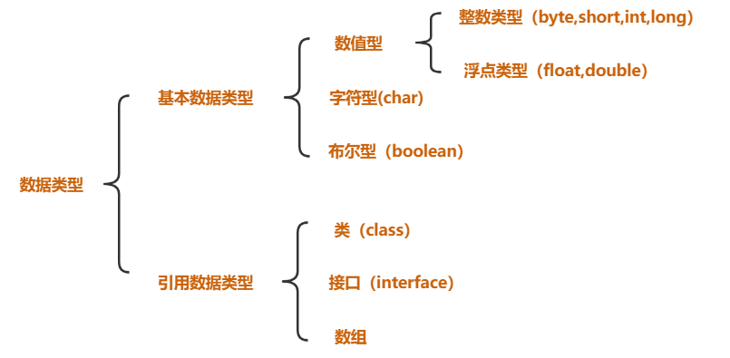

> PS:巧妙记忆：除了基本数据类型以外的所有类型都属于引用数据类型，本章重点：基本数据类型

### 整数类型

#### 整数类型常量

十进制整数，如：99, -500, 0
八进制整数，要求以 0 开头，如：015
十六进制数，要求 0x 或 0X 开头，如：0x15
二进制：要求0b或者0B开头，如：0b11


几进制：就是逢几进1的问题：

平时实际生活中用的最多的是：十进制
计算机用二进制最多


##### 扩展：进制转换问题

###### 1. 二进制转换为十进制：
二进制： 1101

    1*2^3  +   1*2^2   +  0*2^1  +     1*2^0
=    8         +      4       +     0       +      1
=  13 


###### 2. 十进制转换为二进制：
十进制  13   


##### 3. 八进制转换十进制：
八进制： 16

1*8^1 +   6*8^0
=   8     +  6
=14


##### 4. 十进制转换为八进制：
十进制14：


##### 5. 八进制转换为十六进制：

把十进制当做一个中转站：

八进制---》十进制---》十六进制

实际上根本不用自己转换这么麻烦：我们可以直接用系统中提供给我们的计算器：


#### 整数类型变量

整型数据类型：


比如：byte的右侧表数范围127怎么算出来的？
byte: 1字节 =  8位 
二进制：01111111
   1*2^6  + 1*2^5  +  1*2^4 + 1*2^3  + 1*2^2 +   1*2^1 +   1*2^0
= 64     +     32       +     16      +8         +4             +    2       +1
= 127

代码：
```java
public class TestVar05{
  public static void main(String[] args){
    //定义整数类型的变量：
    //给变量赋值的时候，值可以为不同进制的：
    int num1 = 12 ;//默认情况下赋值就是十进制的情况
    System.out.println(num1);
    int num2 = 012;//前面加上0，这个值就是八进制的
    System.out.println(num2);
    int num3 = 0x12;//前面加上0x或者0X，这个值就是十六进制的
    System.out.println(num3);
    int num4 = 0b10;//前面加上0b或者0B,这个值就是二进制的
    System.out.println(num4);
    
    //定义byte类型的变量：
    byte b = 126;//定义了一个byte类型的变量，名字叫b，赋值为12
    System.out.println(b);
    //注意：超范围的赋值会报错。
    short s = 30000;
    System.out.println(s);
    int i = 1234;
    System.out.println(i);
    //整数类型默认就是int类型的，所以12345678910是一个int类型的数，对于int类型来说，它超出范围了
    //要想把一个数给long类型变量，那么后面加上L(推荐)或者l就可以了
    long num5 = 12345678910L;
    System.out.println(num5);
    //注意：只有这个数超出int类型的范围了后面才需要加上L，否则无需加L也可以赋值给long类型：
    long num6 = 12;
    System.out.println(num6);
  }
}
```


### 浮点类型

#### 浮点类型常量

1. 十进制数形式，例如:                              
3.14       314.0      0.314
2. 科学记数法形式，如
314e2      314E2 (E的大小写没有区分)    314E-2
double  f = 314e2;  //314*10^2-->31400.0
double  f2 = 314e-2; //314*10^(-2)-->3.14

#### 浮点类型变量

float类型又被称作单精度类型，尾数可以精确到7位有效数字，在很多情况下，float类型的精度很难满足需求。
而double表示这种类型的数值精度约是float类型的两倍，又被称作双精度类型，绝大部分应用程序都采用double类型。
float类型的数值有一个后缀F或者f ，没有后缀F/f的浮点数值默认为double类型。
也可以在浮点数值后添加后缀D或者d， 以明确其为double类型。


PS：有效数字指的是从左开始第一个不为0的数到最后一个数

代码：
```java
public class TestVar06{
  public static void main(String[] args){
    //浮点类型的常量有两种形式：
    //十进制形式：
    double num1 = 3.14;
    System.out.println(num1);
    //科学计数法形式：
    double num2 = 314E-2;
    System.out.println(num2);
    
    //浮点类型的变量：
    //注意：浮点型默认是double类型的，要想将一个double类型的数赋给float类型，必须后面加上F或者f
    float f1 = 3.14234567898623F;
    System.out.println(f1);
    //注意：double类型后面可以加D或者d，但是一般我们都省略不写
    double d1 = 3.14234567898623D;
    System.out.println(d1);
    
    //注意：我们最好不要进行浮点类型的比较：
    float f2 = 0.3F;
    double d2 = 0.3;
    System.out.println(f2==d2);
    /*
    区别：
    = 赋值运算：  将等号右侧的值赋给等号左侧
    == 判断==左右两侧的值是否相等  ：结果要么相等 要么不相等
    ==运算符的结果就是要么是true，要么是false
    */
  }
}
```

### 字符类型

#### 1. Java中使用单引号来表示字符常量，字符型在内存中占2个字节。

char 类型用来表示在Unicode编码表中的字符。Unicode编码被设计用来处理各种语言的文字，它占2个字节，可允许有65536个字符。

#### 2. 转义字符：


#### 3. ASCII表：


#### 4. Unicode编码表：
https://www.cnblogs.com/csguo/p/7401874.html

代码1：
```java
public class TestVar07{
  public static void main(String[] args){
    //定义字符类型的变量：
    char ch1 = 'a';
    System.out.println(ch1);
    char ch2 = 'A';
    System.out.println(ch2);
    char ch3 = '4';
    System.out.println(ch3);
    char ch4 = '中';
    System.out.println(ch4);
    char ch5 = '?';
    System.out.println(ch5);
    //java中无论：字母，数字，符号，中文都是字符类型的常量，都占用2个字节。
    char ch6 = ' ';
    System.out.println(ch6);
    //字符类型：单引号引起来的单个字符
    System.out.println("--------------------------------");
    /*
    转义字符：
    \将后面的普通字符转换为特殊含义
    */
    char ch7 = '\n';
    System.out.println("aaa"+ch7+"bbb");
    
    System.out.println("aaa\nbbb");// \n  换行
    
    System.out.println("aaaaaaa\tbbb");  //  \t  制表符
    
    System.out.println("aaa\bbbb");//aabbb  \b  向前退一格
    System.out.println("aaa\rbbb");//bbb   \r 将光标到本行开头 ：回车
    
    System.out.println("\"java\""); // \" 将双引号原样输出  \' 将单引号原样输出 \\ 将\原样输出
  }
}
```

代码2：
```java
public class TestVar08{
  public static void main(String[] args){
    char ch1 = 'A';
    System.out.println(ch1);//A
    System.out.println(ch1+90);//155
    System.out.println(155-ch1);//90
    //char类型我们看到的样子就是它本身的字面常量,但是底层在进行计算的时候，实际上是按照一个码进行计算的。
    //这个码就是ASCII
    //之前说char类型是按照Unicode码表进行存储的 (Unicode兼容了ASCII码，Unicode的前128位置ASCII)
    
    char ch2 = '中';
    System.out.println(ch2);// 中
    System.out.println(ch2+90);// 20103
    System.out.println(20103-ch2);// 90
    
    //转换：
    int num1 = (int)ch2;
    System.out.println(num1);//20013
    
    char ch = (char)20013;
    System.out.println(ch);
    
    int num2 = '中';
    char ch5 = 20013;
    System.out.println(ch5);
    
    //面试题：
    char ch6 = '2'+2;
    System.out.println(ch6);//'4'--->4
  }
}
```

#### 编码和字符集

##### 1. 什么是编码？


##### 2. 通过生活案例：


##### 3. 由权威机构形成的编码表才可以称之为：字符集

ASCII
                                        <strong>英文字符集</strong>    
                                        <strong>用一个字节的7位表示</strong>

IOS8859-1
                                        <strong>西欧字符集</strong>
                                        <strong>用一个字节的8位表示</strong>

GB2312
                                        <strong>简体中文字符集</strong>
                                        <strong>最多使用两个字节编码</strong>

PS：中文：2个字节

GB2312兼容了ASCII中的字符：

GBK
                                        <strong>GB2312的升级，加入了繁体字</strong>
                                        <strong>最多使用两个字节编码</strong>

<strong>疑问：</strong>


首位如果是0：一个字节代码代表一个字符

首位如果是1：那么一个字节不够，要加上后面的字节才能完整的表示一个字符。


Unicode
                                            国际通用字符集，融合了目前人类使用的所有字符。为每个字符分配唯一的字符码。

退出了UTF标准：

三种编码方案：  UTF-8，UTF-16,UTF-32 


以UTF-8为案例讲解：

中文： 珊     ---》Unicode  ： 29642


底层存储：


UTF-8标准最多可以用6个字节表示：


#### 解释乱码问题


用记事本选择编码方法的时候一般要选择为ANSI---》获取当前操作系统的编码格式：GBK

### 布尔类型

boolean类型有两个常量值，true和false，在内存中占一位（不是一个字节），不可以使用 0 或非 0 的整数替代 true 和 false ，这点和C语言不同。 boolean 类型用来判断逻辑条件，一般用于程序流程控制 。
```java
public class TestVar09{
  public static void main(String[] args){
    //创建一个布尔类型的变量：
    boolean flag1 = true;
    System.out.println(flag1);
    boolean flag2 = false;
    System.out.println(flag2);
    boolean flag3 = 5==9;
    System.out.println(flag3);
    boolean flag4 = 5<9;
    System.out.println(flag4);
  }
}
```

### 基本数据类型的转换

#### 1. 什么是类型转换：
在赋值运算或者算数运算的时候，要求数据类型一致，就要进行类型的转换。

#### 2. 类型转换的种类：
自动转换，强制转换

#### 3. 内存演示：


#### 4. 代码:

```java
public class TestVar10{
  public static void main(String[] args){
    //类型转换的两种形式：
    double d = 6;//int-->double  自动类型转换
    System.out.println(d);
    int i = (int)6.5;//double--->int  强制类型转换 （强转）
    System.out.println(i);
    
    //在同一个表达式中，有多个数据类型的时候，应该如何处理：
    //多种数据类型参与运算的时候，整数类型，浮点类型，字符类型都可以参与运算，唯独布尔类型不可以参与运算。
    //double d2 = 12+1294L+8.5F+3.81+'a'+true;
    double d2 = 12+1294L+8.5F+3.81+'a';
    System.out.println(d2);
    /*
    类型级别：(从低到高的)
    byte,short,char-->int--->long--->float--->double
    级别用来做什么？当一个表达式中有多种数据类型的时候，要找出当前表达式中级别最高的那个类型，然后
    其余的类型都转换为当前表达式中级别最高的类型进行计算。
    double d2 = 12+1294L+8.5F+3.81+'a';
              = 12.0+1294.0+8.5+3.81+97.0
    */
    int i2 = (int)(12+1294L+8.5F+3.81+'a');
    System.out.println(i2);
    /*
    在进行运算的时候：
    左=右  : 直接赋值
    左<右  ：强转
    左>右  ：直接自动转换
    */
    
    //以下情况属于特殊情形：对于byte，short，char类型来说，只要在他们的表数范围中，赋值的时候就不需要进行
    //强转了直接赋值即可。
    byte b = 12;
    System.out.println(b);
    byte b2 = (byte)270;
    System.out.println(b2);
  }
}
```

### 练习：final，字符常量，Scanner的使用

```java
import java.util.Scanner;//形象理解：在java.util下将Scanner拿过来用
public class TestVar11{
  public static void main(String[] args){
    //实现功能：求圆的周长和面积
    //【1】提取变量：提取变量，就是为了一劳永逸，以后只要改变变量的值，下面只要用到这个变量的地方，取值也都发生变化了
    //【2】一个变量被final修饰，这个变量就变成了一个常量，这个常量的值就不可变了
    //     这个常量就是我们所说的 字符常量  ---》pi
    //     约定俗成的规定：字符常量的名字全部大写
    //【3】使用扫描器：Scanner的使用--》注意通过形象的理解去使用
    final double PI = 3.14;
    //拿来一个扫描器：
    Scanner sc = new Scanner(System.in);
    //给一个友好性的提示：
    System.out.print("请录入一个半径：");
    //让扫描器扫描键盘录入的int类型的数据：
    int r = sc.nextInt();
    
    //求周长：
    double c = 2*PI*r;
    System.out.println("周长为："+c);
    
    //求面积：
    //PI = 9.29;报错：TestVar11.java:12: 错误: 无法为最终变量pi分配值
    double s = PI*r*r;
    System.out.println("面积为："+s);
  }
}
```

### 练习：加深对Scanner的使用


```java
import java.util.Scanner;
public class TestVar12{
  public static void main(String[] args){
    //键盘录入学生的信息：年龄，身高，姓名，性别：
    //键盘录入年龄：(接收int类型数据)
    Scanner sc = new Scanner(System.in);
    System.out.print("请录入年龄：");
    int age = sc.nextInt();
    //键盘录入身高：（接收double类型数据）
    System.out.print("请录入身高：");
    double height = sc.nextDouble();
    //键盘录入姓名：(接收String类型数据--》字符串)
    System.out.print("请录入姓名：");
    String name = sc.next();
    //键盘录入性别：(接受char类型)
    System.out.print("请录入性别：");
    String sexStr = sc.next();
    char sex = sexStr.charAt(0);
    //上面两句可以合为一句表示：char sex = sc.next().charAt(0);
    System.out.println("该学生的信息为:姓名是："+name+",年龄是："+age+",身高为："+height+",性别是："+sex);
  }
}
```

# 第三章_运算符

## Java中的运算符

### 1. Java 语言支持如下运算符：
算术运算符   
                                                        +，-，*，/，%，++（自增），--（自减）
赋值运算符 
                                                        =  
扩展赋值运算符
                                                        +=，-=，*=，/=
关系运算符
                                                         >，<，>=，<=，==，!=
逻辑运算符
                                                    &，|，    &&，||，!，^
位运算符
                                                         &，|，^，~ ， >>，<<，>>> (了解！！！)
条件运算符
                                                         ？：
### 2. 相关概念辨析
+        运算符  操作符         Operator
5+6    表达式                     expression
5  6     操作数                     Operand
int m =5+6;    语句         Sentence

## 算术运算符

### /和%

#### 1. /   除法运算符 ： 表示两个数相除运算  
     %   取余运算符： 用来求余数的

```java
public class TestOpe01{
  public static void main(String[] args){
    //打印结果：
    System.out.println(12/3);
    System.out.println(12%5);
    System.out.println(12/3.0);
    System.out.println(12%5.0);
  }
}
```

#### 2. 练习：

```java
import java.util.Scanner;
public class TestOpe02{
  public static void main(String[] args){
    //实现功能：任意给出一个四位数，求出每位上的数字并输出
    
    //1.任意给出一个四位数：
    Scanner input = new Scanner(System.in);
    System.out.println("请录入一个四位数：");
    int num = input.nextInt();
    
    
    //2.求出每位上的数字：
    //个位数：
    int num1 = num%10;
    //十位数：
    int num2 = num/10%10;//1234--->123--->3
    //百位数：
    int num3 = num/100%10;//1234--->12--->2
    //千位数：
    int num4 = num/1000;//1234--->1
    
    
    //3.输出每位上的数字：
    System.out.println("个位上的数为："+num1);
    System.out.println("十位上的数为："+num2);
    System.out.println("百位上的数为："+num3);
    System.out.println("千位上的数为："+num4);
  }
}
```

### +

#### 1. +的作用：
1. 表示正数
2. 表示相加操作
3. 进行字符串的拼接

#### 2. 代码练习：

```java
public class TestOpe03{
  public static void main(String[] args){
    //表示正数：
    System.out.println(+5);//5
    //相加操作：
    System.out.println(5+6);//11
    System.out.println(5+'6');//59
    //字符串的拼接：
    //规则：+左右两侧的任意一侧有字符串，那么这个加号就是字符串拼接的作用，结果一定是字符串
    int num = 56;
    System.out.println("num="+num);//"num=56" ---> num=56
    System.out.println(5+6+"7");//11+"7"--->"117"  --->117
    System.out.println(5+'6'+"7");//59 +"7"--->"597" --->597
    System.out.println("5"+6+"7");//"56"+"7"  --->"567"--->567
    System.out.println("5"+'6'+"7");//"56"+"7"--->"567"--->567
    System.out.println("5"+'6'+'7');//"56"+'7'--->"567"---567
  }
}
```

### ++

#### 1. ++：

```java
public class TestOpe04{
  public static void main(String[] args){
    int a = 5;
    a++;//理解为：相当于  a=a+1 操作  
    System.out.println(a);//6
    
    a = 5;
    ++a;//理解为：相当于  a=a+1 操作  
    System.out.println(a); //6
    
    //总结：++单独使用的时候，无论放在前还是后，都是加1操作
    
    //将++参与到运算中：
    //规则：看++在前还是在后，如果++在后：先运算，后加1   如果++在前，先加1，后运算
    a = 5;
    int m = a++ + 7;//先运算  m=a+7  再加1：  a = a+1 
    System.out.println(m);//12
    System.out.println(a);//6
    
    a = 5;
    int n = ++a + 7;//先加1  a=a+1  再运算：  n = a+7 
    System.out.println(n);//13
    System.out.println(a);//6
  }
}
```

无论这个变量是否参与到运算中去，只要用++运算符，这个变量本身就加1操作
只是说如果变量参与到运算中去的话，对运算结果是产生影响：
看++在前还是在后，如果++在后：先运算，后加1   如果++在前，先加1，后运算


#### 2. 练习：

```java
public class TestOpe05{
  public static void main(String[] args){
    int a = 5;
    System.out.println(a++ + a++);
    System.out.println(a++ + ++a);
    System.out.println(++a + a++);
    System.out.println(++a + ++a);
  }
}
```

运算过程：


## 赋值运算符

### 1. =的作用： 将等号右侧的值赋给等号左侧：

``` java
int age = 19;
int age = 10+3+8;
```

### 2. 练习：

``` java
public class TestOpe06{
  public static void main(String[] args){
    //任意给出两个数，交换两个数并输出：
    //1.给出两个数：
    int num1 = 10;
    int num2 = 20;
    
    //2.输出交换前的两个数：
    System.out.println("交换前："+num1+"\t"+num2);
    
    //3.交换
    /*
    错误代码：
    num1 = num2;
    num2 = num1;	
    */		
    //解决办法：
    //引入一个中间变量:
    int t;
    t = num1;
    num1 = num2;
    num2 = t;
    /*
    int t;
    t = num2;
    num2 = num1;
    num1 = t;
    
    */
    
    //4.输出交换后的两个数：
    System.out.println("交换后："+num1+"\t"+num2);
  }
}
```


## 扩展赋值运算符

### 1. 代码：

```java
public class TestOpe07{
        public static void main(String[] args){
                //实现功能：给出三个数，求和：
                //1.给出三个数：
                int num1 = 10;
                int num2 = 20;
                int num3 = 30;
                //2.求和
                //int sum = num1+num2+num3;
                //定义一个变量，用来接收和：
                int sum = 0;
                sum = sum + num1;//等效：  sum += num1;
                sum = sum + num2;// sum += num2;
                sum = sum + num3;//sum += num3;
                //3.将和输出：
                System.out.println("和："+sum);
        }
}
```

内存：


### 2. a+=b  和  a=a+b  区别：

1. a+=b    可读性稍差 编译效率高   底层自动进行类型转换
2. a=a+b     可读性好  编译效率低   手动进行类型转换

### 3. 面试题

1. 请问a+=b相当于a=a+b,那么也相当于  a=b+a吗？


2. 下面的代码哪一句出错：  4
byte a = 10;  --->1
int b = 20;  --->2
a+=b;  ---->3
a = a+b ;---->4

更正：  a = (byte)(a+b);

## 关系运算符

```java
public class TestOpe08{
        public static void main(String[] args){
                //>，<，>=，<=，==，!=
                //关系运算符最终结果：要么是true要么是false
                System.out.println(4>9);//false
                System.out.println(4<9);//true
                System.out.println(4>=9);//false
                System.out.println(4<=9);//true
                System.out.println(4==9);//false
                System.out.println(4!=9);//true
                System.out.println((5<9)!=(6==8));//true
        }
}
```

## 逻辑运算符

        &，|，    &&，||，!，^
逻辑运算符：进行逻辑运算的，运算符左右连接的都是 布尔类型的操作数，最终表达式的结果是布尔值：要么是true，要么false

代码：

```java
public class TestOpe09{
  public static void main(String[] args){
    // 逻辑与 ：& 规律：只要有一个操作数是false，那么结果一定是false
    System.out.println(true&true);
    System.out.println(true&false);
    System.out.println(false&false);
    System.out.println(false&true);
    
    // 短路与：&& 规律：效率高一些，只要第一个表达式是false，那么第二个表达式就不用计算了，结果一定是false
    System.out.println(true&&true);
    System.out.println(true&&false);
    System.out.println(false&&false);
    System.out.println(false&&true);
    
    // 逻辑或：| 规律：只要有一个操作数是true，那么结果一定是true
    System.out.println(true|true);
    System.out.println(true|false);
    System.out.println(false|false);
    System.out.println(false|true);
    
    // 短路或：|| 规律：效率高一些，只要第一个表达式是true，那么第二个表达式就不用计算了，结果一定是true
    System.out.println(true||true);
    System.out.println(true||false);
    System.out.println(false||false);
    System.out.println(false||true);
    
    //逻辑非：   !  规律：相反结果
    System.out.println(!true);//false
    System.out.println(!false);//true
    
    //逻辑异或： ^  规律：两个操作数相同，结果为false，不相同，结果为true
    System.out.println(true^true);
    System.out.println(true^false);
    System.out.println(false^false);
    System.out.println(false^true);
  }
}
```

再做一个加深的练习：看代码 说结果：

```java
public class TestOpe10{
  public static void main(String[] args){
    int i=8;
    System.out.println((5>7)&&(i++==2)); //false
    System.out.println(i);  //8 
    
    
    int a=8;
    System.out.println((5>7)&(a++==2)); //false
    System.out.println(a); //9
    
    
    int m=8;
    System.out.println((5<7)&&(m++==2)); //false
    System.out.println(m); //9
    
    int b=2;
    System.out.println((5<7)&(b++==2)); //true
    System.out.println(b);  //3
    
    int c=2;
    System.out.println((5<7)&(++c==2)); //false
    System.out.println(c);  //3
  }
}
```

## 条件运算符

### 1. 条件运算符：又称：  三元运算符/三目运算符

### 2. 格式：

  ```a?b:c```
其中a是一个布尔类型的表达式，返回结果要么是true要么false，通过a的结果决定最终表达式的结果:
如果a的结果是true，那么表达式最终结果为b
如果a的结果是false，那么表达式最终结果为c

代码：

```java
public class TestOpe11{
  public static void main(String[] args){
    int num = (5>7)?6:9 ;
    System.out.println(num);
    
    String str = (4==4)?"你好":"你不好" ;
    System.out.println(str);
    
    System.out.println((4==4)?"你好":"你不好");
  }
}
```

练习：

```java
import java.util.*;//*代表所有
public class TestOpe12{
        public static void main(String[] args){
                //实现功能：男孩女孩选择晚饭吃什么，如果意见一致，听男生的，如果意见不一致，听女生的
                
                //1.要让男孩女孩选择晚饭吃什么：
                Scanner sc = new Scanner(System.in);
                System.out.println("请选择今晚吃什么：1.火锅 2.烧烤 3.麻辣烫 4.西餐");
                System.out.println("请男孩选择：");
                int boyChoice = sc.nextInt();
                System.out.println("请女孩选择：");
                int girlChoice = sc.nextInt();
                //2.判断：
                System.out.println(boyChoice==girlChoice?"听男孩的":"听女孩的");
        }
}
```

> PS:三目运算符可以代替后续我们要学习的if-else

## 位运算符(了解)

位运算符：&，|，^，~ ， >>，<<，>>>

如何区分逻辑运算符和位运算符：
逻辑运算符：左右连接的是布尔类型的操作数
位运算符：左右连接的是具体的数值

### 1. <<   左移 

3<<2 = 12


面试题： 4乘以8最快的方式：  4<<3 

### 2. >> 有符号右移

6>>2 = 1


-6>>2 = -2


### 3. >>> 无符号右移：

6>>>2  = 1


### 4. & 与

6&3 = 2


### 5. | 或

6|3=7


### 6. ^异或：

6^3 = 5


### 7. ~反：

~6  = -7


> PS：
> byte类型的表数范围的 -128是怎么算出来的 
> 127： 01111111
> -128：  10000000
> 一看就是个负数
> 减1：    01111111
> 取反：   10000000  ---》2^7  = 128
> 加负号：  -128

## 运算符总结


## 运算符的优先级别

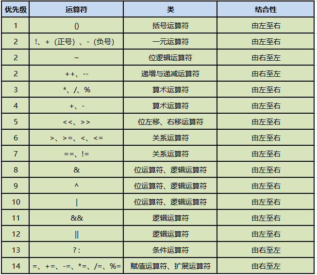

不需要去刻意的记优先级关系
赋值<三目<逻辑<关系<算术<单目
理解运算符的结合性

> PS:实际开发中我们不会写特别复杂的表达式，你要想先算谁就用()

案例：
```java
   5<6 | 'A'>'a' && 12*6<=45+23&&!true
=5<6 | 'A'>'a' && 12*6<=45+23&&false
= 5<6 | 'A'>'a' &&72<=68&&false
= true|false&&false&&false
= true&&false&&false
=false&&false
=false
```

# 第四章_流程控制

## 引入

### 1. 流程控制的作用：

流程控制语句是用来控制程序中各语句执行顺序的语句，可以把语句组合成能完成一定功能的小逻辑模块。

### 2. 控制语句的分类：

控制语句分为三类：顺序、选择和循环。
“顺序结构”代表“先执行a，再执行b”的逻辑。
“条件判断结构”代表“如果…，则…”的逻辑。
“循环结构”代表“如果…，则再继续…”的逻辑。
  三种流程控制语句就能表示所有的事情！不信，你可以试试拆分你遇到的各种事情。这三种基本逻辑结构是相互支撑的，它们共同构成了算法的基本结构，无论怎样复杂的逻辑结构，都可以通过它们来表达。所以任何一种高级语言都具备上述两种结构。
本章是大家真正进入编程界的“门票”。 

### 3. 流程控制的流程：


## 分支结构(选择结构)

### if

#### 单分支

#### 1. 语法结构:

```java
if(布尔表达式){
    语句块
}
```

if语句对布尔表达式进行一次判定，若判定为真，则执行{}中的语句块，否则跳过该语句块。流程图如图所示：

#### 2. 代码：

```java
public class TestIf01{
  public static void main(String[] args){
    //实现一个功能：给出三个数（1-6），对三个数求和计算，根据和的大小来分配不同的奖品
    //1.给出三个数：
    int num1 = 6;
    int num2 = 2;
    int num3 = 3;
    //2.求和
    int sum = 0;
    sum += num1;
    sum += num2;
    sum += num3;
    System.out.println("和为："+sum);
    
    //3.根据和判断奖品：
    //如果和大于等于14，那么就是一等奖
    if(sum>=14){
            System.out.println("一等奖");
            System.out.println("恭喜你很幸运，中了一等奖");
    }
    
    if(sum>=10&&sum<14){
            System.out.println("二等奖");
    }
    
    if(sum>=6&&sum<10){
            System.out.println("三等奖");
    }
    
    if(sum<6){
            System.out.println("四等奖");
    }
    
    /*
    if-单分支：
    （1）结构：
            if(条件表达式，这个表达式的结果是布尔值：要么是false，要么是true){
                    //如果上面()中的表达式返回结果是true，那么执行{}中代码
                    //如果上面()中的表达式返回结果是false ，那么不执行{}中代码
                    //PS:{}中的代码是否执行，取决于()中表达式的返回结果
            }
    （2）上面的代码中，我用四个单分支拼凑出四个选择，每个选择是独立的，依次判断执行的
    （3）if后面的()中的条件，要按照自己需求尽量完善
    （4）{}可以省略不写,但是一旦省略，这个if就只负责后面的一句话，所以我们不建议初学者省略
    */
  }
}
```

### 多分支

#### 1. 语法结构：

```java
if(布尔表达式1) {
        语句块1;
} else if(布尔表达式2) {
        语句块2;
}……
else if(布尔表达式n){
        语句块n;
} else {
        语句块n+1;
}
```

当布尔表达式1为真时，执行语句块1；否则，判断布尔表达式2，当布尔表达式2为真时，执行语句块2；否则，继续判断布尔表达式3······；如果1~n个布尔表达式均判定为假时，则执行语句块n+1，也就是else部分。流程图如图所示：


#### 2. 数轴分析：


#### 3. 代码：

```java
public class TestIf02{
  public static void main(String[] args){
    //实现一个功能：给出三个数（1-6），对三个数求和计算，根据和的大小来分配不同的奖品
    //1.给出三个数：
    int num1 = 6;
    int num2 = 4;
    int num3 = 2;
    //2.求和
    int sum = 0;
    sum += num1;
    sum += num2;
    sum += num3;
    System.out.println("和为："+sum);
    
    //3.根据和判断奖品：
    /*
    利用一个多分支
    【1】结构：
    if(){
            
    }else if(){
            
    }else if(){
            
    }...
    else{
            
    }
    【2】else:隐藏了一个条件，跟上面分支条件表达式相反的功能 (详见数轴分析)
    【3】多分支：好处：只要满足一个 分支以后，后面的分支就不需要判断了 --》效率高
    【4】我们写代码的时候，尽量保证else的存在--》else分支相当于“兜底”“备胎”的作用，别的分支都不走，就会走这个分支了
    */
    if(sum>=14){
            System.out.println("一等奖");
    }else if(sum>=10){//隐藏了sum<14
            System.out.println("二等奖");
    }else if(sum>=6){//隐藏了sum<10
            System.out.println("三等奖");
    }else{//隐藏了sum<6
            System.out.println("四等奖");
    }
  }
}
```

### 双分支

#### 1. 语法结构:

```java
if(布尔表达式){
语句块1
}else{
      语句块2
}
```

当布尔表达式为真时，执行语句块1，否则，执行语句块2。也就是else部分。流程图如图所示：


### 随机数

随机数：这个数在生成之前我们不确定这个数是多少，不可知

在java中依靠一个类：Math类帮助我们生成，这个类中有一个方法专门用来生成随机数：

Math.random() -------> [0.0,1.0)
Math.random()*6 ----->[0.0,6.0)
(int)(Math.random()*6)  ----->[0,5]
(int)(Math.random()*6) +1 ----->[1,6]

应用到程序中：

int num1 = (int)(Math.random()*6) +1;
int num2 = (int)(Math.random()*6) +1;
int num3 = (int)(Math.random()*6) +1;

练习：
```[32,98] - [0,66]+32 - (int)(Math.random()*67) + 32 ```

### 分支的嵌套使用

#### 分支结构练习1

练习：
会员购物时，不同积分享受的折扣不同，规则如下：


计算会员购物时获得的折扣，效果如下：


本题主要考的是 程序的优化：

```java
import java.util.Scanner;
public class TestIf04{
  public static void main(String[] args){
    //1.给出积分：
    Scanner sc = new Scanner(System.in);
    System.out.print("请输入会员积分：");
    
    //先判断键盘录入的数据是不是int类型的
    if(sc.hasNextInt()==true){//是int类型数据：
      //将这个int类型的数据接收：
      int score = sc.nextInt();
      //判断这个积分是否是正数：
      if(score>=0){
        String discount = "";
        //2.根据积分判断折扣：
        if(score>=8000){
          discount = "0.6";
        }else if(score>=4000){
          discount = "0.7";
        }else if(score>=2000){
          discount = "0.8"; 
        }else{
          discount = "0.9"; 
        }
        System.out.println("该会员享受的折扣为："+discount);
      }else{//score<0
        System.out.println("对不起，你录入的积分是负数！不符合需求！");
      }	
    }else{//不是int类型的数据
      System.out.println("你录入的积分不是整数！");
    }
  }
}
```

#### 分支结构练习2

练习：
小朋友搬桌子：
年龄大于7岁，可以搬桌子；
如果年龄大于5岁，性别是男，可以搬桌子；
否则不可以搬动桌子，提示：你还太小了

本题主要考的是：逻辑

方式1：性别用0或者1接收：

```java
import java.util.Scanner;
public class TestIf05{
  public static void main(String[] args){
    //1.录入小朋友的年龄：
    Scanner sc = new Scanner(System.in);
    System.out.println("请录入小朋友的年龄：");
    int age = sc.nextInt();
    
    //2.根据年龄判断：
    if(age>=7){
      System.out.println("yes");
    }else if(age>=5){
      //录入小朋友的性别；
      System.out.println("请录入小朋友的性别：男：1  女 ：0");
      int sex = sc.nextInt();
      if(sex==1){//男生
        System.out.println("yes");
      }else{//女孩
        System.out.println("no");
      }
    }else{//age<5
      System.out.println("no");
    }
  }
}
```

方式2：性别用男或者女接收：

```java
import java.util.Scanner;
public class TestIf06{
  public static void main(String[] args){
    //1.录入小朋友的年龄：
    Scanner sc = new Scanner(System.in);
    System.out.println("请录入小朋友的年龄：");
    int age = sc.nextInt();
    
    //2.根据年龄判断：
    if(age>=7){
            System.out.println("yes");
    }else if(age>=5){
      //录入小朋友的性别；
      System.out.println("请录入小朋友的性别：");
      String str = sc.next();
      char sex = str.charAt(0);
      if(sex=='男'){
        System.out.println("yes");
      }else{
        System.out.println("no");
      }
    }else{//age<5
      System.out.println("no");
    }
  }
}
```

### switch

#### 1. switch多分支结构(多值情况)

语法结构：
```java
switch (表达式) {
    case 值1:
         语句序列1;
         [break];
    case 值2:
         语句序列2;
         [break];
        … … …      … …
    [default:默认语句;]
}
```

switch语句会根据表达式的值从相匹配的case标签处开始执行，一直执行到break语句处或者是switch语句的末尾。如果表达式的值与任一case值不匹配，则进入default语句（如果存在default语句的情况）。根据表达式值的不同可以执行许多不同的操作。switch语句中case标签在JDK1.5之前必须是整数（long类型除外）或者枚举，不能是字符串，在JDK1.7之后允许使用字符串(String)。大家要注意，当布尔表达式是等值判断的情况，可以使用if-else if-else多分支结构或者switch结构，如果布尔表达式区间判断的情况，则只能使用if-else if-else多分支结构。switch多分支结构的流程图如图所示：


```java
public class TestSwitch{
  public static void main(String[] args){
    /*
    实现一个功能：
    根据给出的学生分数，判断学生的等级：
    >=90  -----A
    >=80  -----B
    >=70  -----C
    >=60  -----D
    <60   -----E
    
    用if分支：
    if(score>=90){
            
    }else if(score>=80){
            
    }
    */
    //1.给出学生的成绩：
    int score = 167;
    //2.根据成绩判断学生的等级：
    switch(score/10){
      case 10 : 
      case 9 : System.out.println("A级");break;
      case 8 : System.out.println("B级");break;
      case 7 : System.out.println("C级");break;
      case 6 : System.out.println("D级");break;
      default:System.out.println("成绩错误");break;
      case 5 :  
      case 4 :  
      case 3 :  
      case 2 :  
      case 1 :  
      case 0 : System.out.println("E级");break;
    }
    /*
    【1】语法结构：
    switch(){
      case * :
      case * :
      .......
    }
    【2】switch后面是一个()，()中表达式返回的结果是一个等值，这个等值的类型可以为：
    int,byte,short,char,String,枚举类型
    【3】这个()中的等值会依次跟case后面的值进行比较，如果匹配成功，就执行:后面的代码
    【4】为了防止代码的“穿透”效果：在每个分支后面加上一个关键词break，遇到break这个分支就结束了
    【5】类似else的“兜底”“备胎”的分支：default分支
    【6】default分支可以写在任意的位置上，但是如果没有在最后一行，后面必须加上break关键字，
    如果在最后一行的话，break可以省略
    【7】相邻分支逻辑是一样的，那么就可以只保留最后一个分支，上面的都可以省去不写了
    【8】switch分支和if分支区别：
    表达式是等值判断的话--》if ，switch都可以
    如果表达式是区间判断的情况---》if最好
    【9】switch应用场合：就是等值判断，等值的情况比较少的情况下
    */
  }
}
```

## 循环结构

### while

#### 1. 语法结构：

```java
while (布尔表达式) {
            循环体;
}
```

在循环刚开始时，会计算一次“布尔表达式”的值，若条件为真，执行循环体。而对于后来每一次额外的循环，都会在开始前重新计算一次。
语句中应有使循环趋向于结束的语句，否则会出现无限循环–––"死"循环。
while循环结构流程图如图所示:

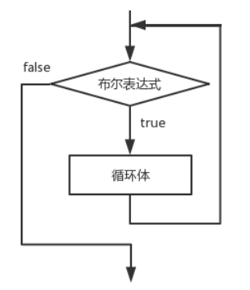

#### 2. 练习：1+2+3+4+5

```java
public class TestWhile{
  public static void main(String[] args){
    //功能：1+2+3+4+5
    //1.定义变量：
    int num1 = 1;
    int num2 = 2;
    int num3 = 3;
    int num4 = 4;
    int num5 = 5;
    //2.定义一个求和变量，用来接收和：
    int sum = 0;
    sum += num1;
    sum += num2;
    sum += num3;
    sum += num4;
    sum += num5;
    
    //3.输出和
    System.out.println(sum);
  }
}
```

上述代码缺点：变量的定义个数太多了
解决：

```java
public class TestWhile{
  public static void main(String[] args){
    //功能：1+2+3+4+5
    //1.定义变量：
    int num = 1;
    //2.定义一个求和变量，用来接收和：
    int sum = 0;
    sum += num;
    num++;
    sum += num;
    num++;
    sum += num;
    num++;
    sum += num;
    num++;
    sum += num;
    num++;
    
    //3.输出和
    System.out.println(sum);
  }
}
```

上述代码缺点：重复写的代码太多了
解决：---》引入java中循环结构：

```java
public class TestWhile{
  public static void main(String[] args){
    //功能：1+2+3+4+5
    //1.定义变量：
    int num = 1;[1]条件初始化
    //2.定义一个求和变量，用来接收和：
    int sum = 0;              
    while(num<=5){[2]条件判断
            sum += num;[3]循环体
            num++;[4]迭代
    }      
    //3.输出和
    System.out.println(sum);
  }
}
```

#####  总结：
1. 循环作用：将部分代码重复执行。
                                循环只是提高了程序员编写代码的效率，但是底层执行的时候依然是重复执行。
2. 循环四要素：


初始化谁，就判断谁，判断谁，就迭代谁
执行过程：[1][2][3][4] [2][3][4] [2][3][4]。。。。

3. 循环的执行过程：


4. 验证循环的执行过程：


#### 练习

1. 1+2+3+4+5+。。。。+100
2. 2+4+6+8+。。。。+998+1000
3. 5+10+15+20+。。。+100
4. 99+97+95+。。5+3+1
5. 1*3*5*7*9*11*13

```java
public class TestWhile02{
  public static void main(String[] args){
    /*
    【1】1+2+3+4+5+。。。。+100
    int i = 1;
    int sum = 0;
    while(i<=100){
      sum += i;
      i++;
    }
    System.out.println(sum);
    【2】2+4+6+8+。。。。+998+1000
    int i = 2;
    int sum = 0;
    while(i<=1000){
      sum += i;
      i = i+2;
    }
    System.out.println(sum);
    【3】5+10+15+20+。。。+100
    int i = 5;
    int sum = 0;
    while(i<=100){
      sum += i;
      i = i+5;
    }
    System.out.println(sum);
    
    【4】99+97+95+。。5+3+1
    int i = 99;
    int sum = 0;
    while(i>=1){
      sum += i;
      i = i-2;
    }
    System.out.println(sum);
    【5】1*3*5*7*9*11*13
    
    */
    int i = 1;
    int result = 1;
    while(i<=13){
      result *= i;
      i = i+2;
    }
    System.out.println(result);
  } 
}
```

### do-while

1. 语法结构：

```java
do {
            循环体;
    } while(布尔表达式) ;
```

do-while循环结构会先执行循环体，然后再判断布尔表达式的值，若条件为真，执行循环体，当条件为假时结束循环。do-while循环的循环体至少执行一次。do-while循环结构流程图如图
所示：

```java
public class TestDoWhile{
  public static void main(String[] args){
    //1+2+3+4+...100
    //while方式:
    /*
    int i = 101;
    int sum = 0;
    while(i<=100){
      sum += i;
      i++;
    }
    System.out.println(i);//101
    System.out.println(sum);//0
    */
    //do-while方式：
    
    int i = 101;
    int sum = 0;
    do{
            sum += i;
            i++;
    }while(i<=100);//一定要注意写这个分号，否则编译出错
    System.out.println(i);//102
    System.out.println(sum);//101
    /*
    【1】while和do-while的区别:
            while:先判断，再执行
            do-while:先执行，再判断---》至少被执行一次，从第二次开始才进行判断
    【2】什么场合使用do-while:
    
    while(考试是否通过){
            考试；
    }
    ---》不合适
    do{
            考试；
    }while(考试是否通过);
    ---》合适
    */
  }
}
```

### for

#### 1. 语法结构：

```java
for (初始表达式; 布尔表达式; 迭代因子) {
          循环体;
}
```

for循环语句是支持迭代的一种通用结构，是最有效、最灵活的循环结构。for循环在第一次反复之前要进行初始化，即执行初始表达式；随后，对布尔表达式进行判定，若判定结果为true，则执行循环体，否则，终止循环；最后在每一次反复的时候，进行某种形式的“步进”，即执行迭代因子。
1. 初始化部分设置循环变量的初值
2. 条件判断部分为任意布尔表达式
3. 迭代因子控制循环变量的增减
for循环在执行条件判定后，先执行的循环体部分，再执行步进。
for循环结构的流程图如图所示：


#### 2. 代码：

```java
public class TestFor01{
  public static void main(String[] args){
    //1+2+3+..+100
    //while:
    /*int i = 1;
    int sum = 0;
    while(i<=100){
            sum += i;
            i++;
    }
    System.out.println(sum);
    */
    
    //for:
    int sum = 0;
    int i;
    for(i = 1;i<=100;i++){
      sum += i;
    }
    System.out.println(sum);
    System.out.println(i);
    
    /*
    【1】for的结构：
    for(条件初始化;条件判断;迭代){
      循环体；
    }
    
    【2】i的作用域：作用范围：离变量最近{}  --->可以自己去控制
    【3】for循环格式特别灵活：格式虽然很灵活，但是我们自己写代码的时候不建议灵活着写。
    for(;;){}  -->死循环
    
    int i = 1;
    for(;i<=100;){
      sum += i;
      i++;
    }
    
    【4】死循环：
    for(;;){}
    
    while(true){}
    
    do{
            
    }while(true);
    
    【5】循环分为两大类：
    第一类：当型   while(){}   for(;;){}
    第二类：直到型  do{}while();
    
    【6】以后常用：for循环 
    【7】do-while,while,for循环谁的效率高？  一样高 
    */
  }
}
```

### 关键字

在任何循环语句的主体部分，均可用break控制循环的流程。<strong style="color:#DD5145">break</strong>用于强行退出循环，不执行循环中剩余的语句。
<strong style="color:#DD5145">continue</strong> 语句用在循环语句体中，用于终止某次循环过程，即跳过循环体中尚未执行的语句，接着进行下一次是否执行循环的判定。
<strong style="color:#DD5145">return</strong>的作用,结束当前所在方法的执行.

### 循环练习

1. 练习1：

```java
public class TestFor09{
  public static void main(String[] args){
    /* 输出1-100中被5整除的数,每行输出6个*/
    //引入一个计数器：
    int count = 0;//初始值为0
    for(int i=1;i<=100;i++){
      if(i%5==0){//被5整除的数
        System.out.print(i+"\t");
        count++;//每在控制台输出一个数，count就加1操作
        if(count%6==0){
          System.out.println();//换行
        }
      }
    }
  }
}
```

2. 练习2：

```java
import java.util.Scanner;
public class TestFor10{
  public static void main(String[] args){
    /*
        实现一个功能： 
    【1】请录入10个整数，当输入的数是666的时候，退出程序。
    【2】判断其中录入正数的个数并输出。
    【3】判断系统的退出状态：是正常退出还是被迫退出。
    */
    //引入一个计数器：
    int count = 0;
    //引入一个布尔类型的变量：
    boolean flag = true; //---》理解为一个“开关”，默认情况下开关是开着的
    Scanner sc = new Scanner(System.in);
    for(int i=1;i<=10;i++){//i:循环次数
      System.out.println("请录入第"+i+"个数：");
      int num = sc.nextInt();
      if(num>0){//录入的正数
        count++;
      }
      if(num==666){
        flag = false;//当遇到666的时候，“开关”被关上了
        //退出循环：
        break;
      }
    }
    
    System.out.println("你录入的正数的个数为："+count);
    
    if(flag){//flag==true
      System.out.println("正常退出！");
    }else{//flag==false
      System.out.println("被迫退出！");
    }
  }
}
```

### 循环的嵌套使用

#### 双重循环

##### 乘法口诀

乘法口诀：
```
1*1=1
1*2=2   2*2=4
1*3=3   2*3=6   3*3=9
1*4=4   2*4=8   3*4=12  4*4=16
1*5=5   2*5=10  3*5=15  4*5=20  5*5=25
1*6=6   2*6=12  3*6=18  4*6=24  5*6=30  6*6=36
1*7=7   2*7=14  3*7=21  4*7=28  5*7=35  6*7=42  7*7=49
1*8=8   2*8=16  3*8=24  4*8=32  5*8=40  6*8=48  7*8=56  8*8=64
1*9=9   2*9=18  3*9=27  4*9=36  5*9=45  6*9=54  7*9=63  8*9=72  9*9=81
```

代码：

```java
public class TestFor11{
  public static void main(String[] args){
    //1*6=6   2*6=12  3*6=18  4*6=24  5*6=30  6*6=36
    /*
    System.out.print("1*6=6"+"\t");
    System.out.print("2*6=12"+"\t");
    System.out.print("3*6=18"+"\t");
    System.out.print("4*6=24"+"\t");
    System.out.print("5*6=30"+"\t");
    System.out.print("6*6=36"+"\t");
    
    for(int i=1;i<=6;i++){
      System.out.print(i+"*6="+i*6+"\t");
    }
    //换行
    System.out.println();
    
    //1*7=7   2*7=14  3*7=21  4*7=28  5*7=35  6*7=42  7*7=49
    for(int i=1;i<=7;i++){
      System.out.print(i+"*7="+i*7+"\t");
    }
    //换行
    System.out.println();
    
    //1*8=8   2*8=16  3*8=24  4*8=32  5*8=40  6*8=48  7*8=56  8*8=64
    for(int i=1;i<=8;i++){
      System.out.print(i+"*8="+i*8+"\t");
    }
    //换行
    System.out.println();
    */
    
    for(int j=1;j<=9;j++){
      for(int i=1;i<=j;i++){
        System.out.print(i+"*"+j+"="+i*j+"\t");
      }
      //换行
      System.out.println();
    }
  }
}
```

```
1*9=9   2*9=18  3*9=27  4*9=36  5*9=45  6*9=54  7*9=63  8*9=72  9*9=81
1*8=8   2*8=16  3*8=24  4*8=32  5*8=40  6*8=48  7*8=56  8*8=64
1*7=7   2*7=14  3*7=21  4*7=28  5*7=35  6*7=42  7*7=49
1*6=6   2*6=12  3*6=18  4*6=24  5*6=30  6*6=36
1*5=5   2*5=10  3*5=15  4*5=20  5*5=25
1*4=4   2*4=8   3*4=12  4*4=16
1*3=3   2*3=6   3*3=9
1*2=2   2*2=4
1*1=1
```

代码：

```java
public class TestFor12{
  public static void main(String[] args){
    /*
    //1*8=8   2*8=16  3*8=24  4*8=32  5*8=40  6*8=48  7*8=56  8*8=64
    for(int i=1;i<=8;i++){
      System.out.print(i+"*8="+i*8+"\t");
    }
    //换行
    System.out.println();
    
    //1*7=7   2*7=14  3*7=21  4*7=28  5*7=35  6*7=42  7*7=49
    for(int i=1;i<=7;i++){
      System.out.print(i+"*7="+i*7+"\t");
    }
    //换行
    System.out.println();
      
    //1*6=6   2*6=12  3*6=18  4*6=24  5*6=30  6*6=36
    for(int i=1;i<=6;i++){
      System.out.print(i+"*6="+i*6+"\t");
    }
    //换行
    System.out.println();
    */
    
    for(int j=9;j>=1;j--){
      for(int i=1;i<=j;i++){
        System.out.print(i+"*"+j+"="+i*j+"\t");
      }
      //换行
      System.out.println();
    }
  } 
}
```

##### 打印各种形状

1. 长方形：


```java
for(int j=1;j<=4;j++){//j:控制行数
  //*********
  for(int i=1;i<=9;i++){//i:控制*的个数
    System.out.print("*");
  }
  //换行：
  System.out.println();
}
```

2. 距离前面有一定空隙的长方形：


```java
for(int j=1;j<=4;j++){//j:控制行数
  //加入空格：
  for(int i=1;i<=5;i++){//i:控制空格的个数
    System.out.print(" ");
  }
  //*********
  for(int i=1;i<=9;i++){//i:控制*的个数
    System.out.print("*");
  }
  //换行：
  System.out.println();
}
```

3. 平行四边形：


```java
for(int j=1;j<=4;j++){//j:控制行数
  //加入空格：
  for(int i=1;i<=(9-j);i++){//i:控制空格的个数
    System.out.print(" ");
  }
  //*********
  for(int i=1;i<=9;i++){//i:控制*的个数
    System.out.print("*");
  }
  //换行：
  System.out.println();
}
```

4. 三角形：


```java
for(int j=1;j<=4;j++){//j:控制行数
  //加入空格：
  for(int i=1;i<=(9-j);i++){//i:控制空格的个数
    System.out.print(" ");
  }
  //*********
  for(int i=1;i<=(2*j-1);i++){//i:控制*的个数
    System.out.print("*");
  }
  //换行：
  System.out.println();
}
```

5. 菱形：


```java
//上面三角形：
  for(int j=1;j<=4;j++){//j:控制行数
    //加入空格：
    for(int i=1;i<=(9-j);i++){//i:控制空格的个数
      System.out.print(" ");
    }
    //*********
    for(int i=1;i<=(2*j-1);i++){//i:控制*的个数
      System.out.print("*");
    }
    //换行：
    System.out.println();
  }
  
  //下面三角形：
  for(int j=1;j<=3;j++){//j:控制行数
    //加入空格：
    for(int i=1;i<=(j+5);i++){//i:控制空格的个数
      System.out.print(" ");
    }
    //*********
    for(int i=1;i<=(7-2*j);i++){//i:控制*的个数
      System.out.print("*");
    }
    //换行：
    System.out.println();
  }
```

6. 空心菱形：


```java
//上面三角形：
  for(int j=1;j<=4;j++){//j:控制行数
    //加入空格：
    for(int i=1;i<=(9-j);i++){//i:控制空格的个数
            System.out.print(" ");
    }
    //*********
    for(int i=1;i<=(2*j-1);i++){//i:控制*的个数
      if(i==1||i==(2*j-1)){
        System.out.print("*");
      }else{
        System.out.print(" ");
      }
    }
    //换行：
    System.out.println();
  }
  
  //下面三角形：
  for(int j=1;j<=3;j++){//j:控制行数
    //加入空格：
    for(int i=1;i<=(j+5);i++){//i:控制空格的个数
      System.out.print(" ");
    }
    //*********
    for(int i=1;i<=(7-2*j);i++){//i:控制*的个数
      if(i==1||i==(7-2*j)){
        System.out.print("*");
      }else{
        System.out.print(" ");
      }
}
    //换行：
    System.out.println();
  }
```

#### 三重循环

1. 二重循环可以帮我们解决：二元一次方程组的问题：

```java
public class TestFor15{
  public static void main(String[] args){
    for(int a=1;a<=5;a++){
      for(int b=3;b<=6;b++){
        if(a+b==7){
          System.out.println(a+"----"+b);
        }
      }
    }
  }
}
```

2. 三重循环可以帮我们解决：三元一次方程组的问题：

```java
public class TestFor16{
  public static void main(String[] args){
    /*
      百钱买百鸡：
      公鸡5文钱一只，母鸡3文钱一只，小鸡3只一文钱，
      用100文钱买一百只鸡,其中公鸡，母鸡，小鸡都必须要有，问公鸡，母鸡，小鸡要买多少只刚好凑足100文钱。
      数学：
      设未知数：
      公鸡：x只
      母鸡：y只
      小鸡：z只
      x+y+z=100只
      5x+3y+z/3=100钱
      麻烦方式：
      for(int x=1;x<=100;x++){
        for(int y=1;y<=100;y++){
          for(int z=1;z<=100;z++){
            if((x+y+z==100)&&(5*x+3*y+z/3==100)&&(z%3==0)){
              System.out.println(x+"\t"+y+"\t"+z);
            }
          }
        }
      }
    */
    //优化：
    for(int x=1;x<=19;x++){
      for(int y=1;y<=31;y++){
        int z = 100-x-y;
        if((5*x+3*y+z/3==100)&&(z%3==0)){
          System.out.println(x+"\t"+y+"\t"+z);
        } 
      }
    }
  }
}
```

# 第五章_方法的定义/调用/重载

## 方法的定义和调用

1. 什么是方法？

方法(method)就是一段用来完成特定功能的代码片段，类似于其它语言的函数(function)。
方法用于定义该类或该类的实例的行为特征和功能实现。 方法是类和对象行为特征的抽象。方法很类似于面向过程中的函数。面向过程中，函数是最基本单位，整个程序由一个个函数调用组成。面向对象中，整个程序的基本单位是类，方法是从属于类和对象的。

2. 方法声明格式：

```
[修饰符1  修饰符2  …]  返回值类型    方法名(形式参数列表){
        Java语句；… … …
}
```

3. 方法的调用方式：

对象名.方法名(实参列表)

4. 方法的详细说明

形式参数：在方法声明时用于接收外界传入的数据。
实参：调用方法时实际传给方法的数据。
返回值：方法在执行完毕后返还给调用它的环境的数据。
返回值类型：事先约定的返回值的数据类型，如无返回值，必须显示指定为为void。

5. 代码：

```java
public class TestMethod01{
  //方法的定义：（写方法）
  public static int add(int num1,int num2){
    int sum = 0;
    sum += num1;
    sum += num2;
    return sum;//将返回值返回到方法的调用处
  }
  
  public static void main(String[] args){
    //10+20:
    //方法的调用：（用方法）
    int num = add(10,20);
    System.out.println(num);
    /*
    int num1 = 10;
    int num2 = 20;
    int sum = 0;
    sum += num1;
    sum += num2;
    System.out.println(sum);
    */
    //30+90:
    int sum = add(30,90);
    System.out.println(sum);
    /*
    int num3 = 30;
    int num4 = 90;	
    int sum1 = 0 ;
    sum1 += num3;
    sum1 += num4;
    System.out.println(sum1);
    */
    //50+48:
    System.out.println(add(50,48));
  }
}
```

6. 总结：

1. 方法是：对特定的功能进行提取，形成一个代码片段，这个代码片段就是我们所说的方法
2. 方法和方法是并列的关系，所以我们定义的方法不能写到main方法中
3. 方法的定义--》格式：
        ```
        修饰符 方法返回值类型 方法名(形参列表){
                方法体;
                return 方法返回值;
        }
        ```

4. 方法的作用：提高代码的复用性
5. 总结方法定义的格式：
    1. 修饰符: 暂时使用public static --->面向对象一章讲解
    2. 方法返回值类型  : 方法的返回值对应的数据类型
      数据类型： 可以是基本数据类型（byte,short,int,long,float,double,char,boolean） 也可以是引用数据类型 
    3. 方法名 :见名知意，首字母小写，其余遵循驼峰命名，  eg: addNum ,一般尽量使用英文来命名  
    4. 形参列表 :方法定义的时候需要的形式参数 ：  int  num1, int num2 -->相当于告诉方法的调用者：需要传入几个参数，需要传入的参数的类型
        实际参数：方法调用的时候传入的具体的参数：  10,20  -->根据形式参数的需要传入的

    5. 方法体：具体的业务逻辑代码
    6. return 方法返回值;

方法如果有返回值的话： return+方法返回值，将返回值返回到方法的调用处
方法没有返回值的话：return可以省略不写了，并且方法的返回值类型为：void

```java
public class TestMethod02{
  public static void add(int num1,int num2){
    int sum = 0;
    sum += num1;
    sum += num2;	
    System.out.println(sum);
    //return; 
  }
  
public static void main(String[] args){
    //10+20:
    //方法的调用：（用方法）
    add(10,20); 
    //30+90:
    add(30,90);
    //50+48:
    //System.out.println(add(50,48));//报错：TestMethod02.java:22: 错误: 此处不允许使用 '空' 类型
  }
}
```

什么时候有返回值，什么时候没有返回值？ 看心情--》看需求

6. 方法的定义需要注意什么？
    1. 形参列表要怎么写：定义几个参数，分别是什么类型的  ---》不确定因素我们会当做方法的形参
    2. 方法到底是否需要返回值 ，如果需要的话，返回值的类型是什么


7. 方法的调用需要注意什么？
    1. 实际参数要怎么传入：传入几个参数，传入什么类型的
    2. 方法是否有返回值需要接受

### 练习

1. 基本功能：

```java
import java.util.Scanner;
public class TestMethod03{
    public static void main(String[] args){
      //功能：我心里有一个数，你来猜，看是否猜对
      //1.你猜一个数
      Scanner sc = new Scanner(System.in);
      System.out.println("请你猜一个数：");
      int yourGuessNum = sc.nextInt();
      //2.我心里有一个数
      int myHeartNum = 5;
      //3.将两个数比对：
      System.out.println(yourGuessNum==myHeartNum?"猜对了":"猜错了");
      }
}
```

对猜数功能提取为一个方法：

```java
import java.util.Scanner;
public class TestMethod03{
  public static void main(String[] args){
    //功能：我心里有一个数，你来猜，看是否猜对
    //1.你猜一个数
    Scanner sc = new Scanner(System.in);
    System.out.println("请你猜一个数：");
    int yourGuessNum = sc.nextInt();
    
    //调用猜数的方法：
    guessNum(yourGuessNum);
  }

  //方法的定义：功能：实现猜数功能：
  public static void guessNum(int yourNum){
    //我心里有一个数(1-6)
    int myHeartNum = (int)(Math.random()*6)+1;
    //将两个数比对：
    System.out.println(yourNum==myHeartNum?"猜对了":"猜错了");	
  }
}
```

### 面试题：两个数交换是否成功

1. 面试题：请问下面代码中两个数是否交换成功：

```java
public class TestM{
  public static void main(String[] args){
    int a=10;
    int b=20;
    System.out.println("输出交换前的两个数："+a+"---"+b);
    changeNum(a,b);
    System.out.println("输出交换后的两个数："+a+"---"+b);
  }
  public static void changeNum(int num1,int num2){
    int t;
    t=num1;
    num1=num2;
    num2=t;
  }
}
```

结果：没有交换成功：


原因：


## 方法的重载

1. 什么是方法的重载：
方法的重载是指一个类中可以定义多个方法名相同，但参数不同的方法。 调用时，会根据不同的参数自动匹配对应的方法。

注意本质：重载的方法，实际是完全不同的方法，只是名称相同而已！

2. 构成方法重载的条件：
❀不同的含义：形参类型、形参个数、形参顺序不同
❀    只有返回值不同不构成方法的重载
如：int a(String str){}与 void a(String str){}不构成方法重载
❀    只有形参的名称不同，不构成方法的重载
如：int a(String str){}与int a(String s){}不构成方法重载

3. 代码：
```java
public class TestMethod05{
    public static void main(String[] args){
      //10+20:
      int sum = add(10,20);
      System.out.println(sum);
      
      //20+40+80:
      //System.out.println(add(add(20,40),80));
      System.out.println(add(20,40,80));
      //30+60+90+120:
      //System.out.println(add(add(30,60),add(90,120)));
      System.out.println(add(30,60,90,120));
      //9.8+4.7:
      //System.out.println(add(9.8,4.7));
      System.out.println(add(9.8,4.7));
    }
        
    //定义一个方法：两个数相加：两个int类型数据相加
    public static int add(int num1,int num2){
      return num1+num2;
    }
    
    //定义一个方法：三个数相加：
    public static int add(int num1,int num2,int num3){
      return num1+num2+num3;
    }
    
    //定义一个方法：四个数相加：
    public static int add(int num1,int num2,int num3,int num4){
      return num1+num2+num3+num4;
    }
    //定义一个方法：两个数相加：两个double类型的数据相加
    public static double add(double num1,double num2){
      return num1+num2;
    }
}
```
总结：
1. 方法的重载：在同一个类中，方法名相同，形参列表不同的多个方法，构成了方法的重载。
2. 方法的重载只跟：方法名和形参列表有关，与修饰符，返回值类型无关。
3. 注意：形参列表不同指的是什么？
    1. 个数不同
add()   add(int num1)   add(int num1,int num2)
    2. 顺序不同
add(int num1,double num2)   add(double num1,int num2)
    3. 类型不同
add(int num1)   add(double num1)

4. 请问下面的方法是否构成了方法的重载？
    1. add(int a)  和  add(int b)   --->不构成,相当于方法的重复定义
    2. public static int add(int a) 和  public static void add(int b)  --->不构成


4. 扩充：
```java
public class TestMethod06{
  public static void main(String[] args){
    add(5);
    //级别：byte,short,char-->int-->long-->float--->double
  }
  
  public static void add(double num1){
    System.out.println("------2");
  }
  public static void add(float num1){
    System.out.println("------3");
  }
  public static void add(long num1){
    System.out.println("------4");
  }
  /*
  public static void add(int num1){
    System.out.println("------1");
  }
  */
}
```

# 第六章_数组

## 数组的引入

1. 习题引入：
```java
import java.util.Scanner;
public class TestArray01{
  public static void main(String[] args){
    //功能：键盘录入十个学生的成绩，求和，求平均数：
    //定义一个求和的变量：
    int sum = 0;
    Scanner sc = new Scanner(System.in);
    for(int i=1;i<=10;i++){//i:控制循环次数
      System.out.print("请录入第"+i+"个学生的成绩：");
      int score = sc.nextInt();
      sum += score;
    }
    
    System.out.println("十个学生的成绩之和为："+sum);
    System.out.println("十个学生的成绩平均数为："+sum/10);
    
    //本题的缺点：
    //求第6个学生的成绩：？？？？？---》不能
  }
}
```
缺点：就是不能求每个学生的成绩具体是多少

解决：将成绩进行存储  ----》 引入 ： 数组 

感受到数组的作用：数组用来存储数据的，在程序设计中，为了处理方便，数组用来将相同类型的若干数据组织起来。
这个若干数据的集合我们称之为数组。

## 数组的学习

1. 数组的定义
数组是相同类型数据的有序集合。数组描述的是相同类型的若干个数据，按照一定的先后次序排列组合而成。其中，每一个数据称作一个元素，每个元素可以通过一个索引（下标）来访问它们。
数组的四个基本特点：
1.长度是确定的。数组一旦被创建，它的大小就是不可以改变的。
2.其元素的类型必须是相同类型，不允许出现混合类型。
3.数组类型可以是任何数据类型，包括基本类型和引用类型。
4.数组有索引的：索引从0开始，到 数组.length-1 结束 
5.数组变量属于引用类型，数组也是对象。
PS:数组变量属于引用类型，数组也是对象，数组中的每个元素相当于该对象的成员变量。数组本身就是对象，Java中对象是在堆中的，因此数组无论保存原始类型还是其他对象类型，数组对象本身是在堆中存储的。

2. 数组的学习：
```java
public class TestArray02{
  public static void main(String[] args){
    //数组的作用：用来存储相同类型的数据
    //以int类型数据为案例：数组用来存储int类型数据
    //1.声明(定义数组)
    int[] arr; //定义一个int类型的数组，名字叫arr
    //int arr2[];
    //如果数组只声明，没有后续操作，那么这个数组相当于没定义
    //int[] arr3 = null;//空 辨别：数组赋值为null和什么都没有赋值  不一样的效果 
    
    //2.创建
    arr = new int[4];//给数组开辟了一个长度为4的空间
    //编译期声明和创建会被合为一句话: int[] arr = new int[4];
    
    //3.赋值
    arr[0] = 12;
    arr[3] = 47;
    arr[2] = 98;
    arr[1] = 56;
    arr[2] = 66;
    /*
    arr[4] = 93;
    出现异常：Exception in thread "main" java.lang.ArrayIndexOutOfBoundsException: 4
    Array 数组
    Index 索引
    OutOf 超出
    Bounds 界限
    Exception 异常
    ---》数组索引越界异常  
    */

    //4.使用
    System.out.println(arr[2]);
    System.out.println(arr[0]+100);
    //通过数组一个属性来获取  length 长度
    System.out.println("数组的长度是："+arr.length);
  }
}
```

### 内存分析


## 完善引入的习题_数组的遍历

1. 代码：
```java
import java.util.Scanner;
public class TestArray03{
  public static void main(String[] args){
      //功能：键盘录入十个学生的成绩，求和，求平均数：
      //定义一个int类型的数组，长度为10 ：
      int[] scores = new int[10];
      //定义一个求和的变量：
      int sum = 0;
      Scanner sc = new Scanner(System.in);
      for(int i=1;i<=10;i++){//i:控制循环次数
        System.out.print("请录入第"+i+"个学生的成绩：");
        int score = sc.nextInt();
        scores[i-1] = score;
        sum += score;
      }
      
      System.out.println("十个学生的成绩之和为："+sum);
      System.out.println("十个学生的成绩平均数为："+sum/10);
      
        
      //求第6个学生的成绩： 
      //System.out.println(scores[5]);
      /*
      System.out.println(scores[0]);
      System.out.println(scores[1]);
      System.out.println(scores[2]);
      System.out.println(scores[3]);
      //....
      System.out.println(scores[9]);
      */
      //将数组中的每个元素进行查看--》数组的遍历：
      //方式1：普通for循环---》正向遍历：
      for(int i=0;i<=9;i++){
        System.out.println("第"+(i+1)+"个学生的成绩为："+scores[i]);
      }
      
      //方式2：增强for循环:
      //对scores数组进行遍历，遍历出来每个元素都用int类型的num接收：
      int count = 0;
      for(int num:scores){
        count++;
        //每次都将num在控制台输出
        System.out.println("第"+count+"个学生的成绩为："+num);
      }
      
      /*
      增强for循环：
      优点：代码简单
      缺点：单纯的增强for循环不能涉及跟索引相关的操作
      */
      
      //方式3：利用普通for循环： 逆向遍历：
      for(int i=9;i>=0;i--){
        System.out.println("第"+(i+1)+"个学生的成绩为："+scores[i]);
      }
    }
}
```

2. 用IDEA验证数组的确将数据进行存储了：


## 数组的三种初始化方式

数组的初始化方式总共有三种：静态初始化、动态初始化、默认初始化。

- 静态初始化
除了用new关键字来产生数组以外，还可以直接在定义数组的同时就为数组元素分配空间并赋值。

eg:
int[] arr = {12,23,45};
int[] arr = new int[]{12,23,45};
注意：
1. new int[3]{12,23,45};-->错误
2. int[] arr ;
   arr = {12,23,45};  --->错误

- 动态初始化
数组定义与为数组元素分配空间并赋值的操作分开进行。

eg:
int[] arr ;
arr = new int[3]
arr[0] = 12;
arr[1] = 23;
arr[2] = 45;
默认初始化
数组是引用类型，它的元素相当于类的实例变量，因此数组一经分配空间，其中的每个元素也被按照实例变量同样的方式被隐式初始化。

int[] arr = new int[3];   ---> 数组有默认的初始化值


## 数组的应用题

### 最值问题

1. 实现一个功能：给定一个数组int[] arr = {12,3,7,4,8,125,9,45}; ，求出数组中最大的数。
思路图：


```java
public class TestArray04{
  public static void main(String[] args){
    //实现一个功能：给定一个数组int[] arr = {12,3,7,4,8,125,9,45}; ，求出数组中最大的数。
    //1.给定一个数组
    int[] arr = {12,3,7,4,8,125,9,45,666,36};
    
    //2.求出数组中的最大值：
    //先找一个数上擂台，假定认为这个数最大：
    int maxNum = arr[0];
    for(int i=0;i<arr.length;i++){
      if(arr[i]>maxNum){
        maxNum = arr[i];
      }
    }
    System.out.println("当前数组中最大的数为："+maxNum);
  }
}
```
2. 将求最大值的方法提取出来：
```java
public class TestArray04{
  public static void main(String[] args){
    //实现一个功能：给定一个数组int[] arr = {12,3,7,4,8,125,9,45}; ，求出数组中最大的数。
    //1.给定一个数组
    int[] arr = {12,3,7,4,8,725,9,45,666,36};
    
    //2.求出数组中的最大值：
    //调用方法：
    int num = getMaxNum(arr);
    System.out.println("当前数组中最大的数为："+num);
  }
      
  /*
  想提取一个方法：求数组中的最大值
  求哪个数组中的最大值 ---》不确定因素：哪个数组 (形参)---》返回值：最大值
  */
  public static int getMaxNum(int[] arr){
    //先找一个数上擂台，假定认为这个数最大：
    int maxNum = arr[0];
    for(int i=0;i<arr.length;i++){
      if(arr[i]>maxNum){
        maxNum = arr[i];
      }
    }
    return maxNum;
  }
}
```
3. 画内存：
方法的实参传递给形参的时候一定要注意：一切都是值传递：
如果是基本数据类型，那么传递的就是字面值
如果是引用数据类型，那么传递的就是地址值


### 查询问题

1. 查询指定位置的元素
```java
public class TestArray05{
  public static void main(String[] args){
    //查询指定位置的元素
    //给定一个数组：
    int[] arr = {12,34,56,7,3,10};
    //查找索引为2的位置上对应的元素是什么？
    System.out.println(arr[2]);
  }
}
```
上面代码体现了数组的一个优点：
在按照位置查询的时候，直接一步到位，效率非常高

2. 查询指定元素的位置--》找出元素对应的索引 
```java
public class TestArray06{
  public static void main(String[] args){
    //查询指定元素的位置--》找出元素对应的索引 
    //给定一个数组：
    int[] arr = {12,34,56,7,3,56};
    //           0  1  2  3 4  5
    
    //功能：查询元素888对应的索引：
    int index = -1; //这个初始值只要不是数组的索引即可
    for(int i=0;i<arr.length;i++){
      if(arr[i]==12){
        index = i;//只要找到了元素，那么index就变成为i
        break;//只要找到这个元素，循环就停止
      }
    }
    if(index!=-1){
      System.out.println("元素对应的索引："+index);
    }else{//index==-1
      System.out.println("查无次数！");
    }
  }
}
```
3. 将查指定元素对应的索引的功能提取为方法：
```java
public class TestArray06{
    public static void main(String[] args){
      //查询指定元素的位置--》找出元素对应的索引 
      //给定一个数组：
      int[] arr = {12,34,56,7,3,56};
      //           0  1  2  3 4  5
      
      //功能：查询元素888对应的索引：
      //调用方法：
      int index = getIndex(arr,999);
      //后续对index的值进行判断：
      if(index!=-1){
        System.out.println("元素对应的索引："+index);
      }else{//index==-1
        System.out.println("查无次数！");
      }
    }
        
    /*
    定义一个方法：查询数组中指定的元素对应的索引：
    不确定因素：哪个数组，哪个指定元素  （形参）
    返回值：索引
    
    */
    public static int getIndex(int[] arr,int ele){
      int index = -1; //这个初始值只要不是数组的索引即可
      for(int i=0;i<arr.length;i++){
        if(arr[i]==ele){
          index = i;//只要找到了元素，那么index就变成为i
          break;//只要找到这个元素，循环就停止
        }
      }
      return index;
    }
}
```

### 添加元素

1. 实现一个功能：
添加逻辑：


```java
public class TestArray07{
  public static void main(String[] args){
    //功能：给定一个数组,在数组下标为2的位置上添加一个元素91
    
    //1.给定一个数组：
    int[] arr = {12,34,56,7,3,10,55,66,77,88,999,89};
    //           0  1   2 3 4 5
    //2.输出增加元素前的数组：
    System.out.print("增加元素前的数组：");
    for(int i=0;i<arr.length;i++){
      if(i!=arr.length-1){
        System.out.print(arr[i]+",");
      }else{//i==arr.length-1 最后一个元素不用加,
        System.out.print(arr[i]);
      }
    }
    
    //3.增加元素
    /*
    arr[5] = arr[4];
    arr[4] = arr[3];
    arr[3] = arr[2];
    */
    int index = 1;//在这个指定位置添加 元素
    for(int i=arr.length-1;i>=(index+1);i--){
      arr[i] = arr[i-1];
    }
    arr[index] = 666;
    
    
    //4.输出增加元素后的数组：
    System.out.print("\n增加元素后的数组：");
    for(int i=0;i<arr.length;i++){
      if(i!=arr.length-1){
        System.out.print(arr[i]+",");
      }else{//i==arr.length-1 最后一个元素不用加,
        System.out.print(arr[i]);
      }
    }
  }	
}
```
2. 将添加功能提取为一个 方法：
```java
import java.util.Scanner;
public class TestArray07{
  public static void main(String[] args){
    //功能：给定一个数组,在数组下标为2的位置上添加一个元素91
    
    //1.给定一个数组：
    int[] arr = {12,34,56,7,3,10,55,66,77,88,999,89};
    //           0  1   2 3 4 5
    //2.输出增加元素前的数组：
    /*
    System.out.print("增加元素前的数组：");
    for(int i=0;i<arr.length;i++){
      if(i!=arr.length-1){
        System.out.print(arr[i]+",");
      }else{//i==arr.length-1 最后一个元素不用加,
        System.out.print(arr[i]);
      }
    }
    */
    
    //从键盘接收数据：
    Scanner sc = new Scanner(System.in);
    System.out.println("请录入你要添加元素的指定下标：");
    int index = sc.nextInt();
    System.out.println("请录入你要添加的元素：");
    int ele = sc.nextInt();
    
    //3.增加元素
    //调用方法：
    insertEle(arr,index,ele);
    
    //4.输出增加元素后的数组：
    System.out.print("\n增加元素后的数组：");
    for(int i=0;i<arr.length;i++){
      if(i!=arr.length-1){
        System.out.print(arr[i]+",");
      }else{//i==arr.length-1 最后一个元素不用加,
        System.out.print(arr[i]);
      }
    }
  }	
        
  /*
  提取一个添加元素的方法：
  在数组的指定位置上添加一个指定的元素。
  在哪个数组的哪个位置添加哪个元素！
  不确定因素：形参：哪个数组，哪个位置，哪个元素
  返回值：无
  
  */
  public static void insertEle(int[] arr,int index,int ele){
    for(int i=arr.length-1;i>=(index+1);i--){
      arr[i] = arr[i-1];
    }
    arr[index] = ele;
  }
}
```

### 删除元素

1. 实现一个功能：删除指定位置上的元素
逻辑：


```java
import java.util.Arrays;
public class TestArray08{
  public static void main(String[] args){
    //功能：给定一个数组,删除下标为2元素
    
    //1.给定一个数组：
    int[] arr = {12,34,56,7,3,10,34,45,56,7,666};
    //           0  1   2 3 4 5
    //2.输出删除前的数组：
    System.out.println("删除元素前的数组："+Arrays.toString(arr));
    
    //3.删除
    /*
    arr[2] = arr[3];
    arr[3] = arr[4];
    arr[4] = arr[5];
    */
    int index = 0;
    for(int i=index;i<=arr.length-2;i++){
      arr[i] = arr[i+1];
    }
    arr[arr.length-1] = 0;
    
    //4.输出删除后的数组：
    System.out.println("删除元素后的数组："+Arrays.toString(arr));
  }
}
```
2. 实现一个功能：删除指定元素
```java
import java.util.Arrays;
public class TestArray09{
  public static void main(String[] args){
    //功能：给定一个数组,删除元素3：
    
    //1.给定一个数组：
    int[] arr = {12,34,56,7,3,10,34,45,56,7,666};
      
    //2.输出删除前的数组：
    System.out.println("删除元素前的数组："+Arrays.toString(arr));
    
    
    //找到要删除的元素对应的索引即可：
    int index = -1 ;
    for(int i=0;i<arr.length;i++){
      if(arr[i]==1200){
        index = i;
        break;
      }
    }
    
    //3.删除
    
    if(index!=-1){
      for(int i=index;i<=arr.length-2;i++){
        arr[i] = arr[i+1];
      }
      arr[arr.length-1] = 0;
    }else{//index==-1
      System.out.println("根本没有你要删除的元素！");
    }
    
    //4.输出删除后的数组：
    System.out.println("删除元素后的数组："+Arrays.toString(arr));
  }
}
```

## 详述main方法

1. main方法：程序的入口，在同一个类中，如果有多个方法，那么虚拟机就会识别main方法，从这个方法作为程序的入口
2. main方法格式严格要求：
```java
public static void main(String[] args){}

public static --->修饰符 ，暂时用这个 -->面向对象一章
void --->代表方法没有返回值 对应的类型void
main --->见名知意名字
String[] args  --->形参  ---》不确定因素
```
3. 问题：程序中是否可以有其他的方法也叫main方法？
可以，构成了方法的重载。
```java
public class TestArray10{
  public static void main(String[] args){
              
  }
  public static void main(String str){
          
  }
}
```
4. 形参为String[] 那么实参到底是什么？
```java
public class TestArray10{
  public static void main(String[] args){
    //从侧面验证：
    //int[] arr1; //如果对数组只声明，没有后续操作，那么相当于 白定义了。
    //int[] arr2 = null; 
    //System.out.println(arr2.length);//Exception in thread "main" java.lang.NullPointerException
    //int[] arr3 = new int[0];
    //System.out.println(arr3.length);
    //int[] arr4 = new int[4];
    //System.out.println(arr4.length);
    
    //System.out.println(args.length);//0
    //从这个结果证明，参数是String[],实参是  new String[0] 
    //默认情况下，虚拟机在调用main方法的时候就是传入了一个长度为0的数组
    
    System.out.println(args.length);
    for(String str:args){
      System.out.println(str);
    }
  }
}
```
手动传入实参：
有特殊符号的时候可以加上“”

没有特殊符号用空格隔开即可：


## 可变参数

```java
public class TestArray12{
  /*
  1.可变参数：作用提供了一个方法，参数的个数是可变的 ,解决了部分方法的重载问题
  int...num
  double...num
  boolean...num
  
  
  2.可变参数在JDK1.5之后加入的新特性
  3.方法的内部对可变参数的处理跟数组是一样
  4.可变参数和其他数据一起作为形参的时候，可变参数一定要放在最后
  5.我们自己在写代码的时候，建议不要使用可变参数。
  */
  public static void main(String[] args){
    //method01(10);
    //method01();
    //method01(20,30,40);
    method01(30,40,50,60,70);
    //method01(new int[]{11,22,33,44});
  }
  public static void method01(int num2,int...num){
    System.out.println("-----1");
    for(int i:num){
            System.out.print(i+"\t");
    }
    System.out.println();
    
    System.out.println(num2);
  }
}
```

## Arrays工具类

为了方便我们对数组进行操作，系统提供一个类Arrays，我们将它当做工具类来使用。
```java
import java.util.Arrays;
public class TestArray13{
  public static void main(String[] args){
    //给定一个数组：
    int[] arr = {1,3,7,2,4,8};
    //toString:对数组进行遍历查看的，返回的是一个字符串，这个字符串比较好看
    System.out.println(Arrays.toString(arr));
    
    //binarySearch:二分法查找：找出指定数组中的指定元素对应的索引：
    //这个方法的使用前提：一定要查看的是一个有序的数组：
    //sort：排序 -->升序
    Arrays.sort(arr);
    System.out.println(Arrays.toString(arr));
    System.out.println(Arrays.binarySearch(arr,4));
    
    int[] arr2 = {1,3,7,2,4,8};
    //copyOf:完成数组的复制：
    int[] newArr = Arrays.copyOf(arr2,4);
    System.out.println(Arrays.toString(newArr));
    
    //copyOfRange:区间复制：
    int[] newArr2 = Arrays.copyOfRange(arr2,1,4);//[1,4)-->1,2,3位置
    System.out.println(Arrays.toString(newArr2));
    
    //equals:比较两个数组的值是否一样：
    int[] arr3 = {1,3,7,2,4,8};
    int[] arr4 = {1,3,7,2,4,8};
    System.out.println(Arrays.equals(arr3,arr4));//true
    System.out.println(arr3==arr4);//false ==比较左右两侧的值是否相等，比较的是左右的地址值，返回结果一定是false
    
    //fill：数组的填充：
    int[] arr5 = {1,3,7,2,4,8};
    Arrays.fill(arr5,10);
    System.out.println(Arrays.toString(arr5));
  }
}
```

## 数组的复制操作


原理:


## 二维数组

1. 引入：本质上全部都是一维数组：

2.基本代码：

```java
public class TestArray15{
  public static void main(String[] args){
    //定义一个二维数组：
    int[][] arr = new int[3][];//本质上定义了一个一维数组，长度为3
    
    int[] a1 = {1,2,3};
    arr[0] = a1;
    
    arr[1] = new int[]{4,5,6,7};
    
    arr[2] = new int[]{9,10};
  }
}
```
对应内存：


3. 四种遍历方式：
```java
public class TestArray15{
  public static void main(String[] args){
    //定义一个二维数组：
    int[][] arr = new int[3][];//本质上定义了一个一维数组，长度为3
    
    int[] a1 = {1,2,3};
    arr[0] = a1;
    
    arr[1] = new int[]{4,5,6,7};
    
    arr[2] = new int[]{9,10};
    
    //读取6这个元素：
    //System.out.println(arr[1][2]);
    
    //对二维数组遍历：
    //方式1：外层普通for循环+内层普通for循环：
    for(int i=0;i<arr.length;i++){
      for(int j=0;j<arr[i].length;j++){
        System.out.print(arr[i][j]+"\t");
      }
      System.out.println();
    }
    
    //方式2：外层普通for循环+内层增强for循环：
    for(int i=0;i<arr.length;i++){
      for(int num:arr[i]){
        System.out.print(num+"\t");
      }
      System.out.println();
    }
    
    //方式3：外层增强for循环+内层增强for循环：
    for(int[] a:arr){
      for(int num:a){
        System.out.print(num+"\t");
      }
      System.out.println();
    }
    
    //方式4：外层增强for循环+内层普通for循环：
    for(int[] a:arr){
      for(int i=0;i<a.length;i++){
        System.out.print(a[i]+"\t");
      }
      System.out.println();
    }
  }
}
```

## 二维数组的初始化方式

数组的初始化方式总共有三种：静态初始化、动态初始化、默认初始化。

- 静态初始化
除了用new关键字来产生数组以外，还可以直接在定义数组的同时就为数组元素分配空间并赋值。

eg:
```java
int[][] arr = {{1,2},{4,5,6},{4,5,6,7,8,9,9}};
int[][] arr =new int[][] {{1,2},{4,5,6},{4,5,6,7,8,9,9}};
```
- 动态初始化
数组定义与为数组元素分配空间并赋值的操作分开进行。
eg:
```java
int[][] arr = new int[3][]; //本质上定义了一维数组长度为3，每个“格子”中放入的是一个数组
arr[0] = new int[]{1,2};
arr[1] = new int[]{3,4,5,6};
arr[2] = new int[]{34,45,56};
```
eg:
```java
int[][] arr = new int[3][2]; 
public class TestArray16{
  public static void main(String[] args){
    int[][] arr = new int[3][2];
    //本质上：定义一维数组，长度为3，每个数组“格子”中，有一个默认的长度为2的数组：

    arr[1] = new int[]{1,2,3,4};

    //数组遍历：
    for(int[] a:arr){
      for(int num:a){
        System.out.print(num+"\t");
      }
      System.out.println();
    }
  }
}
```
- 默认初始化
数组是引用类型，它的元素相当于类的实例变量，因此数组一经分配空间，其中的每个元素也被按照实例变量同样的方式被隐式初始化。

# 第七章_IDEA的使用

## IDEA

### IDE

集成开发环境（<strong style="color:#DD5145">IDE，Integrated Development Environment</strong> ）是用于提供程序开发环境的应用程序，一般包括代码编辑器、编译器、调试器和图形用户界面等工具。集成了代码编写功能、分析功能、编译功能、调试功能等一体化的开发软件服务套。所有具备这一特性的软件或者软件套（组）都可以叫集成开发环境。如微软的Visual Studio系列，Borland的C++ Builder、Delphi系列等。该程序可以独立运行，也可以和其它程序并用。IDE多被用于开发HTML应用软件。例如，许多人在设计网站时使用IDE（如HomeSite、DreamWeaver等），因为很多项任务会自动生成。编程开发软件将编辑、编译、调试等功能集成在一个桌面环境中,这样就大大方便了用户。

- 优点
节省时间和精力。IDE的目的就是要让开发更加快捷方便，通过提供工具和各种性能来帮助开发者组织资源，减少失误，提供捷径。
建立统一标准。当一组程序员使用同一个开发环境时，就建立了统一的工作标准，当IDE提供预设的模板，或者不同团队分享代码库时，这一效果就更加明显了。
管理开发工作。首先，IDE提供文档工具，可以自动输入开发者评论，或者迫使开发者在不同区域编写评论。其次，IDE可以展示资源，更便于发现应用所处位置，无需在文件系统里面艰难的搜索。

- 缺点
学习曲线问题。IDE基本上是比较复杂的工具，为了更好的熟练使用，需要一定的时间和耐心。
初学者的困难。对初学者来说，使用IDE来学习开发有相当的难度，不适合学习一种新语言时使用。
无法修复坏代码或设计。开发者不能完全依赖工具的便捷，还是必须保持专业水准和熟练度，开发的成果好坏主要还是看开发员的技术。

### JetBrains公司介绍

1. IntelliJ IDEA就是Java的IDE。
2. 市场占有率竹节攀升，超过了Eclipse。
3. JetBrains公司介绍：

JetBrains是一家捷克的软件开发公司，该公司位于捷克的布拉格，并在俄罗斯的圣彼得堡及美国麻州波士顿都设有办公室，该公司最为人所熟知的产品是Java编程语言开发撰写时所用的集成开发环境：IntelliJ IDEA。公司旗下还有其它产品，比如：
- WebStorm: 用于开发JavaScript、HTML5、 CS3等前端技术;
- PyCharm: 用于开发python（python语言热度排行榜排名第一，在人工智能大数据领域应用）
- PhpStorm: 用于开发PHP
- RubyMine: 用于开发Ruby/Rails
- AppCode: 用于开发Objective - C/Swift,替换xcode的
- CLion: 用于开发C/C++
- DataGrip: 用于开发数据库和SQL
- Rider: 用于开发.NET
- GoLand: 用于开发Go（区块链主流开发语言就是Go语言）

4. 官网: https://www.jetbrains.com


### IntelliJ_IDEA介绍

1. IDEA 全称IntelliJ IDEA，是用于java语言开发的集成环境IDE(Integrated Development Environment)，也可用于其他语言。
IntelliJ在业界被公认为最好的java开发工具之一，尤其在智能代码助手、代码自动提示、重构、J2EE支持、Ant、JUnit、CVS整合、代码审查、 创新的GUI设计等方面的功能可以说是超常的。

IDEA是JetBrains公司的产品，这家公司总部位于捷克共和国的首都布拉格，开发人员以严谨著称的东欧程序员为主。

2. IDEA的支持：
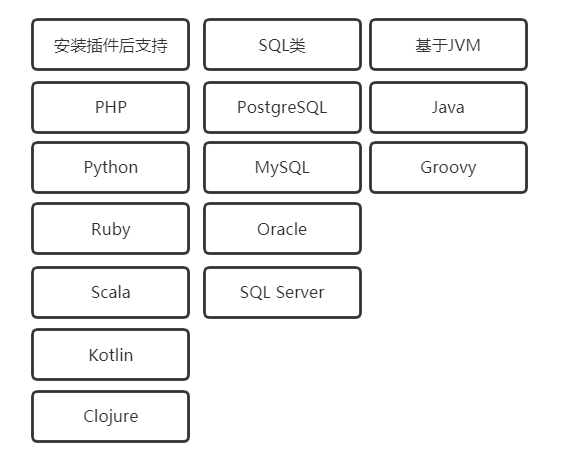


3. IDEA的优势（相对于Eclipse）
    1. 强大的整合能力。比如: Git、 Maven、 Spring 等
    2. 提示功能的快速、便捷
    3. 提示功能的范围广
    4. 好用的快捷键和代码模板
    5. 精准搜索

### IntelliJ_IDEA的下载和安装的准备

1. 官网: https://www.jetbrains.com


2. 安装的准备：
    1. 硬件环境：
    内存8G以上
    CPU i5以上
    安装在固态硬盘下
    2. 软件环境：
    需要安装JDK

### IDEA的卸载

对于免安装的idea：
1. 删除安装文件
2. 到用户下将idea的缓存，配置的目录删除掉即可 

安装idea:
1. 可以用控制面板--》程序

### IDEA的安装和破解

1. 将安装包进行解压--》选择固态盘符
2. 发送到桌面快捷方式，生成一个快捷方式
3. 打开：

选择主题：


先进入再说，免费试用：

创建一个项目：

选择JDK：


找到jetbrains-agent.jar 文件，然后放入合适的文件夹内（我一般直接放入idea的安装位置了，你随意，不建议有中文路径）
点击IDEA的菜单，找到： Help---》Edit Custom VM Options

然后在文件中最后一行填入：
-javaagent:D:\soft_setup\IDEA\ideaIU-2019.2.3.win\jetbrains-agent.jar
注意这个jetbrains-agent.jar的路径要是你自己的真实的路径。

关闭IDEA
再次打开IDEA，点击菜单 ，Help---》Register:


关闭IDEA
重启IDEA
看到带Licenseed to..字样的 证明激活成功！

### IDEA页面展示

1. 项目下内容：
- 工程下的src类似于Eclipse下的src目录，用于存放代码。。
- 工程下的.idea 和TestProject.iml文件都是IDEA工程特有的。类似于Eclipse 工程下的settings、.classpath、.project 等。
2. 配置：


### Module的概念和使用

1. 在Eclipse中我们有Workspace (工作空间)和Project (工程)的概念，在IDEA中只有Project (工程)和Module (模块)的概念。
这里的对应关系为: 
IDEA官网说明:
An Eclipse workspace is similar to a project in IntelliJ IDEA 
An Eclipse project maps to a module in IntelliJ IDEA
翻译:
Eclipse中 workspace 相当于 IDEA中的Project
Eclipse中   Project     相当于 IDEA中的Module
在IntelliJ IDEA中Project(工程) 是最顶级的级别，次级别是Module(模块)。 
一个Project下可以有多个Module。
2. 从Eclipse 转过来的人总是下意识地要在同一个窗口管理n个项目，这在Intellij IDEA是无法做到的。Intellij IDEA提供的解决方案是打开多个项目实例，即打开多个项目窗口。即:一个Project 打开一个Window窗口。
3. IDEA这样设置的原因：
目前主流的大型项目都是分布式部署的，结构都是类似这种多Module的。
这类项目一般是这样划分的，比如: 积分模块、任务模块、活动模块等等，模块之间彼此可以相互依赖。这些Module之间都是处于同一个项目业务下的模块，彼此之间是有不可分割的业务关系的。
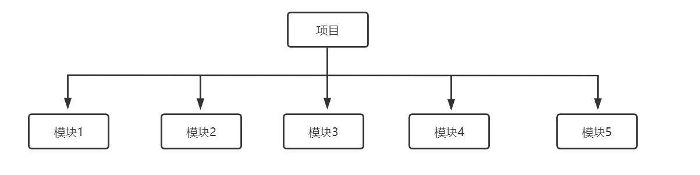

4. out目录的说明：里面存放的是编译后的字节码文件


5. 删除模块：
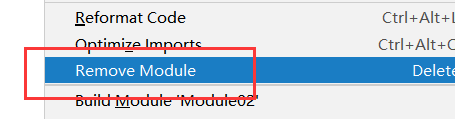

### IDEA的常用设置

1. 进入设置：


2. 设置主题：


3. 编辑区的字体变大或者变小：


4. 鼠标悬浮在代码上有提示：


5. 自动导包和优化多余的包：
手动导包：快捷键：alt+enter
自动导包和优化多余的包：


6. 同一个包下的类，超过指定个数的时候，导包合并为*


7. 显示行号 ，  方法和方法间的分隔符：


8. 忽略大小写，进行提示：


9. 多个类不隐藏，多行显示：


10. 设置默认的字体，字体大小，字体行间距：(编辑区和控制台都会变化)


11. 修改代码中注释的字体颜色：


12. 修改类头的文档注释信息：---》注意：对新建的类才有效
```java
/**
* @Auther:  
* @Date: ${DATE} - ${MONTH} - ${DAY} - ${TIME} 
* @Description: ${PACKAGE_NAME}
* @version: 1.0
*/
```


13. 设置项目文件编码：

文件右下角可以调节编码格式：


14. 自动编译：


15. 省电模式：


16. 代码显示结构：


17. 导入jar包：
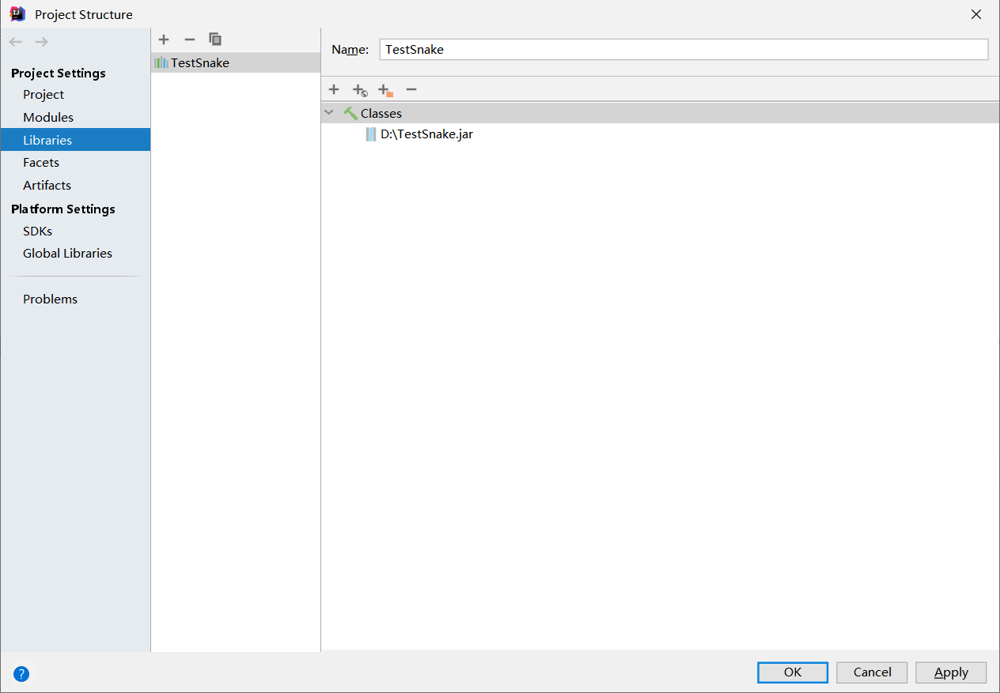

18. 生成序列化版本号：

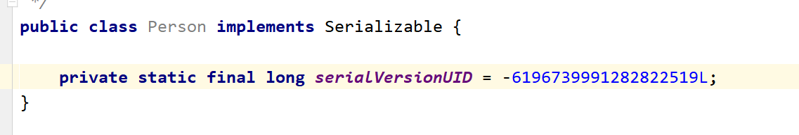

### IDEA的常用快捷键

1. 创建内容：alt+insert
2. main方法：psvm
3. 输出语句：sout
4. 复制行：ctrl+d
5. 删除行：ctrl+y


6. 代码向上/下移动：Ctrl + Shift + Up / Down
7. 搜索类：  ctrl+n
8. 生成代码  ：alt + Insert（如构造函数等，getter,setter,hashCode,equals,toString）
9. 百能快捷键 : alt + Enter （导包，生成变量等）
10. 单行注释或多行注释 ：  Ctrl + / 或 Ctrl + Shift + /
11. 重命名 shift+f6
12. for循环  直接 ：fori   回车即可
13. 代码块包围：try-catch,if,while等  ctrl+alt+t
14. 代码自动补全提示:


15. idea代码字体大小放大和缩小的快捷键


16. 代码一层一层调用的快捷键：
点进源码：ctrl+鼠标悬浮在代码上+点进去即可：


17. 显示代码结构  : alt + 7
18. 显示导航栏： alt +1 
19. 撤回：ctrl+z
20. REDO操作：
如果跟搜狗输入法的快捷键冲突，可以选择将搜狗的快捷键取消。


21. 缩进：tab  取消缩进： shift+tab

### 模板的使用

#### 代码模板是什么

它的原理就是配置一些常用代码字母缩写，在输入简写时可以出现你预定义的固定模式的代码，使得开发效率大大提高，同时也可以增加个性化。最简单的例子就是在Java中输入sout会出现System.out.println();

1. 所处位置：
    1. Live Templates
    2. Postfix Completion


2. 区别：
    1. Live Templates中可以做用户的个性化定制。
    Postfix Completion中只能用，不能修改。
    2. 使用方式不同


#### 修改现有模板

1. 案例1：改main方法：  psvm
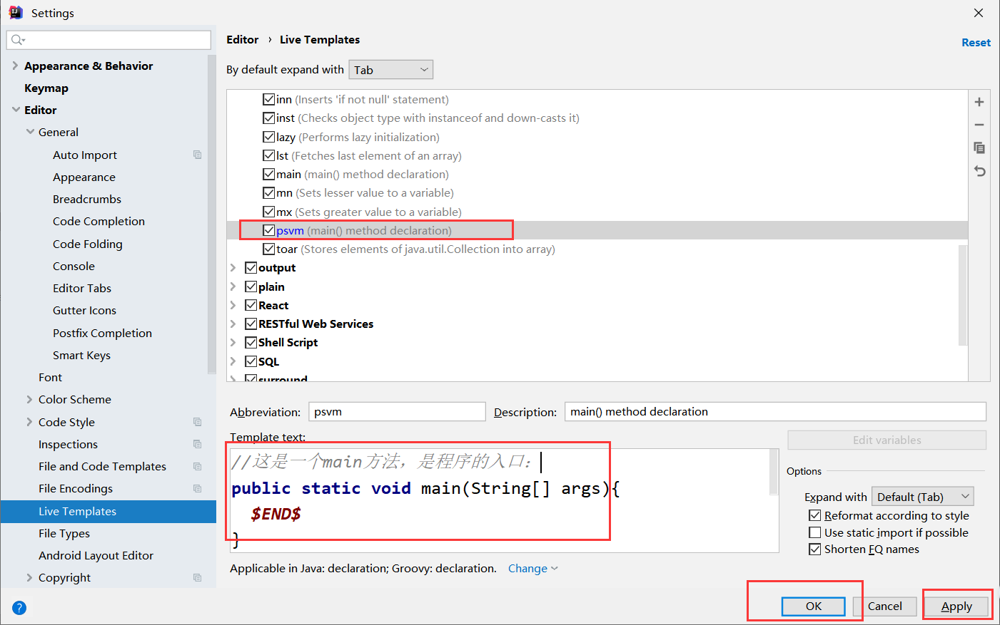
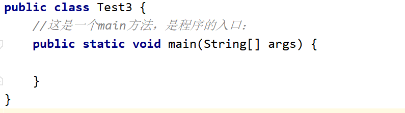

2. 案例2：修饰属性的修饰符：


#### 常用的代码模板

1. 模板1： main方法：
main  或者 psvm

2. 模板2：输出语句：
sout   或者   .sout
一些变型：
soutp:打印方法的形参
soutm:打印方法的名字
soutv:打印变量

3. 模板3： 循环
普通for循环：   fori（正向）   或者   .fori （正向）   . forr(逆向)
增强for循环：  iter  或者  .for
（可以用于数组的遍历，集合的遍历）

4. 模板4： 条件判断
ifn 或者  .null ：判断是否为null  （if null）
inn 或者 .nn ：判断不等于null   (if not null)

5. 模板5： 属性修饰符：
prsf : private static final
psf  :public static final

#### 自定义模板

1. 测试方法：


2. 常用属性：($$中的内容其实就是在定义光标的位置，光标可以切换，用回车切换)


3. 方法注释模板：
```java
/**
* 功能描述:
* @param: $param$
* @return: $return$
* @auther: $user$
* @date: $date$ $time$
*/  
```


### IDEA中的断点调试

#### 常用断点调试快捷键

调试在开发中大量应用：
1. Debug的优化设置：更加节省内存空间：
设置Debug连接方式，默认是Socket。 Shared memory是Windows 特有的一个属性，一般在Windows系统下建议使用此设置，
内存占用相对较少。
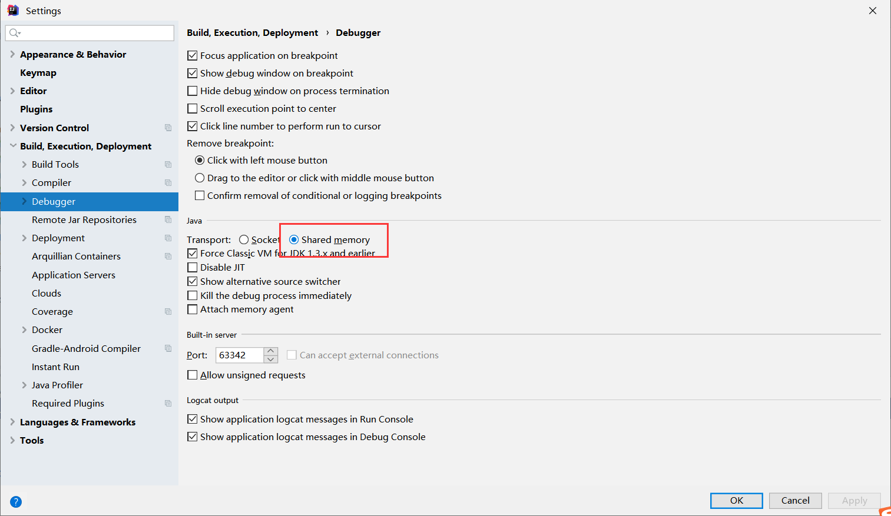

2. 常用断点调试快捷键：

一步一步的向下运行代码，不会走入任何方法中。
一步一步的向下运行代码，不会走入系统类库的方法中，但是会走入自定义的方法中。
一步一步的向下运行代码，会走入系统类库的方法中，也会走入自定义的方法中。
跳出方法
结束程序
进入到下一个断点，如果没有下一个断点了，就直接运行到程序结束。
在当前次取消未执行的断点。

#### 条件判断，查看表达式的值

1. 条件判断：
说明:
调试的时候，在循环里增加条件判断，可以极大的提高效率，心情也能惧悦。 
具体操作: 
在断点处右击调出条件断点。可以在满足某个条件下，实施断点。 


2. 查看表达式的值：
选择行，alt+f8。


# 第八章_面向对象

## 面向过程和面向对象的区别

面向过程: 当事件比较简单的时候, 利用面向过程, 注重的是事件的具体的步骤/过程, 注重的时过程中的具体行为, 以函数为最小单位, <strong style="color:orange">考虑怎么做</strong>
面向对象: 注重找"参与者", 将功能封装进对象, 强调具备了功能的对象, 以类/对象为最小单位, <strong style="color:orange">考虑谁来做</strong>
案例：
人把大象装进冰箱：
面向过程：
函数1：打开冰箱(){人站在冰箱前，打开冰箱，冰箱卡到30度角的时候，冰箱的灯打开了.........}
函数2：储存大象(){大象先迈左腿，再迈右退，考虑冰箱能不能装下......}
函数3：关闭冰箱(){人站在冰箱前，关闭冰箱，冰箱开到30度角的时候，冰箱的灯关闭了..........}
面向对象：
人{
  打开(冰箱){
    冰箱.打开();
  }

  存储(大象){
    大象.进入();
  }

  关闭(冰箱){
    冰箱.关闭();
  }
}


冰箱{
  打开() { 1.2.3.}
  关闭() {}
}

柜子{
}

大象{
  进入(冰箱){
  }
}

面向过程 ---> 面向对象, 其实就是由执行者 ---> 指挥者的一个过渡
面向过程：编年体
面向对象：纪传体
二者相辅相成, 并不是对立的, 解决复杂问题, 通过面向对象方式便于我们从宏观上把握事物之间复杂的关系, 方便我们分析整个系统, 具体到围观操作, 仍然使用面向过程方式来处理

## 类和对象的关系

1. 万事万物皆对象
2. 对象: 具体的事物, 具体的实体, 具体的实例, 模板下具体的产品
3. 类: 对对象向上抽取出公共的部分, 形成类, 类是对象的, 是一个模板
4. 一般卸载代码的时候先写类, 然后在根据类创建对应的对象

## 面向对象的三个阶段

面向对象的三个阶段:
1. 面向对象分析OOA —— Object Oriented Analysis
对象: 张三, 李四, 王五
抽取出一个人类 ---> 人类
类里有什么:
动词 --> 动态特性 --> 方法体
名词 --> 静态特性 --> 属性
2. 面向对象设计OOD —— Object Oriented Design
现有类, 再有对象
类: 人类: Person
对象: 张三, 李四, 王五
3. 面向对象编程OOP —— Object Oriented Programming

## 创建类

- 创建类
1. 属性(field成员变量)
属性用于定义该类或该对象包含的数据或者说静态特征, 属性作用范围是整个类体
属性定义格式:
```java
[修饰符] 属性类型 属性名 = [默认值];
```
2. 方法
方法用于定义该类或该类的实例的行为特征和功能实现, 方法是类和对象行为特征的抽象, 方法很类似于面向过程中的函数, 面向过程中, 函数是最基本单位, 整个程序由一个个函数调用组成, 面向对象中, 整个程序的基本单位是类, 方法是从属于类和对象的
方法定义格式:
```java
[修饰符] 方法返回值类型 方法名(形参列表) {
  // n条语句
}
```
void代表没有返回值, 方法的作用: 重用代码, 封装功能, 便于修改

代码:
```java
package com.cn.dhc;
/**
 * @Auther: Evin_D
 * @Date: 2022/9/24 - 上午10:44
 * @Description: com.cn.dhc
 * @version: 1.0
 */
public class Person {
    // 名词 ---> 属性 ---> 成员变量 ---> 放在类中方法外(注意: 我们值把有需要的内容写到代码里, 不相关的东西不要放在代码中)
    int age; // 年龄
    String name; // 姓名
    double height; // 身高
    double weight; // 体重

    // 动词 ---> 方法
    /**
    * 功能描述:吃饭
    * @param: null
    * @return: null
    * @auther: Evin_D
    * @date: 2022/9/24 - 上午11:10
     */  
    public void eat() {
        System.out.println("吃饭");
    }
    /**
    * 功能描述: 睡觉
    * @param: String address
    * @return: null
    * @auther: Evin_D
    * @date: 2022/9/24 - 上午11:15
     */
    public void sleep(String address) {
        System.out.println("我在" + address + "睡觉");
    }
    /**
    * 功能描述: 自我介绍
    * @param: 
    * @return: String
    * @auther: Evin_D
    * @date: 2022/9/24 - 上午11:18
     */
    public String introduce() {
        return "我的名字是: " + name + ", 我的年龄是: " + age + ", 我的身高是: " + height + ", 我的体重是:" + weight;
    }
}
```

## 创建对象

```java
package com.cn.dhc;

/**
 * @Auther: Evin_D
 * @Date: 2022/9/24 - 上午11:44
 * @Description: com.cn.dhc
 * @version: 1.0
 */
public class Test { // 测试类
  // 这是一个main方法, 是程序的入口
  public static void main(String[] args) {
    // 创建一个人类的具体的对象/实例
    // 创建一个对象, 对象的名字叫:person
    // Person属于引用数据类型
    // 第一次加载类的时候, 会进行类的加载, 初始化创建对象的时候, 对象的属性没有给赋值, 有默认的初始化的值
    Person person = new Person();
    person.name = "张三";
    person.age = 19;
    person.height = 170.0;
    person.weight = 155.0;

    // 再创建一个对象
    // 再次创建类的时候, 就不会进行类的加载了, 类的加载只在第一次需要的时候加载一次
    Person person1 = new Person();
    person1.name = "李四";
    person1.age = 20;
    person1.height = 180.0;
    person1.weight = 167.0;

    // 对属性值进行读取:
    System.out.println(person.name);
    System.out.println(person1.age);

    // 对方法进行操作
    // 不同的对象, 属性有自己的特有的值, 但是方法都是调用类中通用的方法
    // 属性: 各个对象的属性是独立的
    // 方法： 各个对象的方法是共享的
    person.eat();
    person1.eat();
    person.sleep("教室");
    System.out.println(person.introduce());
  }
}
```

## 局部变量和成员变量的区别

- 区别1：代码中位置不同
         成员变量：类中方法外定义的变量
         局部变量：方法中定义的变量  代码块中定义的变量
- 区别2：代码的作用范围
         成员变量：当前类的很多方法
         局部变量：当前一个方法（当前代码块）   

- 区别3：是否有默认值
         成员变量：有
         局部变量：没有


引用数据类型： null
- 区别4：是否要初始化
         成员变量：不需要，不建议初始化，后续使用的时候再赋值即可
         局部变量：一定需要，不然直接使用的时候报错

- 区别5：内存中位置不同
         成员变量：堆内存
         局部变量：栈内存   
- 区别6：作用时间不同
         成员变量：当前对象从创建到销毁
         局部变量：当前方法从开始执行到执行完毕
代码:
```java
package com.cn.dhc;

/**
 * @Auther: Evin_D
 * @Date: 2022/9/24 - 下午1:29
 * @Description: com.cn.dhc
 * @version: 1.0
 */
public class Student {
    byte e;
    short s;
    int c; // 成员变量: 在类中方法外
    long num2;
    float f;
    double d;
    char ch;
    boolean bo;
    String name;
    public void study() {
        int num = 10; // 局部变量: 在方法中
        System.out.println(num); // 10
        // int num; 重复命名, 出错了
        {
            int a; // 局部变量: 在代码块中
        }
        if (1==3) {
            int b;
        }
        System.out.println(c);
    }
    public void eat() {
        System.out.println(c);
    }

    public static void main(String[] args) {
        Student student = new Student();
        System.out.println(student.c);
        System.out.println(student.bo);
        System.out.println(student.ch);
        System.out.println(student.d);
        System.out.println(student.e);
        System.out.println(student.f);
        System.out.println(student.name);
        System.out.println(student.num2);
        System.out.println(student.s);
    }
}
```
运行结果:


## 构造器

```java
package com.cn.dhc2;

/**
 * @Auther: Evin_D
 * @Date: 2022/9/24 - 下午1:46
 * @Description: com.cn.dhc2
 * @version: 1.0
 */
public class Person {
    // 构造器: 没有任何参数的构造器我们叫做: 无参构造器
    public Person() {
        /*age = 19;
        name = "张三";
        height = 170.0;*/
    }
    // 属性
    String name;
    int age;
    double height;

    // 方法
    /**
    * 功能描述: 吃
    * @param:
    * @return: null
    * @auther: Evin_D
    * @date: 2022/9/24 - 下午1:47
     */
    public void eat() {
        System.out.println("吃");
    }
}
```

```java
package com.cn.dhc2;

/**
 * @Auther: Evin_D
 * @Date: 2022/9/24 - 下午1:47
 * @Description: com.cn.dhc2
 * @version: 1.0
 */
public class Test {
    public static void main(String[] args) {
        // 创建一个Person类的具体对象/实例/实体:
        /**
         * 创建对象的过程
         * 1. 第一次遇到Person的时候, 进行类的加载(只加载一次)
         * 2. 创建对象, 为这个对象在堆中开辟空间
         * 3. 为对象进行属性的初始化动作
         * new关键字实际上是在调用一个方法, 这个方法叫构造方法(构造器)
         * 调用构造器的时候, 如果你的类中没有写构造器, 那么系统会默认给你分配一个构造器, 只是我们看不到罢了
         * 可以自己显示的将构造器编写出来
         * 构造器的格式:
         * [修饰符] 构造器的名字() {
         *
         * }
         * 构造器和方法的区别:
         * 1. 没有方法的返回值类型
         * 2. 方法体内部不能有return语句
         * 3. 构造器的名字很特殊, 必须跟类名一样
         * 构造器的作用: 不是为了创建对象, 因为在调用构造器前, 这个对象就已经创建好了, 并且属性有默认的初始化的值调用构造器的目的时给属性进行赋值操作的
         * 注意: 我们一般不会在空构造器中进行初始化操作, 因为那样的话每个对象的属性就一样了
         * 实际上, 我们只要保证空构造器的存在就可以了, 里面的东西不用写
         */
        Person person = new Person();
        System.out.println(person.age);
        System.out.println(person.name);
        System.out.println(person.height);

        Person person1 = new Person();
        System.out.println(person1.age);
        System.out.println(person1.name);
        System.out.println(person1.height);

    }
}
```

## 构造器的重载

```java
package com.cn.dhc3;

/**
 * @Auther: Evin_D
 * @Date: 2022/9/24 - 下午1:46
 * @Description: com.cn.dhc2
 * @version: 1.0
 */
public class Person {
    // 属性
    String name;
    int age;
    double height;

    // 构造器: 没有任何参数的构造器我们叫做: 无参构造器
    public Person() {
    }
    public Person(String name, int age, double height) {
        // 当形参名字和属性名字重名的时候, 会出现就近原则:
        // 在要表示对象的属性前加上this.来修饰, 因为this代表的就是你创建的哪个对象
        this.name = name;
        this.age = age;
        this.height = height;
    }
    public Person(String name, int age) {
        this.name = name;
        this.age = age;
    }

    // 方法
    /**
    * 功能描述: 吃
    * @param:
    * @return: null
    * @auther: Evin_D
    * @date: 2022/9/24 - 下午1:47
     */
    public void eat() {
        System.out.println("吃");
    }
}
```
```java
package com.cn.dhc3;

/**
 * @Auther: Evin_D
 * @Date: 2022/9/24 - 下午1:47
 * @Description: com.cn.dhc2
 * @version: 1.0
 */
public class Test {
    public static void main(String[] args) {
        /**
         * 1. 一般保证空构造器的存在, 空构造器中一般不会进行属性的赋值操作
         * 2. 一般我们会重载构造器, 在重载构造器中进行属性赋值
         * 3. 在重载构造器以后, 假如空构造器忘写了, 系统也不会给你分配默认的空构造器了, 那么你要调用的话就会出错了
         * 4. 在要表示对象的属性前加上this.来修饰, 因为this代表的就是你创建的哪个对象
         */
        // 创建一个Person类的具体对象/实例/实体:
        Person person = new Person();
        Person person1 = new Person("zhangsan", 19, 170.0);
        System.out.println(person1.age);
        System.out.println(person1.name);
        System.out.println(person1.height);
    }
}
```

## 内存分析

### 代码1

```java
 public class Person {
  int  id;
  int  age;

  public static void main(String args[]){
    Person p1= new Person();
  }
}
```
内存分析:


### 代码2

```java
public class Person {
  int id;
  int age;
  String school;
  public Person (int a,int b,String c){
    id=a;
    age=b;
    school=c;
  }
  public static void main(String args[]){
    Person p= new Person(1,20, "海淀");
  }
}
```
内存分析:


### 代码3

```java
class Person{
  int id;
  int age;
  String school;
  Person (int a,int b,String c){
    id=a;
    age=b;
    school=c;
  }

  public void setAge(int a){
    age=a;
  }
}
```
```java

public class Test {
    public static void main(String[] args) {
      Test t=new Test();
      int age=40;
      Person tom=new Person(1,20,"海淀");
      Person jack=new Person(2,30,"朝阳");
      t.change1(age);
      t.change2(tom);
      t.change3(jack);
      System.out.println(age); //40
      System.out.println("id:"+jack.id+",age:"+jack.age+",school:"+jack.school); //id:2,age:66,school:"朝阳"
    }
    public void change1(int i){
      i=3366;
    }

    public void change2(Person p){
      p=new Person(3,22,"西城");
    }

    public void change3(Person p){
      p.setAge(66);
    }
}
```


## this

1. 创建对象的过程：
    1. 在第一次遇到一个类的时候，对这个类要进行加载，只加载一次。
    2. 创建对象，在堆中开辟空间
    3. 对对象进行初始化操作，属性赋值都是默认的初始值。
    4. new关键字调用构造器，执行构造方法，在构造器中对属性重新进行赋值
this:


从上面的效果能够看到：this指代的就是当前对象：

内存：

this关键字 用法：
1. this可以修饰属性：
总结：当属性名字和形参发生重名的时候，或者  属性名字 和局部变量重名的时候，都会发生就近原则，所以如果我要是直接使用变量名字的话就指的是离的近的那个形参或者局部变量，这时候如果我想要表示属性的话，在前面要加上：this.修饰
如果不发生重名问题的话，实际上你要是访问属性也可以省略this.

```java
package com.cn.dhc4;

/**
 * @Auther: Evin_D
 * @Date: 2022/9/24 - 下午3:29
 * @Description: com.cn.dhc4
 * @version: 1.0
 */
public class Person {
    int age;
    String name;
    double height;
    public Person() {
    }
    public Person(int age, String name, double height) {
        this.age = age;
        this.name = name;
        this.height = height;
    }
    public void eat() {
        int age = 10;
        System.out.println(age); // 就近原则, age指的是离他近的age ---> 局部变量的age
        System.out.println(this.age); // 这里指代的就是属性的age
        System.out.println("吃");
    }
}
```
2. this修饰方法：
总结：在同一个类中，方法可以互相调用，this.可以省略不写。

```java
package com.cn.dhc4;

/**
 * @Auther: Evin_D
 * @Date: 2022/9/24 - 下午3:29
 * @Description: com.cn.dhc4
 * @version: 1.0
 */
public class Person {
    int age;
    String name;
    double height;
    public Person() {
    }
    public Person(int age, String name, double height) {
        this.age = age;
        this.name = name;
        this.height = height;
    }
    public void play() {
        /*this.*/eat();
        System.out.println("上网");
        System.out.println("洗澡");
    }
    public void eat() {
        System.out.println(/*this.*/age);
        System.out.println("吃饭");
    }
}
```
3. this可以修饰构造器：
总结：同一个类中的构造器可以相互用this调用，注意：this修饰构造器必须放在第一行
```java
package com.cn.dhc4;

/**
 * @Auther: Evin_D
 * @Date: 2022/9/24 - 下午3:29
 * @Description: com.cn.dhc4
 * @version: 1.0
 */
public class Person {
    int age;
    String name;
    double height;
    public Person() {
    }
    public Person(int age, String name, double height) {
        this(age, name);
        this.height = height;
    }
    public Person(int age, String name) {
        this(age);
        this.name = name;
    }
    public Person(int age) {
        this.age = age;
    }
}
```

## static

1. static可以修饰：属性，方法，代码块，内部类。
2. static修饰属性；
```java
package com.cn.dhc5;

/**
 * @Auther: Evin_D
 * @Date: 2022/9/24 - 下午5:18
 * @Description: com.cn.dhc5
 * @version: 1.0
 */
public class Test {
    int id;
    static int sid;

    public static void main(String[] args) {
        Test.sid = 100;
        System.out.println(Test.sid);

        Test test1 = new Test();
        test1.id = 10;
        test1.sid = 10;

        Test test2 = new Test();
        test2.id = 20;
        test2.sid = 20;

        Test test3 = new Test();
        test3.id = 30;
        test3.sid = 30;

        System.out.println(test1.id);
        System.out.println(test2.id);
        System.out.println(test3.id);

        System.out.println(test1.sid);
        System.out.println(test2.sid);
        System.out.println(test3.sid);
    }
}
```
内存分析：

一般官方的推荐访问方式：可以通过类名.属性名的方式去访问：


static修饰属性总结：
  1. 在类加载的时候一起加载入方法区中的静态域中
  2. 先于对象存在
  3. 访问方式： 对象名.属性名    类名.属性名（推荐）

  static修饰属性的应用场景：某些特定的数据想要在内存中共享，只有一块 --》这个情况下，就可以用static修饰的属性
  ```java
  package com.cn.dhc5;

  /**
  * @Auther: Evin_D
  * @Date: 2022/9/24 - 下午5:28
  * @Description: com.cn.dhc5
  * @version: 1.0
  */
  public class Student {
      String name;
      int age;
      static String school;

      public static void main(String[] args) {
          Student.school = "辽宁工业大学";
          Student student1 = new Student();
          student1.name = "张三";
          student1.age = 19;
  //        student1.school = "辽宁工业大学";

          Student student2 = new Student();
          student2.name = "李四";
          student2.age = 20;
  //        student2.school = "辽宁工业大学";
          System.out.println(student2.school);
      }
  }
  ```
  属性：
  静态属性 （类变量）
  非静态属性（实例变量）

3. static修饰方法；
```java
package com.cn.dhc5;

/**
 * @Auther: Evin_D
 * @Date: 2022/9/24 - 下午5:34
 * @Description: com.cn.dhc5
 * @version: 1.0
 */
public class Demo {
    int id;
    static int sid;
    public void a() {
        System.out.println(id);
        System.out.println(sid);
        System.out.println("---------a");
    }
    // 1. static和Public都是修饰符, 并列的没有先后顺序, 先写谁厚些谁都行
    static public void b() {
//         System.out.println(id); // 2. 在静态方法中不能访问非静态的属性
//         a(); // 3. 在静态方法中不能访问非静态的方法
//        System.out.println(this.id); //4. 在静态方法中不能使用this关键字
        System.out.println(sid);
        System.out.println("---------b");
    }

    public static void main(String[] args) {
        // 5. 非静态的方法可以用对象名.方法名去调用
        Demo demo = new Demo();
        demo.a();

        // 6. 静态的方法可以用对象名.方法名去调用也可以用类名.方法名调用(推荐)
        Demo.b();
        demo.b();

        // 在同一个类中可以直接调用
        b();
    }
}
```

## 代码块

1. 类的组成：属性，方法，构造器，代码块，内部类
2. 代码块分类：普通块，构造块，静态块，同步块（多线程）
3. 代码：
```java
package com.cn.dhc6;

/**
 * @Auther: Evin_D
 * @Date: 2022/9/24 - 下午5:45
 * @Description: com.cn.dhc6
 * @version: 1.0
 */
public class Test {
    // 属性
    int a;
    static int sa;

    // 方法
    public void a() {
        System.out.println("方法a");
        {
            // 普通块限制了局部变量的作用范围
            System.out.println("普通块");
            int num = 10;
            System.out.println(num);
        }
    }
    public static void b() {
        System.out.println("方法b");
    }
    // 构造块
    {
        System.out.println("构造块");
    }
    // 静态块
    static{
        // 在静态块中只能访问: 静态属性, 静态方法
        System.out.println("静态块");
        System.out.println(sa);
        b();
    }
    // 构造器
    public Test() {
        System.out.println("这是空构造器");
    }
    public Test(int a) {
        this.a = a;
    }
    public static void main(String[] args) {
        Test test1 = new Test();
        test1.a();

        Test test2 = new Test();
        test2.a();
    }
}
```
- 总结：
代码块执行顺序：
最先执行静态块，只在类加载的时候执行一次，所以一般以后实战写项目：创建工厂，数据库的初始化信息都放入静态块。
一般用于执行一些全局性的初始化操作。
再执行构造块，（不常用）
再执行构造器，
再执行方法中的普通块。

## 包，import

1. 生活案例：
邮寄快递：中国.北京.通州区.****小区.5号楼.3单元.101房.赵珊珊
历史：常山赵子龙

2. 包的作用：
为了解决重名问题（实际上包对应的就是盘符上的目录）
解决权限问题

3. 创建包：


包名定义：
    1. 名字全部小写
    2. 中间用.隔开
    3. 一般都是公司域名倒着写 ：  com.jd   com.dhc
    4. 加上模块名字：com.jd.login    com.jd.register
    5. 不能使用系统中的关键字：nul,con,com1---com9.....
    6. 包声明的位置一般都在非注释性代码的第一行：

4. 导包问题
```java
package com.cn.dhc7;

import com.cn.dhc2.Person; // 导包

import java.util.Date;

/**
 * @Auther: Evin_D
 * @Date: 2022/9/26 - 下午9:06
 * @Description: com.cn.dhc7
 * @version: 1.0
 */
public class Test {
    public static void main(String[] args) {
        new Person();
        new Date();
        new java.sql.Date(1000L); // 在导包以后, 还想用其他包下同名的类, 就必须要手动自己写所在的包
        new Demo();
    }
}
```

- 总结：
 

5. 在Java中的导包没有包含和被包含的关系：
设置目录平级的格式（不是包含和被包含的显示）：


6. 静态导入：
```java
package com.cn.dhc11;
// 静态导入
import static java.lang.Math.*;
// 导入: java.lang下的Math类中的所有静态内容
/**
 * @Auther: Evin_D
 * @Date: 2022/9/26 - 下午9:23
 * @Description: com.cn.dhc11
 * @version: 1.0
 */
public class Test {
    public static void main(String[] args) {
        System.out.println(random());
        System.out.println(PI);
        System.out.println(round(5.6));
    }
    // 在静态导入后, 同一个类中所有相同的方法的时候, 会有限走自己定义的方法
    public static int round(double a) {
        return 1000;
    }
}
```

## 三大特性

### 封装(Encapsulation)

1. 生活案例：
ATM ,  电线
2. Java中封装的理解：
将某些东西进行隐藏，然后提供相应的方式进行获取。

我们程序设计追求“高内聚，低耦合”。

- 高内聚:类的内部数据操作细节自己完成，不允许外部干涉;
- 低耦合:仅对外暴露少量的方法用于使用。 
隐藏对象内部的复杂性，只对外公开简单的接口。便于外界调用，从而提
高系统的可扩展性、可维护性。通俗的说，把该隐藏的隐藏起来，该暴露
的暴露出来。这就是封装性的设计思想。 
3. 封装的好处：
提高代码的安全性
4. 代码：通过一个属性感受封装：
```java
package cn.com.dhc;

/**
 * @Auther: Evin_D
 * @Date: 2022/9/26 - 下午9:35
 * @Description: cn.com.dhc
 * @version: 1.0
 */
public class Girl {
    // 属性:
    private int age;

    // 读取年龄
    public int getAge() {
        return age;
    }

    // 设置年龄
    public void setAge(int age) {
        if (age >= 30) {
            this.age = 18;
        }
        this.age = age;
    }
}
```
```java
package cn.com.dhc;

/**
 * @Auther: Evin_D
 * @Date: 2022/9/26 - 下午9:35
 * @Description: cn.com.dhc
 * @version: 1.0
 */
public class Test {
    public static void main(String[] args) {
        Girl girl = new Girl();
        /*girl.age = 18;
        System.out.println(girl.age);*/
        // 设置年龄
        girl.setAge(29);
        // 读取年龄
        System.out.println(girl.getAge());
    }
}
```

上面的代码，对于属性age来说，我加了修饰符private，这样外界对它的访问就受到了限制，现在我还想加上其他的限制条件，但是在属性本身上没有办法再加了，所以我们通过定义方法来进行限制条件的添加。
  以属性为案例：
  进行封装：
    1. 将属性私有化，被private修饰--》加入权限修饰符
    一旦加入了权限修饰符，其他人就不可以随意的获取这个属性
    2. 提供public修饰的方法让别人来访问/使用
    3. 即使外界可以通过方法来访问属性了，但是也不能随意访问，因为咱们在方法中可以加入 限制条件。

5. 实际开发中，方法一般会写成 setter，getter方法：
可以利用IDEA快捷键生成：alt+insert -->getter and setter:
6. 加深练习：
```java
package cn.com.dhc2;

/**
 * @Auther: Evin_D
 * @Date: 2022/9/26 - 下午9:47
 * @Description: cn.com.dhc2
 * @version: 1.0
 */
public class Student {
    private int age;
    private String name;
    private String sex;
    public int getAge() {
        return age;
    }

    public void setAge(int age) {
        this.age = age;
    }

    public String getName() {
        return name;
    }

    public void setName(String name) {
        this.name = name;
    }

    public String getSex() {
        return sex;
    }

    public void setSex(String sex) {
        if ("男".equals(sex) || "女".equals(sex)) {
            this.sex = sex;
        } else  {
            this.sex = "男";
        }
    }
    public Student() {}
    public Student(String name, int age, String sex) {
        this.name = name;
        this.age = age;
        this.setSex(sex);
    }
}
```
```java
package cn.com.dhc2;

/**
 * @Auther: Evin_D
 * @Date: 2022/9/26 - 下午9:47
 * @Description: cn.com.dhc2
 * @version: 1.0
 */
public class Test {
    public static void main(String[] args) {
        Student student = new Student();
        student.setName("张三");
        student.setAge(20);
        student.setSex("男");
        System.out.println(student.getName() + "-----" + student.getAge() + "-----" + student.getSex());

        Student student1 = new Student("李四", 21, "女");
        System.out.println(student1.getName() + "-----" + student1.getAge() + "-----" + student1.getSex());

    }
}
```

### 继承(Inheritance)

1. 类是对对象的抽象：
举例：
荣耀20 ，小米 红米3，华为 p40 pro   ---> 类：手机类
2. 继承是对类的抽象：
举例：
学生类：Student：
属性：姓名，年龄，身高，学生编号
方法：吃饭，睡觉，喊叫，学习
教师类：Teacher:
属性：姓名，年龄，身高，教师编号
方法：吃饭，睡觉，喊叫，教学
员工类：Emploee:
属性：姓名，年龄，身高，员工编号
方法：吃饭，睡觉，喊叫，工作
共同的东西：
人类：
属性：姓名，年龄，身高
方法：吃饭，睡觉，喊叫
学生类/教师类/员工类  继承 自   人类  
以后定义代码：
先定义人类：
人类： ---》父类，基类，超类
属性：姓名，年龄，身高
方法：吃饭，睡觉，喊叫
再定义 ： ---》子类，派生类
学生类：Student：
属性：学生编号
方法：学习
教师类：Teacher:
属性：教师编号
方法：教学
员工类：Emploee:
属性：员工编号
方法：工作 
子类  继承自  父类 
狗类：
属性：姓名，年龄，身高
方法：吃饭，睡觉，喊叫
我们的继承关系，是在合理的范围中进行的抽取 ，抽取出子类父类的关系：
上面的案例中：
学生类/教师类/员工类  继承 自   人类   ---》合理
学生类/教师类/员工类  继承 自   狗类   ---》不合理
区分：
学生是一个人
教师是一个人
员工是一个人   ---》合理
学生是一个狗    ---》不合理
总结：继承 就是  is - a 的关系 
3. 代码层面的解释：
先写父类，再写子类：
父类：人类  Person
子类：学生类   Student
```java
package cn.com.dhc3;

/**
 * @Auther: Evin_D
 * @Date: 2022/9/27 - 下午9:28
 * @Description: cn.com.dhc3
 * @version: 1.0
 */
public class Person {
    private int age;
    private String name;
    private double height;

    public int getAge() {
        return age;
    }

    public void setAge(int age) {
        this.age = age;
    }

    public String getName() {
        return name;
    }

    public void setName(String name) {
        this.name = name;
    }

    public double getHeight() {
        return height;
    }

    public void setHeight(double height) {
        this.height = height;
    }
    public void eat() {
        System.out.println("吃饭");
    }
    public void sleep() {
        System.out.println("睡觉");
    }
}
```
```java
package cn.com.dhc3;

/**
 * @Auther: Evin_D
 * @Date: 2022/9/27 - 下午9:32
 * @Description: cn.com.dhc3
 * @version: 1.0
 */
public class Student extends Person{ // 子类Student继承父类Person
    private int sno;
    public int getSno() {
        return sno;
    }

    public void setSno(int sno) {
        this.sno = sno;
    }

    public void study() {
        System.out.println("学习");
    }
}
```
```java
package cn.com.dhc3;

/**
 * @Auther: Evin_D
 * @Date: 2022/9/27 - 下午9:40
 * @Description: cn.com.dhc3
 * @version: 1.0
 */
public class Test {
    public static void main(String[] args) {
        Student student = new Student();
        student.setSno(1001);
        student.setName("张三");
        student.setAge(18);
        student.setHeight(180.0);
        System.out.println("姓名" + student.getName() + "学号" + student.getSno());
        student.eat();
        student.study();
    }
}
```
4. 继承的好处：提高代码的复用性
父类定义的内容，子类可以直接拿过来用就可以了，不用代码上反复重复定义了
需要注意的点：
父类private修饰的内容，子类实际上也继承，只是因为封装的特性阻碍了直接调用，但是提供了间接调用的方式，可以间接调用。
5. 总结：
    1. 继承关系 ：
    父类/基类/超类
    子类/派生类
    子类继承父类一定在合理的范围进行继承的    子类 extends  父类
    2. 继承的好处：
        1.提高了代码的复用性，父类定义的内容，子类可以直接拿过来用就可以了，不用代码上反复重复定义了
        2.便于代码的扩展
        3.为了以后多态的使用。是多态的前提。
    3. 父类private修饰的内容，子类也继承过来了。
    4. 一个父类可以有多个子类。
    5. 一个子类只能有一个直接父类。
    但是可以间接的继承自其它类。


6. 继承具有传递性：
Student --》继承自  Person  ---》继承自Object
Object类是所有类的根基父类。
所有的类都直接或者间接的继承自Object。

#### 内存分析


#### 权限修饰符

 

1. private：权限：在当前类中可以访问


2. default:缺省修饰符：权限：到同一个包下的其他类都可以访问


3. protected：权限：最大到不同包下的子类


4. public：在整个项目中都可以访问
- 总结：
属性，方法：修饰符：四种：private，缺省，protected，public
类：修饰符：两种：缺省，public
以后写代码
一般属性：用private修饰 ，方法：用public修饰

#### 方法的重写

1. 重写：
发生在子类和父类中，当子类对父类提供的方法不满意的时候，要对父类的方法进行重写。
2. 重写有严格的格式要求：
子类的方法名字和父类必须一致，参数列表（个数，类型，顺序）也要和父类一致。
3. 代码：
```java
package cn.com.dhc4;

/**
 * @Auther: Evin_D
 * @Date: 2022/9/28 - 下午7:10
 * @Description: cn.com.dhc4
 * @version: 1.0
 */
public class Person {
    public void eat() {
        System.out.println("吃");
    }
    public void sleep() {
        System.out.println("睡");
    }
}
```
```java
package cn.com.dhc4;

/**
 * @Auther: Evin_D
 * @Date: 2022/9/28 - 下午7:10
 * @Description: cn.com.dhc4
 * @version: 1.0
 */
public class Student extends Person{
    public void study() {
        System.out.println("学习");
    }
    public void eat() {
        System.out.println("吃板面");
    }
}
```
```java
package cn.com.dhc4;

/**
 * @Auther: Evin_D
 * @Date: 2022/9/28 - 下午7:10
 * @Description: cn.com.dhc4
 * @version: 1.0
 */
public class Student extends Person{
    public void study() {
        System.out.println("学习");
    }
    public void eat() {
        System.out.println("吃板面");
    }
}
```


4. 内存：


5. 重载和重写的区别：
重载：在同一个类中，当方法名相同，形参列表不同的时候  多个方法构成了重载
重写：在不同的类中，子类对父类提供的方法不满意的时候，要对父类的方法进行重写。


#### super

1. super:指的是：  父类的
2. super可以修饰属性，可以修饰方法；
在子类的方法中，可以通过  super.属性  super.方法 的方式，显示的去调用父类提供的属性，方法。在通常情况下，super.可以省略不写：

在特殊情况下，当子类和父类的属性重名时，你要想使用父类的属性，必须加上修饰符super.，只能通过super.属性来调用
在特殊情况下，当子类和父类的方法重名时，你要想使用父类的方法，必须加上修饰符super.，只能通过super.方法来调用
在这种情况下，super.就不可以省略不写。


3. super修饰构造器：
其实我们平时写的构造器的第一行都有：super()  -->作用：调用父类的空构造器，只是我们一般都省略不写
（所有构造器的第一行默认情况下都有super(),但是一旦你的构造器中显示的使用super调用了父类构造器，那么这个super()就不会给你默认分配了。如果构造器中没有显示的调用父类构造器的话，那么第一行都有super(),可以省略不写）

如果构造器中已经显示的调用super父类构造器，那么它的第一行就没有默认分配的super();了

在构造器中，super调用父类构造器和this调用子类构造器只能存在一个，两者不能共存：
因为super修饰构造器要放在第一行，this修饰构造器也要放在第一行：

改正二选一即可：


4. 以后写代码构造器的生成可以直接使用IDEA提供的快捷键：
alt+insert


#### 继承条件下构造方法的执行过程


```java
package cn.com.dhc10;

/**
 * @Auther: Evin_D
 * @Date: 2022/9/28 - 下午8:34
 * @Description: cn.com.dhc10
 * @version: 1.0
 */
public class Person {
    int age;
    String name;

    public Person(int age, String name) {
        this.age = age;
        this.name = name;
    }

    public Person() {
    }
}
```
```java
package cn.com.dhc10;

import cn.com.dhc8.Person;

/**
 * @Auther: Evin_D
 * @Date: 2022/9/28 - 下午8:35
 * @Description: cn.com.dhc10
 * @version: 1.0
 */
public class Student extends Person {
    double height;

    public Student(int age, String name, double height) {
        super(age, name);
        this.height = height;
    }

    public Student() {
    }
}
```
```java
package cn.com.dhc10;

/**
 * @Auther: Evin_D
 * @Date: 2022/9/28 - 下午8:39
 * @Description: cn.com.dhc10
 * @version: 1.0
 */
public class Test {
    public static void main(String[] args) {
        Student student = new Student(19, "张三", 180.0);
    }
}
```

#### Object类

所有类都直接或间接的继承自Object类，Object类是所有Java类的根基类。
也就意味着所有的Java对象都拥有Object类的属性和方法。
如果在类的声明中未使用extends关键字指明其父类，则默认继承Object类。


##### toString()方法

1. Object类的toString()的作用：

方法的原理：

现在，使用toString方法的时候，打印出来的东西 “不好看”，对于其他人来说不友好，可读性不好
我们现在是想知道对象的信息，名字，年龄，身高。。。。。。
现在的格式不好：

出现的问题：子类Student对父类Object提供的toString方法不满意，不满意--》对toString方法进行重写：

```java
package cn.com.dhc1;

/**
 * @Auther: Evin_D
 * @Date: 2022/9/28 - 下午9:06
 * @Description: cn.com.dhc1
 * @version: 1.0
 */
public class Student {
    private String name;
    private int age;
    private double height;

    public String getName() {
        return name;
    }

    public void setName(String name) {
        this.name = name;
    }

    public int getAge() {
        return age;
    }

    public void setAge(int age) {
        this.age = age;
    }

    public double getHeight() {
        return height;
    }

    public void setHeight(double height) {
        this.height = height;
    }

    public Student() {
    }

    public Student(String name, int age, double height) {
        this.name = name;
        this.age = age;
        this.height = height;
    }
    public String toString() {
        return "这是一个Student对象, 这个对象的名字: " + name + ", 年龄" + age + ", 身高" + height;
    }
}
```
测试类：

总结：toString的作用就是对对象进行“自我介绍”，一般子类对父类提供的toString都不满意，都要进行重写。
IDEA提供了快捷键：

```java
package cn.com.dhc1;

/**
 * @Auther: Evin_D
 * @Date: 2022/9/28 - 下午9:06
 * @Description: cn.com.dhc1
 * @version: 1.0
 */
public class Student {
    private String name;
    private int age;
    private double height;

    public String getName() {
        return name;
    }

    public void setName(String name) {
        this.name = name;
    }

    public int getAge() {
        return age;
    }

    public void setAge(int age) {
        this.age = age;
    }

    public double getHeight() {
        return height;
    }

    public void setHeight(double height) {
        this.height = height;
    }

    public Student() {
    }

    public Student(String name, int age, double height) {
        this.name = name;
        this.age = age;
        this.height = height;
    }
    /*public String toString() {
        return "这是一个Student对象, 这个对象的名字: " + name + ", 年龄" + age + ", 身高" + height;
    }*/

    @Override
    public String toString() {
        return "Student{" +
                "name='" + name + '\'' +
                ", age=" + age +
                ", height=" + height +
                '}';
    }
}
```

##### equals方法

```java
package cn.com.dhc2;

/**
 * @Auther: Evin_D
 * @Date: 2022/9/28 - 下午9:27
 * @Description: cn.com.dhc2
 * @version: 1.0
 */
public class Phone {
    private String brand;
    private double price;
    private int year;

    public String getBrand() {
        return brand;
    }

    public void setBrand(String brand) {
        this.brand = brand;
    }

    public double getPrice() {
        return price;
    }

    public void setPrice(double price) {
        this.price = price;
    }

    public int getYear() {
        return year;
    }

    public void setYear(int year) {
        this.year = year;
    }

    public Phone() {
    }

    public Phone(String brand, double price, int year) {
        this.brand = brand;
        this.price = price;
        this.year = year;
    }

    @Override
    public String toString() {
        return "Phone{" +
                "brand='" + brand + '\'' +
                ", price=" + price +
                ", year=" + year +
                '}';
    }

    // 对equals方法进行重写:
    public boolean equals(Object obj) {
        // 将obj转为Phone类型
        Phone other = (Phone)obj;
        if (this.getBrand() == other.getBrand() && this.getPrice() == other.getPrice() && this.getYear() == other.getYear()) {
            return true;
        } else {
            return  false;
        }
    }
}
```
```java
package cn.com.dhc2;

/**
 * @Auther: Evin_D
 * @Date: 2022/9/28 - 下午9:29
 * @Description: cn.com.dhc2
 * @version: 1.0
 */
public class Test {
    public static void main(String[] args) {
        Phone phone1 = new Phone("Mi10", 6999.0, 2022);
        Phone phone2 = new Phone("Mi10", 6999.0, 2022);
        // 比较两个对象: p1和p2对象:
        // ==的作用, 比较左右两侧的值是否相等, 要么相等, 返回true, 要么不相等, 返回false
        System.out.println(phone1 == phone2); // --> 对于引用数据类型来说, 比较的是地址值 ---> 一定返回的是false

        // Object类提供了一个方法equals方法: 作用: 比较对象具体内容是否相等
        System.out.println(phone1.equals(phone2));
    }
}
```
总结：
equals作用：这个方法提供了对对象的内容是否相等 的一个比较方式，对象的内容指的就是属性。
父类Object提供的equals就是在比较==地址，没有实际的意义，我们一般不会直接使用父类提供的方法，
而是在子类中对这个方法进行重写。

###### instanceof


###### 利用集成开发工具生成equals方法

1. 利用eclipse：


2. 利用idea：


#### 类和类的关系

##### 代码

总结：
1. 面向对象的思维：找参与者，找女孩类，找男孩类
2. 体会了什么叫方法的性擦，什么叫方法的实参：

具体传入的内容 实参：


3. 类和类可以产生关系：
    1. 将一个类作为另一个类中的方法的形参
    2. 将一个类作为另一个类的属性
```java
package cn.com.dhc3;

/**
 * @Auther: Evin_D
 * @Date: 2022/10/7 - 下午6:00
 * @Description: cn.com.dhc3
 * @version: 1.0
 */
public class Girl {
    String name;
    double weight;
    public void add(int a) {
        System.out.println(a);
        System.out.println(a + 100);
    }
    public void love(Boy boy) {
        System.out.println("男友名字" + boy.name + "男友年龄:" + boy.age);
        boy.buy();
    }
    public Girl(String name, double weight) {
        this.name = name;
        this.weight = weight;
    }
}
```
```java
package cn.com.dhc3;

/**
 * @Auther: Evin_D
 * @Date: 2022/10/7 - 下午5:59
 * @Description: cn.com.dhc3
 * @version: 1.0
 */
public class Boy {
    int age;
    String name;
    public void buy() {
        System.out.println("买");
    }

    public Boy(int age, String name) {
        this.age = age;
        this.name = name;
    }
}
```
```java
package cn.com.dhc3;

/**
 * @Auther: Evin_D
 * @Date: 2022/10/8 - 下午9:18
 * @Description: cn.com.dhc3
 * @version: 1.0
 */
public class Mom {
    public void say() {
        System.out.println("唠叨");
    }
}
```
```java
package cn.com.dhc3;

/**
 * @Auther: Evin_D
 * @Date: 2022/10/8 - 下午9:12
 * @Description: cn.com.dhc3
 * @version: 1.0
 */
public class Test {
    public static void main(String[] args) {
        Boy boy = new Boy(30, "张三");
        Girl girl = new Girl( "李四", 100.0);
//        girl.love(boy);
        Boy boy2 = new Boy(35, "王五");
        girl.love(boy2);
        girl.mom = new Mom();
        girl.wechat();
    }
}
```

##### 总结

1. 继承关系      
继承指的是一个类（称为子类、子接口）继承另外的一个类（称为父类、父接口）的功能，并可以增加它自己的新功能的能力。在Java中继承关系通过关键字extends明确标识，在设计时一般没有争议性。在UML类图设计中，继承用一条带空心三角箭头的实线表示，从子类指向父类，或者子接口指向父接口。


2. 实现关系      
实现指的是一个class类实现interface接口（可以是多个）的功能，实现是类与接口之间最常见的关系。在Java中此类关系通过关键字implements明确标识，在设计时一般没有争议性。在UML类图设计中，实现用一条带空心三角箭头的虚线表示，从类指向实现的接口。


3. 依赖关系      
简单的理解，依赖就是一个类A使用到了另一个类B，而这种使用关系是具有偶然性的、临时性的、非常弱的，但是类B的变化会影响到类A。比如某人要过河，需要借用一条船，此时人与船之间的关系就是依赖。表现在代码层面，让类B作为参数被类A在某个method方法中使用。在UML类图设计中，依赖关系用由类A指向类B的带箭头虚线表示。


4. 关联关系  
关联体现的是两个类之间语义级别的一种强依赖关系，比如我和我的朋友，这种关系比依赖更强、不存在依赖关系的偶然性、关系也不是临时性的，一般是长期性的，而且双方的关系一般是平等的。关联可以是单向、双向的。表现在代码层面，为被关联类B以类的属性形式出现在关联类A中，也可能是关联类A引用了一个类型为被关联类B的全局变量。在UML类图设计中，关联关系用由关联类A指向被关联类B的带箭头实线表示，在关联的两端可以标注关联双方的角色和多重性标记。


5. 聚合关系      
聚合是关联关系的一种特例，它体现的是整体与部分的关系，即has-a的关系。此时整体与部分之间是可分离的，它们可以具有各自的生命周期，部分可以属于多个整体对象，也可以为多个整体对象共享。比如计算机与CPU、公司与员工的关系等，比如一个航母编队包括海空母舰、驱护舰艇、舰载飞机及核动力攻击潜艇等。表现在代码层面，和关联关系是一致的，只能从语义级别来区分。在UML类图设计中，聚合关系以空心菱形加实线箭头表示。


6. 组合关系     
组合也是关联关系的一种特例，它体现的是一种contains-a的关系，这种关系比聚合更强，也称为强聚合。它同样体现整体与部分间的关系，但此时整体与部分是不可分的，整体的生命周期结束也就意味着部分的生命周期结束，比如人和人的大脑。表现在代码层面，和关联关系是一致的，只能从语义级别来区分。在UML类图设计中，组合关系以实心菱形加实线箭头表示。


7. 总结     
对于继承、实现这两种关系没多少疑问，它们体现的是一种类和类、或者类与接口间的纵向关系。其他的四种关系体现的是类和类、或者类与接口间的引用、横向关系，是比较难区分的，有很多事物间的关系要想准确定位是很难的。前面也提到，这四种关系都是语义级别的，所以从代码层面并不能完全区分各种关系，但总的来说，后几种关系所表现的强弱程度依次为：组合>聚合>关联>依赖。

### 多态(Polymorphism)

1. 多态跟属性无关，多态指的是方法的多态，而不是属性的多态。
2. 案例代入：
```java
package cn.com.dhc1;

/**
 * @Auther: Evin_D
 * @Date: 2022/10/8 - 下午9:42
 * @Description: cn.com.dhc1
 * @version: 1.0
 */
public class Animal {
    public void shout() {
        System.out.println("叫");
    }
}
```
```java
package cn.com.dhc1;

/**
 * @Auther: Evin_D
 * @Date: 2022/10/8 - 下午9:37
 * @Description: cn.com.dhc1
 * @version: 1.0
 */
public class Cat extends Animal {
    public void shout() {
        System.out.println("喵");
    }
    public void scratch() {
        System.out.println("挠");
    }
}
```
```java
package cn.com.dhc1;

/**
 * @Auther: Evin_D
 * @Date: 2022/10/8 - 下午9:39
 * @Description: cn.com.dhc1
 * @version: 1.0
 */
public class Dog extends Animal {
    public void shout() {
        System.out.println("汪");
    }
    public void guard() {
        System.out.println("保护");
    }
}
```
```java
package cn.com.dhc1;

/**
 * @Auther: Evin_D
 * @Date: 2022/10/8 - 下午9:47
 * @Description: cn.com.dhc1
 * @version: 1.0
 */
public class Pig extends Animal {
    public void shout() {
        System.out.println("哼");
    }
    public void eat() {
        System.out.println("吃");
    }
}
```
```java
package cn.com.dhc1;

/**
 * @Auther: Evin_D
 * @Date: 2022/10/8 - 下午9:38
 * @Description: cn.com.dhc1
 * @version: 1.0
 */
public class Girl {
    public void play(Cat cat) {
        cat.shout();
    }
    public void play(Dog dog) {
        dog.shout();
    }
    public void play(Animal animal) {
        animal.shout();
    }
}
```
```java
package cn.com.dhc1;

/**
 * @Auther: Evin_D
 * @Date: 2022/10/8 - 下午9:38
 * @Description: cn.com.dhc1
 * @version: 1.0
 */
public class Test {
    public static void main(String[] args) {
//        Cat cat = new Cat();
        Girl girl = new Girl();
//        girl.play(cat);
//        Dog dog = new Dog();
//        girl.play(dog);
//        Cat cat = new Cat();
//        Dog dog = new Dog();
        Pig pig = new Pig();
        Animal animal = pig;

        girl.play(animal);
    }
}
```
3. 总结：
    1. 先有父类，再有子类：--》继承   先有子类，再抽取父类 ----》泛化 
    2. 什么是多态：
    多态就是多种状态：同一个行为，不同的子类表现出来不同的形态。
    多态指的就是同一个方法调用，然后由于对象不同会产生不同的行为。
    3. 多态的好处：
    为了提高代码的扩展性，符合面向对象的设计原则：开闭原则。
    开闭原则：指的就是扩展是 开放的，修改是关闭的。
    > 注意：多态可以提高扩展性，但是扩展性没有达到最好，以后我们会学习 反射
    4. 多态的要素：
        1. 继承：   Cat extends Animal  ,Pig extends Animal,   Dog extends Animal
        2. 重写：子类对父类的方法shout()重写
        3. 父类引用指向子类对象：
        ```java
        Pig p = new Pig();
        Animal animal = p;
        ```
        将上面的代码合为一句话：
        ```java
        Animal animal = new Pig();
        ```
        =左侧：编译器的类型
        =右侧：运行器的类型
        ```java
        Animal an = new Pig();
        g.play(an); //
        ```
        ```java
        package cn.com.dhc1;

        /**
        * @Auther: Evin_D
        * @Date: 2022/10/8 - 下午10:03
        * @Description: cn.com.dhc1
        * @version: 1.0
        */
        public class Demo {
            public static void main(String[] args) {
                Animal animal = new Pig();
                animal.shout();
            }
        }
        ```

    上面的代码，也是多态的一种非常常见的应用场合：父类当方法的形参，然后传入的是具体的子类的对象，
    然后调用同一个方法，根据传入的子类的不同展现出来的效果也不同，构成了多态。


#### 内存分析


#### 向下转型，向上转型


现在我就想访问到eat()方法和weight属性：
```java
package cn.com.dhc1;

/**
 * @Auther: Evin_D
 * @Date: 2022/10/8 - 下午10:03
 * @Description: cn.com.dhc1
 * @version: 1.0
 */
public class Demo {
    public static void main(String[] args) {
        Animal animal = new Pig();
        animal.shout();
        // 假如转型的代码
        // 将Animal转为Pig
        Pig pig = (Pig) animal;
        pig.eat();
        pig.age = 10;
        pig.weight = 60.8;
    }
}
```
对应内存:

思考之前的equals方法：


#### 简单工厂模式

不仅可以使用父类做方法的形参，还可以使用父类做方法的返回值类型，真实返回的对象可以是该类的任意一个子类对象。
简单工厂模式的实现，它是解决大量对象创建问题的一个解决方案。将创建和使用分开，工厂负责创建，使用者直接调用即可。简单工厂模式的基本要求是
- 定义一个static方法，通过类名直接调用
- 返回值类型是父类类型，返回的可以是其任意子类类型
- 传入一个字符串类型的参数，工厂根据参数创建对应的子类产品
```java
package cn.com.dhc1;

/**
 * @Auther: Evin_D
 * @Date: 2022/10/8 - 下午9:38
 * @Description: cn.com.dhc1
 * @version: 1.0
 */
public class Test {
    public static void main(String[] args) {
        Girl girl = new Girl();
        Animal animal = PetStore.getAnimal("猪");
        girl.play(animal);
    }
}
```
```java
package cn.com.dhc1;

/**
 * @Auther: Evin_D
 * @Date: 2022/10/9 - 下午7:30
 * @Description: cn.com.dhc1
 * @version: 1.0
 */
public class PetStore {
    // 提供动物
    public static Animal getAnimal(String petName) {
        Animal animal = null;
        if (("猫".equals((petName)))) { // petName.equals("猫") --> 这样写容易发生空指针异常
            animal = new Cat();
        } else if(("狗".equals((petName)))) {
            animal = new Dog();
        } else if(("猪".equals((petName)))) {
            animal = new Pig();
        }
        return animal;
    }
}
```

## final

1. 修饰变量；
```java
package cn.com.dhc2;

/**
 * @Auther: Evin_D
 * @Date: 2022/10/9 - 下午7:48
 * @Description: cn.com.dhc2
 * @version: 1.0
 */
public class Test {
    public static void main(String[] args) {
        // 第一种情况
        // final修饰一个变量, 变量的值不能改变, 这和变量也变成了一个字符常量, 约定俗成的规定: 名字大写
        final int A = 10; // 基本数据类型
//        A = 20; 报错: 不可以修改值

        // 第二种情况
        final Dog dog = new Dog(); // final修饰引用数据类型, 那么地址值就不可以改变
//        dog = new Dog(); 报错: 地址值不可以更改
        // dog对象的属性依然可以改变
        dog.age = 10;
        dog.weight = 13.7;

        // 第三种情况
        final Dog dog1 = new Dog();
        a(dog1);
        b(dog1);
    }
    public static void a(Dog d) {
        d = new Dog();
    }
    public static void b(final Dog d) { // d被final修饰, 指向不可以改变
//        d = new Dog();
    }
}
```
2. 修饰方法；
final修饰方法，那么这个方法不可以被该类的子类重写：


3. 修饰类；
final修饰类，代表没有子类，该类不可以被继承：
一旦一个类被final修饰，那么里面的方法也没有必要用final修饰了（final可以省略不写）


4. 案例：JDK提供的Math类：看源码发现：
    1. 使用Math类的时候无需导包，直接使用即可：
    
    2. Math类没有子类，不能被其他类继承了
    
    3. 里面的属性全部被final修饰，方法也是被final修饰的，只是省略不写了
    原因：子类没有必要进行重写。
    4. 外界不可以创建对象：
    ```java
    Math m = new Math();
    ```
    
    5. 发现Math类中的所有的属性，方法都被static修饰
    那么不用创建对象去调用，只能通过类名.属性名  类名.方法名 去调用

## 抽象类，抽象方法

1. 抽象类和抽象方法的关系：
抽象类中可以定义0-n个抽象方法。
2. 抽象类作用：
在抽象类中定义抽象方法，目的是为了为子类提供一个通用的模板，子类可以在模板的基础上进行开发，先重写父类的抽象方法，然后可以扩展子类自己的内容。抽象类设计避免了子类设计的随意性，通过抽象类，子类的设计变得更加严格，进行某些程度上的限制。
使子类更加的通用。
3. 代码：
```java
package cn.com.dhc3;

/**
 * @Auther: Evin_D
 * @Date: 2022/10/9 - 下午8:26
 * @Description: cn.com.dhc3
 * @version: 1.0
 */
// 4. 一个类中如果有方法是抽象方法, 那么这个类也要变成一个抽象类
// 5. 一个抽象类中可以有0-n个抽象方法
public abstract class Person {
    // 1. 在一个类中, 会有一个类方法, 子类对这个方法非常满意, 无需重写, 直接使用
    public void eat() {
        System.out.println("吃");
    }
    // 2. 在一个类中, 会有一个类方法, 子类对这个方法永远不满意, 会对这个方法进行重写
    // 3. 一个方法的方法体去掉, 然后被abstract修饰, 那么这个方法就变成了一个抽象方法
    public abstract void say();
    public abstract void sleep();
}
// 6. 抽象类可以被其他类继承
// 7. 一个类继承一个抽象类, 那么这个类可以变成抽象类
// 8. 一般子类不会加abstract修饰, 一般会让子类重写父类中的抽象方法
// 9. 子类继承抽象类, 就必须重写全部的抽象方法
// 10. 子类如果没有重写父类全部的抽象方法, 那么子类也可以编程一个抽象类
class Student extends Person {
    @Override
    public void say() {
        System.out.println("说");
    }

    @Override
    public void sleep() {
        System.out.println("睡");
    }
}
class Demo {
    public static void main(String[] args) {
        // 11. 创建抽象类的对象: --> 抽象类不可以创建对象
//        Person p = new Person();

        // 12. 创建子类对象
        Student s = new Student();
        s.say();
        s.sleep();

        // 13. 多态写法: 父类引用指向子类对象
        Person person = new Student();
        person.say();
        person.sleep();
    }
}
```
4. 面试题：
    1. 抽象类不能创建对象，那么抽象类中是否有构造器？
    抽象类中一定有构造器。构造器的作用  给子类初始化对象的时候要先super调用父类的构造器。
    2. 抽象类是否可以被final修饰？
    不能被final修饰，因为抽象类设计的初衷就是给子类继承用的。要是被final修饰了这个抽象类了，就不存在继承了，就没有子类。

## 接口

1. 接口声明格式：
```java
[访问修饰符]  interface 接口名   [extends  父接口1，父接口2…]  {
  常量定义；       
  方法定义；
}
```
2. 代码：
```java
package cn.com.dhc4;

/**
 * @Auther: Evin_D
 * @Date: 2022/10/9 - 下午8:59
 * @Description: cn.com.dhc4
 * 1. 类是类接口是接口, 是同一层次的概念
 * 2. 接口中没有构造器
 * 3. 接口如何声明: interface
 * 4. 在JDK1.8之前, 接口中只有两部分内容:
 *  (1)常量: 固定修饰符: public static final
 *  (2)抽象方法: 固定修饰符: public abstract
 * 注意: 修饰符可以省略不写, IDE会帮你自动不全, 但是初学着建议写上, 防止遗忘
 * @version: 1.0
 */
public interface TestInterface01 {
    // 常量:
    /*public static final*/ int NUM = 10;

    // 抽象方法:
    /*public abstract*/ void a();
    /*public abstract*/ void b(int num);
    /*public abstract*/ int c(String name);
}
interface TestInterface02 {
    void e();
    void f();
}
/**
 * 5. 类和接口的关系是什么? 实现关系 类实现接口
 * 6. 一旦实现一个接口, 那么实现类要重写接口中的全部的抽象方法:
 * 7. 如果没有全部重写抽象方法, 那么这个类可以变成一个抽象类
 * 8. java只有单继承, java还有多实现
 * 一个类继承其他类, 只能直接继承一个父类
 * 但是实现类实现接口的话, 可以实现多个接口
 * 9. 写法: 先继承 再实现: Student extends Person implements TestInterface01, TestInterface02
 */
class Student extends Person implements TestInterface01, TestInterface02 {
    @Override
    public void a() {
        System.out.println("a");
    }

    @Override
    public void b(int num) {
        System.out.println("b");
    }

    @Override
    public int c(String name) {
        return 100;
    }

    @Override
    public void e() {
        System.out.println("e");
    }

    @Override
    public void f() {
        System.out.println("f");
    }
}
class Test {
    public static void main(String[] args) {
        // 10. 接口不能创建对象
//        TestInterface02 t = new TestInterface02();
        TestInterface02 t = new Student(); // 接口指向实现类 --> 多态

        // 11. 接口中常量如何访问
        System.out.println(TestInterface01.NUM);
        System.out.println(Student.NUM);
        Student student = new Student();
        System.out.println(student.NUM);
        TestInterface01 t2 = new Student();
        System.out.println(t2.NUM);
    }
}
```
3. 接口的作用是什么？
定义规则，只是跟抽象类不同地方在哪？它是接口不是类。
接口定义好规则之后，实现类负责实现即可。
4. 
继承：子类对父类的继承
实现：实现类对接口的实现
手机  是不是  照相机  
继承：手机   extends 照相机     “is-a”的关系，手机是一个照相机 
上面的写法 不好：
实现：  手机    implements   拍照功能   “has-a”的关系，手机具备照相的能力
案例：飞机，小鸟，风筝
  定义一个接口： Flyable
5. 多态的应用场合：
    1. 父类当做方法的形参，传入具体的子类的对象
    2. 父类当做方法的返回值，返回的是具体的子类的对象
    3. 接口当做方法的形参，传入具体的实现类的对象
    4. 接口当做方法的返回值，返回的是具体的实现类的对象

6. 接口和抽象类的区别：


### JDK1.8以后的接口新增内容

在JDK1.8之前，接口中只有两部分内容：

1. 常量：固定修饰符：public static final
2. 抽象方法：固定修饰符：public abstract

在JDK1.8之后，新增非抽象方法：
1. 被public default修饰的非抽象方法：
注意1：default修饰符必须要加上，否则出错
注意2：实现类中要是想重写接口中的非抽象方法，那么default修饰符必须不能加，否则出错。
```java
package cn.com.dhc5;

import cn.com.dhc4.TestInterface01;

/**
* @Auther: Evin_D
* @Date: 2022/10/9 - 下午9:37
* @Description: cn.com.dhc5
* @version: 1.0
*/
public interface TestInterface {
    // 常量:
    public static final int NUM = 10;
    // 抽象方法:
    public abstract void a();
    // public default修饰的抽象方法:
    public default void b() {
        System.out.println("TestInterface   b()");
    }
}
class Test implements TestInterface {
    public void c() {
        b(); // 可以
//        super.b(); 不可以
        TestInterface.super.b(); // 可以
    }
    @Override
    public void a() {
        System.out.println("重写了a方法");
    }
    @Override
    public void b() {
        System.out.println("重写了b方法");
    }
}
```
2. 静态方法：
注意1：static不可以省略不写
注意2：静态方法不能重写

```java
package cn.com.dhc5;

/**
 * @Auther: Evin_D
 * @Date: 2022/10/9 - 下午9:47
 * @Description: cn.com.dhc5
 * @version: 1.0
 */
public interface TestInterface2 {
    // 常量
    public static int NUM = 10;
    // 抽象方法
    public abstract void a();
    // 非抽象方法
    public default void b() {
        System.out.println("TestInterface2---b");
    }
    // 静态方法
    public static void c() {
        System.out.println("TestInterface2---static");
    }
}
class Demo implements TestInterface2{
    @Override
    public void a() {
        System.out.println("重写a方法");
    }
    public static void c() {
        System.out.println("Demo---static");
    }
}
class A {
    public static void main(String[] args) {
        Demo demo = new Demo();
        demo.c();
        Demo.c();
        TestInterface2.c();
    }
}
```
  疑问：为什么要在接口中加入非抽象方法？？？
  如果接口中只能定义抽象方法的话，那么我要是修改接口中的内容，那么对实现类的影响太大了，所有实现类都会受到影响。
  现在在接口中加入非抽象方法，对实现类没有影响，想调用就去调用即可。

## 内部类

### 成员内部类

```java
package cn.com.dhc7;

/**
 * @Auther: Evin_D
 * @Date: 2022/10/9 - 下午10:01
 * @Description: cn.com.dhc7
 * 1. 类的组成: 属性, 方法, 构造器, 代码块(普通快, 静态块, 构造块, 同步块), 内部类
 * 2. 一个类TestOuter的内部类SubTest叫内部类, 内部类: SubTest 外部类: TestOuter
 * 3. 内部类: 成员内部类(静态, 非静态)和局部内部类(位置: 方法内, 块内, 构造器内)
 * 4. 成员内部类：
 *  里面属性, 方法, 构造器等
 *  修饰符: public default, protected, private, final, abstract
 * @version: 1.0
 */
public class TestOuter {
    // 成员内部类
    public class D {
        String name;
        int age = 20;
        public void method() {
            // 5. 内部类可以访问外部类的内容
            /*System.out.println(age);
            a();*/
            int age = 30;
            // 8. 内部类和外部类属性重名的时候, 如何进行调用
            System.out.println(age);
            System.out.println(this.age);
            System.out.println(TestOuter.this.age);
        }
    }
    static class E {
        public void method() {
            // 6. 静态内部类中只能访问外部类中被static修饰的内容
            /*System.out.println(age);
            a();*/
        }
    }
    // 静态成员内部类
    int age = 10;
    public void a() {
        System.out.println("method a");
        {
            System.out.println("This is a common code block");
            class B{}
        }
        class A {}
        // 7. 外部类想要访问内部类的东西, 需要创建内部类的对象进行调用
        D d = new D();
        System.out.println(d.name);
        d.method();
//        System.out.println(name);
    }
    {
        System.out.println("This is a construct block");
    }
    static {
        System.out.println("This is a static block");
    }
    public TestOuter() {
        class C {}
    }
    public TestOuter(int age) {
        this.age = age;
    }
}
class Demo {
    public static void main(String[] args) {
        // 创建外部类的对象
        TestOuter testOuter = new TestOuter();
        testOuter.a();
        // 创建内部类的对象
        // 静态创建内部类的对象
        TestOuter.E e = new TestOuter.E();
        // 非静态创建内部类的对象
//        错误: TestOuter.D d = new TestOuter.D();
        TestOuter t = new TestOuter();
        TestOuter.D d = t.new D();
    }
}
```

### 局部内部类

```java
package cn.com.dhc8;

/**
 * @Auther: Evin_D
 * @Date: 2022/10/9 - 下午10:21
 * @Description: cn.com.dhc8
 * @version: 1.0
 */
public class TestOuter {
    // 1. 在局部内部类中访问到的变量必须是被final修饰的
    public void method() {
        final int num = 10;
        class A {
            public void a() {
//                num = 20;
                System.out.println(num);
            }
        }
    }
    // 2. 如果类B在整个项目中只使用一次, 那么就没有必要单独创建一个B类, 使用内部类就可以了
    public Comparable method2() {
        class B implements Comparable {
            @Override
            public int compareTo(Object o) {
                return 100;
            }
        }
        return new B();
    }
    public Comparable method3() {
        // 3. 匿名内部类
        return new Comparable() {
            @Override
            public int compareTo(Object o) {
                return 200;
            }
        };
    }
    public void test() {
        Comparable comparable = new Comparable() {
            @Override
            public int compareTo(Object o) {
                return 300;
            }
        };
        System.out.println(comparable.compareTo("abc"));
    }
}
```

# 第九章_异常

## 习题的引入

1. 代码：

```java
package cn.com.dhc1;

import java.util.Scanner;

/**
 * @Auther: Evin_D
 * @Date: 2022/10/14 - 下午9:59
 * @Description: cn.com.dhc1
 * @version: 1.0
 */
public class Test {
    public static void main(String[] args) {
        // 实现一个功能: 键盘录入两个数, 求商:
        Scanner sc = new Scanner(System.in);
        System.out.println("请录入第一个数:");
        int num1 = sc.nextInt();
        System.out.println("请录入第二个数:");
        int num2 = sc.nextInt();
        System.out.println("商:" + num1 / num2);
    }
}
```
运行结果：

测试过程发现问题：
录入的数据应为int类型，但是录入非int类型数据的时候，出异常：

除数为0的时候：

异常：Exception：在程序的运行过程中，发生了不正常的现象，阻止了程序的运行，我们称之为发生异常。

## 通过if-else解决异常

```java
package cn.com.dhc1;

import java.util.Scanner;

/**
 * @Auther: Evin_D
 * @Date: 2022/10/14 - 下午9:59
 * @Description: cn.com.dhc1
 * @version: 1.0
 */
public class Test {
    public static void main(String[] args) {
        // 实现一个功能: 键盘录入两个数, 求商:
        Scanner sc = new Scanner(System.in);
        System.out.println("请录入第一个数:");
        if (sc.hasNextInt()) {
            int num1 = sc.nextInt();
            System.out.println("请录入第二个数:");
            if (sc.hasNextInt()) {
                int num2 = sc.nextInt();
                if (num2 == 0) {
                    System.out.println("对不起除数不能为0");
                } else {
                    System.out.println("商:" + num1 / num2);
                }
            } else {
                System.out.println("对不起, 你录入的不是int类型的数据");
            }
        } else {
            System.out.println("对不起, 你录入的不是int类型的数据");
        }
    }
}
```
用if-else堵漏洞的缺点：
1. 代码臃肿，业务代码和处理异常的代码混在一起。
2. 可读性差
3. 程序员需要花费大量的经历来维护这个漏洞
4. 程序员很难堵住所有的漏洞。

## try-catch

1. 基于if-else处理异常缺点太多，所以java中专门出了一个异常处理机制：
“异常三连”  try-catch-finally
2. 异常出现了以后怎么看：


3. 捕获异常： try-catch
对应代码：
```java
package cn.com.dhc1;

import java.util.Scanner;

/**
 * @Auther: Evin_D
 * @Date: 2022/10/14 - 下午10:15
 * @Description: cn.com.dhc1
 * @version: 1.0
 */
public class Test2 {
    public static void main(String[] args) {
        // 实现一个功能: 键盘录入两个数, 求商:
        try {
            Scanner sc = new Scanner(System.in);
            System.out.println("请录入第一个数:");
            int num1 = sc.nextInt();
            System.out.println("请录入第二个数:");
            int num2 = sc.nextInt();
            System.out.println("对不起除数不能为0");
            System.out.println("商:" + num1 / num2);
        } catch (Exception e) {
            System.out.println("对不起, 程序出现异常");
        }
        System.out.println("感谢使用");
    }
}
```

原理：
把可能出现异常的代码放入try代码块中，然后将异常封装为对象，被catch后面的()中的那个异常对象接收，接收以后：执行catch后面的{}里面的代码，然后try-catch后面的代码，该怎么执行就怎么执行。

详细说一下：
1. try中没有异常，catch中代码不执行。
2. try中有异常，catch进行捕获：
如果catch中异常类型和你出的异常类型匹配的话：走catch中的代码--》进行捕获
如果catch中异常类型和你出的异常类型不匹配的话：不走catch中的代码--》没有捕获成功，程序相当于遇到异常了，中断了，后续代码不执行

注意：
  1. try中如果出现异常，然后用catch捕获成功的话，那么try中后续的代码是不会执行的。
  2. 如果catch捕获异常成功，那么try-catch后面的代码该执行还是执行没有影响。

## catch中如何处理异常

```java
package cn.com.dhc1;

import java.util.Scanner;

/**
 * @Auther: Evin_D
 * @Date: 2022/10/14 - 下午10:22
 * @Description: cn.com.dhc1
 * @version: 1.0
 */
public class Test3 {
    public static void main(String[] args) {
        // 实现一个功能: 键盘录入两个数, 求商:
        try {
            Scanner sc = new Scanner(System.in);
            System.out.println("请录入第一个数:");
            int num1 = sc.nextInt();
            System.out.println("请录入第二个数:");
            int num2 = sc.nextInt();
            System.out.println("商:" + num1 / num2);
        } catch (Exception e) {
            // 第一种处理: 什么都不写, 什么都不做

            // 第二种处理: 输出自定义异常
            /*System.out.println("对不起, 程序出现异常");*/

            // 第三种处理: 打印异常信息:
            // (1) 调用toString方法, 显示异常的类名(全限定路径)
            /*System.out.println(e);
            System.out.println(e.toString());*/

            // (2) 显示异常描述信息对应的字符串, 如果没有就显示null
            /*System.out.println(e.getMessage());*/

            // (3) 显示异常的堆栈信息: 将异常信息捕获后, 在控制台将异常的效果给我们展示出来, 方便我们查看
            /*e.printStackTrace();*/

            // 第四种处理:  抛出异常:
            throw e;
        }

        System.out.println("感谢使用");
    }
}
```

## try-catch-finally

1. 在什么情况下，try-catch后面的代码不执行？
    1. throw抛出异常的情况
    2. catch中没有正常的进行异常捕获
    3. 在try中遇到return
2. 怎么样才可以将 try-catch后面的代码  必须执行？
只要将必须执行的代码放入finally中，那么这个代码无论如何一定执行。
3. return和finally执行顺序？
先执行finally最后执行return
4. 什么代码会放在finally中呢？
关闭数据库资源，关闭IO流资源，关闭socket资源。
5. 有一句话代码很厉害，它可以让finally中代码不执行!
代码:
```java
package cn.com.dhc1;

import java.util.Scanner;

/**
 * @Auther: Evin_D
 * @Date: 2022/10/14 - 下午10:22
 * @Description: cn.com.dhc1
 * @version: 1.0
 */
public class Test3 {
    public static void main(String[] args) {
        // 实现一个功能: 键盘录入两个数, 求商:
        try {
            Scanner sc = new Scanner(System.in);
            System.out.println("请录入第一个数:");
            int num1 = sc.nextInt();
            System.out.println("请录入第二个数:");
            int num2 = sc.nextInt();
            System.out.println("商:" + num1 / num2);
            System.exit(0); // 终止当前的虚拟机执行
            return;
        } catch (Exception e) {
            throw e;
        } finally {
            System.out.println("感谢使用");
        }
    }
}
```

## 多重catch

1. try中出现异常以后，将异常类型跟catch后面的类型依次比较，按照代码的顺序进行比对，执行第一个与异常类型匹配的catch语句
2. 一旦执行其中一条catch语句之后，后面的catch语句就会被忽略了！
3. 在安排catch语句的顺序的时候，一般会将特殊异常放在前面（并列），一般化的异常放在后面。
先写子类异常，再写父类异常。
4. 在JDK1.7以后，异常新处理方式：可以并列用|符号连接：
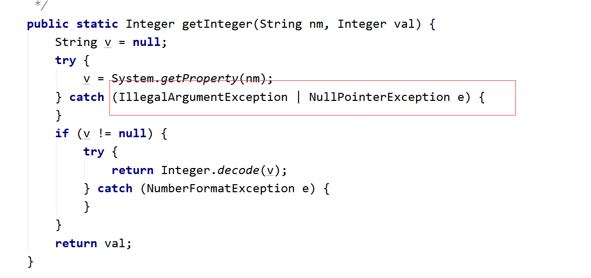

```java
package cn.com.dhc1;

import java.util.InputMismatchException;
import java.util.Scanner;

/**
 * @Auther: Evin_D
 * @Date: 2022/10/14 - 下午10:22
 * @Description: cn.com.dhc1
 * @version: 1.0
 */
public class Test4 {
    public static void main(String[] args) {
        // 实现一个功能: 键盘录入两个数, 求商:
        try {
            Scanner sc = new Scanner(System.in);
            System.out.println("请录入第一个数:");
            int num1 = sc.nextInt();
            System.out.println("请录入第二个数:");
            int num2 = sc.nextInt();
            System.out.println("商:" + num1 / num2);
        } catch (InputMismatchException e) {
            System.out.println("对不起, 你录入的数据不是int类型的数据");
        }  catch (ArithmeticException e) {
            System.out.println("对不起, 除数不可以为0");
        }   catch (Exception e) {
            System.out.println("对不起, 你的程序出现异常");
        } finally {
            System.out.println("感谢使用");
        }
    }
}
```

## 异常的分类

1. 层次结构：


> 注意：程序中语法错误，逻辑错误  都不属于上面的Error，Exception
2. 运行时异常：
```java
package cn.com.dhc1;

/**
 * @Auther: Evin_D
 * @Date: 2022/10/15 - 下午5:57
 * @Description: cn.com.dhc1
 * @version: 1.0
 */
public class Test5 {
    public static void main(String[] args) {
        // 运行时异常:
        int[] arr = {1, 2, 3};
        System.out.println(arr.length);
        // NullPointerException(空指针异常)
        /*int[] arr2 = null;
        System.out.println(arr2.length);*/

        // ArrayIndexOutOfBoundsException(数组越界异常)
        System.out.println(arr[10]);
    }
}
```
3. 检查异常：
处理方式1：try-catch嵌套try-catch
```java
package cn.com.dhc1;

/**
 * @Auther: Evin_D
 * @Date: 2022/10/15 - 下午6:00
 * @Description: cn.com.dhc1
 * @version: 1.0
 */
public class Test6 {
    public static void main(String[] args) {
        // 检查异常:
        try {
            Class.forName("cn.com.dhc1.Test").newInstance();
        } catch (ClassNotFoundException e) {
            throw new RuntimeException(e);
        } catch (InstantiationException e) {
            throw new RuntimeException(e);
        } catch (IllegalAccessException e) {
            throw new RuntimeException(e);
        }
    }
}
```
处理方式2：多重catch
```java
package cn.com.dhc1;

/**
 * @Auther: Evin_D
 * @Date: 2022/10/15 - 下午6:00
 * @Description: cn.com.dhc1
 * @version: 1.0
 */
public class Test6 {
    public static void main(String[] args) {
        // 检查异常:
        try {
            Class.forName("cn.com.dhc1.Test").newInstance();
        } catch (IllegalAccessException | ClassNotFoundException | InstantiationException e) {
            throw new RuntimeException(e);
        }
    }
}
```
处理方式3：throws
```java
package cn.com.dhc1;

/**
 * @Auther: Evin_D
 * @Date: 2022/10/15 - 下午6:00
 * @Description: cn.com.dhc1
 * @version: 1.0
 */
public class Test6 {
    public static void main(String[] args) throws ClassNotFoundException, InstantiationException, IllegalAccessException {
        // 检查异常:
        Class.forName("cn.com.dhc1.Test").newInstance();
    }
}
```

## throw和throws的区别

```java
package cn.com.dhc1;

import java.util.Scanner;

/**
 * @Auther: Evin_D
 * @Date: 2022/10/15 - 下午6:09
 * @Description: cn.com.dhc1
 * @version: 1.0
 */
public class Test7 {
    public static void main(String[] args) throws Exception {
        /*try {
            devide();
        } catch (Exception e) {
            e.printStackTrace();
        }*/
        devide();
    }
    public static void devide() throws Exception {
        Scanner sc = new Scanner(System.in);
        System.out.println("请录入第一个数:");
        int num1 = sc.nextInt();
        System.out.println("请录入第二个数:");
        int num2 = sc.nextInt();
        System.out.println("商:" + num1 / num2);
        if (num2 == 0) {
            // 制造运行时异常
            /*throw new RuntimeException();*/

            // 制造检查异常:
            /*try {
                throw new Exception();
            } catch (Exception e) {
                e.printStackTrace();
            }*/
            throw new Exception();
        }
    }
}
```
总结：
throw和throws的区别：
1. 位置不同：
throw：方法内部
throws: 方法的签名处，方法的声明处
2. 内容不同：
throw+异常对象（检查异常，运行时异常）
throws+异常的类型（可以多个类型，用，拼接）
3. 作用不同：
throw：异常出现的源头，制造异常。
throws:在方法的声明处，告诉方法的调用者，这个方法中可能会出现我声明的这些异常。然后调用者对这个异常进行处理：
要么自己处理要么再继续向外抛出异常

### 练习

```java
package cn.com.dhc2;

/**
 * @Auther: Evin_D
 * @Date: 2022/10/15 - 下午7:42
 * @Description: cn.com.dhc2
 * @version: 1.0
 */
public class Student {
    private String name;
    private int age;
    private String sex;

    public String getName() {
        return name;
    }

    public void setName(String name) {
        this.name = name;
    }

    public int getAge() {
        return age;
    }

    public void setAge(int age) {
        this.age = age;
    }

    public String getSex() {
        return sex;
    }

    public void setSex(String sex) throws Exception {
        if (sex.equals("男") || sex.equals("女")) {
            this.sex = sex;
        } else {
            // 解决办法1:
            /*this.sex = "男";*/

            // 解决办法2: 给个友好型提示, 但是打印结果为默认的null效果
            /*System.out.println("对不起, 性别错误");*/

            // 解决办法3:
            // 制造运行异常
            /*throw new RuntimeException();*/
            // 制造检查异常
            /*try {
                throw new Exception();
            } catch (Exception e) {
                e.printStackTrace();
            }*/
            throw new Exception();
        }
    }

    @Override
    public String toString() {
        return "Student{" +
                "name='" + name + '\'' +
                ", age=" + age +
                ", sex='" + sex + '\'' +
                '}';
    }

    public Student() {
    }

    public Student(String name, int age, String sex) {
        setName(name);
        setAge(age);
        try {
            setSex(sex);
        } catch (Exception e) {
            e.printStackTrace();
        }
    }
}
```
```java
package cn.com.dhc2;

/**
 * @Auther: Evin_D
 * @Date: 2022/10/15 - 下午7:43
 * @Description: cn.com.dhc2
 * @version: 1.0
 */
public class Test {
    public static void main(String[] args) {
        /*Student student = new Student();
        student.setName("张三");
        student.setAge(18);
        try {
            student.setSex("aa");
        } catch (Exception e) {
            e.printStackTrace();
        }
        System.out.println(student);*/

        Student student2 = new Student("李四", 19, "aaaa");
        System.out.println(student2);
    }
}
```

## 重载和重写的异常


1. 重载:
```java
package cn.com.dhc2;

/**
 * @Auther: Evin_D
 * @Date: 2022/10/15 - 下午7:56
 * @Description: cn.com.dhc2
 * @version: 1.0
 */
public class Demo {
    public void a() throws Exception {}
    public void a(int age) throws ArithmeticException {}
}
```
2. 重写:

子类 <= 父类 

## 自定义异常

自定义的异常可以继承：运行时异常
```java
package cn.com.dhc4;

/**
 * @Auther: Evin_D
 * @Date: 2022/10/15 - 下午8:00
 * @Description: cn.com.dhc4
 * @version: 1.0
 */
public class MyException extends RuntimeException {
    static final long serialVersionUID = -7034897190L;
    public MyException() {}
    public MyException(String msg) {
        super(msg);
    }
}

```
也可以继承检查异常：
```java
package cn.com.dhc4;

/**
 * @Auther: Evin_D
 * @Date: 2022/10/15 - 下午8:00
 * @Description: cn.com.dhc4
 * @version: 1.0
 */
public class MyException extends Exception {
    static final long serialVersionUID = -7034897190L;
    public MyException() {}
    public MyException(String msg) {
        super(msg);
    }
}
```
如果继承的是运行时异常，那么在使用的时候无需额外处理
如果继承的是检查异常，那么使用的时候需要try-catch捕获或者throws向上抛

# 第十章_常用类

## 包装类

### 引入

1. 什么是包装类：
以前定义变量，经常使用基本数据类型，
对于基本数据类型来说，它就是一个数，加点属性，加点方法，加点构造器，
将基本数据类型对应进行了一个封装，产生了一个新的类，---》包装类。
int,byte.....--->基本数据类型
包装类--->引用数据类型
2. 对应关系：
基本数据类型          对应的包装类                继承关系
byte                          Byte                           ---》Number---》Object
short                         Short                         ---》Number---》Object
int                             Integer                      ---》Number---》Object
long                          Long                          ---》Number---》Object
float                          Float                          ---》Number---》Object
double                      Double                      ---》Number---》Object
char                          Character                  Object
boolean                    Boolean                    Object
3. 已经有基本数据类型了，为什么要封装为包装类？
    1. java语言 面向对象的语言，最擅长的操作各种各样的类。
    2. 以前学习装数据的---》数组，int[]  String[]  double[]   Student[]
        以后学习的装数据的---》集合，有一个特点，只能装引用数据类型的数据
4. 是不是有了包装类以后就不用基本数据类型了？
不是。

### Integer

1. 直接使用，无需导包：


2. 类的继承关系：


3. 实现接口：


4. 这个类被final修饰，那么这个类不能有子类，不能被继承：


5. 包装类是对基本数据类型的封装： 对int类型封装产生了Integer


6. 类的历史：


7. 属性：
```java
package cn.com.dhc1;

/**
 * @Auther: Evin_D
 * @Date: 2022/10/15 - 下午9:18
 * @Description: cn.com.dhc1
 * @version: 1.0
 */
public class test01 {
    public static void main(String[] args) {
        System.out.println(Integer.MIN_VALUE);
        System.out.println(Integer.MIN_VALUE);
        System.out.println(Integer.MIN_VALUE + 1);
        System.out.println(Integer.MIN_VALUE - 1);
    }
}
```

8. 构造器（发现没有空参构造器）

    1. int类型作为构造器的参数：
    ```java
    Integer i1 = new Integer(12);
    ```

    
    2. String类型作为构造器的参数：
    ```java
    Integer i2 = new Integer("12");
    Integer i3 = new Integer("abcdef");
    ```
    

9. 包装类特有的机制：自动装箱  自动拆箱：
```java
package cn.com.dhc1;

/**
 * @Auther: Evin_D
 * @Date: 2022/10/15 - 下午9:35
 * @Description: cn.com.dhc1
 * @version: 1.0
 */
public class Test03 {
    public static void main(String[] args) {
        // 自动装箱
        // int --> Integer
        Integer integer1 = 12;
        System.out.println(integer1);

        // 自动拆箱
        Integer integer2 = new Integer(12);
        int num = integer2;
        System.out.println(num);
    }
}
```
  1. 自动装箱  自动拆箱 是从JDK1.5以后新出的特性
  2. 自动装箱  自动拆箱 ：将基本数据类型和包装类进行快速的类型转换。
  验证：
  
  可以自定打断点测试是否走入valueOf方法中：
  

  
10. 常用方法：

valueOf方法的底层：
  
  
```java
package cn.com.dhc1;

/**
 * @Auther: Evin_D
 * @Date: 2022/10/15 - 下午9:39
 * @Description: cn.com.dhc1
 * @version: 1.0
 */
public class Test04 {
    public static void main(String[] args) {
        // compareTo: 只返回三个值: 0, 1, -1
        Integer integer1 = new Integer(55);
        Integer integer2 = new Integer(12);
        System.out.println(integer1.compareTo(integer2)); // return (x < y) ? -1 : ((x == y) ? 0 : 1);

        // equals: Integer对Object中的equals方法进行了重写, 比较的是底层封装的value的值
        // Integer对象是通过new关键字创建的对象:
        Integer integer3 = new Integer(1);
        Integer integer4 = new Integer(12);
        System.out.println(integer3 == integer4); // false 因为==比较的是两个对象的地址
        System.out.println(integer3.equals(integer4));

        // Integer对象通过自动装箱来完成:
        Integer integer5 = 130;
        Integer integer6 = 130;
        System.out.println(integer5.equals(integer6)); // true
        System.out.println(integer5 == integer6);
        /**
         * 如果自动装箱值在-128~127之间, 那么比较的就是具体的数值
         * 否则比较的就是对象的地址
         */

        // intValue(): 作用将Integer --> int
        Integer integer7 = 130;
        int i = integer7.intValue();
        System.out.println(i);

        // parseInt(String s): String --> int
        System.out.println(Integer.parseInt("12"));

        // toString(): Integer --> String
        Integer integer8 = 130;
        System.out.println(integer8.toString());
    }
}
```  

## 日期相关的类

### java.util.Date

```java
package cn.com.dhc2;

import java.util.Date;

/**
 * @Auther: Evin_D
 * @Date: 2022/10/16 - 下午12:37
 * @Description: cn.com.dhc2
 * @version: 1.0
 */
public class Test {
    public static void main(String[] args) {
        // java.util.Date:
        Date date = new Date();
        System.out.println(date);
        System.out.println(date.toGMTString()); // 过期方法, 过时方法, 废弃方法
        System.out.println(date.toLocaleString());
        System.out.println(date.getYear()); // 122 + 1900
        System.out.println(date.getMonth()); // 9: 返回的值在0和11之间, 值0表示1月
        // 返回自1970年1月1日00:00:00 GMT以来此Date对象表示的毫秒数
        System.out.println(date.getTime()); // 1665895248843
        System.out.println(System.currentTimeMillis());
        /**
         * (1)疑问: 以后获取时间差用: getTime还是currentTimeMillis()
         * 答案: currentTimeMillis() --> 因为这个方法是静态的, 可以类名.方法名直接调用
         * (2)public static native long currentTimeMillis();
         * 本地方法
         * 为什么没有方法体？因为这个方法的具体实现不是通过java写的
         * (3)方法的作用:
         * 一般回去衡量一些算法所用的时间
         */
        long startTime = System.currentTimeMillis();
        for (int i = 0; i < 10000; i++) {
            System.out.println(i);
        }
        long entTime = System.currentTimeMillis();
        System.out.println(entTime - startTime);
    }
}
```

### java.sql.Date

```java
package cn.com.dhc2;

import java.sql.Date;

/**
 * @Auther: Evin_D
 * @Date: 2022/10/16 - 下午12:51
 * @Description: cn.com.dhc2
 * @version: 1.0
 */
public class Test02 {
    public static void main(String[] args) {
        // java.sql.Date:
        Date date1 = new Date(1665895806420L);
        System.out.println(date1);
        /**
         * (1)java.sql.Date和java.util.Date的区别:
         * java.util.Date: 年月日 时分秒
         * java.sql.Date: 年月日
         * (2)java.sql.Date和java.util.Date的联系:
         * java.sql.Date(子类) extends java.util.Date(父类)
         */

        // java.sql.Date和java.util.Date相互转换:
        // util --> sql:
        java.util.Date date2 = new Date(1665895806420L); // 创建util.Date的对象
        // 方式1: 向下转型
//        Date date3 = (Date) date2;
        Date date3 = (Date) date2;
        /**
         * 父类: Animal 子类: Dog
         * Animal an = new Dog();
         * Dog d = (Dog)an;
         */
        // 方式2: 利用构造器
        Date date4 = new Date(date2.getTime());

        // sql --> util
        java.util.Date date5 = date1;

        // String --> sql.Date:
        Date date6 = Date.valueOf("2022-10-16");
    }
}
```

### SimpleDateFormat

1. String--->java.util.Date 类型转换：
分解：
  1. String--->java.sql.Date
  2. java.sql.Date--->java.util.Date
```java
package cn.com.dhc2;

/**
 * @Auther: Evin_D
 * @Date: 2022/10/16 - 下午1:17
 * @Description: cn.com.dhc2
 * @version: 1.0
 */
public class Test03 {
    public static void main(String[] args) {
         // (1)String--->java.sql.Date
        java.sql.Date date = java.sql.Date.valueOf("2020-10-16");
         // (2)java.sql.Date--->java.util.Date
        java.util.Date date1 = date;
        System.out.println(date1);
    }
}
```
上面的代码有局限性，字符串的格式只能是年-月-日拼接的形式，换成其它类型，就会出现异常：


2. 引入新的类：SimpleDateFormat
```java
package cn.com.dhc2;

import java.text.DateFormat;
import java.text.ParseException;
import java.text.SimpleDateFormat;
import java.util.Date;

/**
 * @Auther: Evin_D
 * @Date: 2022/10/16 - 下午1:20
 * @Description: cn.com.dhc2
 * @version: 1.0
 */
public class Test04 {
    public static void main(String[] args) {
        // 日期转换
        // SimpleDateFormat(子类) extends DateFormat(父类是一个抽象类)
        // 格式化的标准已经定义好了
        DateFormat dateFormat = new SimpleDateFormat("yyyy-MM-dd HH:mm:ss");
        // String --> Date
        try {
            System.out.println(dateFormat.parse("2020-10-16 13:26:22"));
        } catch (ParseException e) {
            throw new RuntimeException(e);
        }
        // Date --> String
        System.out.println(dateFormat.format(new Date()));

        Date date2 = new Date();
        System.out.println(date2.toString());
        System.out.println(date2.toGMTString());
        System.out.println(date2.toLocaleString());
    }
}
```
3. 日期格式：


### Calendar

```java
package cn.com.dhc2;

import java.util.Calendar;
import java.util.GregorianCalendar;

/**
 * @Auther: Evin_D
 * @Date: 2022/10/16 - 下午1:40
 * @Description: cn.com.dhc2
 * @version: 1.0
 */
public class Test06 {
    public static void main(String[] args) {
        // Calendar是一个抽象类, 不可以直接创建对象
        // GregorianCalendar(子类) extends Calendar（父类是一个抽象类）
        Calendar calendar1 = new GregorianCalendar();
        Calendar calendar2 = Calendar.getInstance();
        System.out.println(calendar1);

        // 常用方法:
        // get方法: 传入参数: Calendar中定义的常量
        System.out.println(calendar1.get(Calendar.YEAR));
        System.out.println(calendar1.get(Calendar.MONTH));
        System.out.println(calendar1.get(Calendar.DATE));
        System.out.println(calendar1.get(Calendar.DAY_OF_WEEK));
        System.out.println(calendar1.getMaximum(Calendar.DATE)); // 获取当月日期的最大天数
        System.out.println(calendar1.getMinimum(Calendar.DATE)); // 获取当月日期的最小天数

        // set方法: 可以改变Calendar中的内容
        calendar1.set(Calendar.YEAR, 1996);
        calendar1.set(Calendar.MONTH, 2);
        calendar1.set(Calendar.DATE, 17);
        System.out.println(calendar1);

        // String --> Calendar:
        // 分解:
        // String --> Date:
        java.sql.Date date = java.sql.Date.valueOf("2020-10-16");
        // java.sql.Date --> Calendar:
        calendar1.setTime(date);
        System.out.println(calendar1);
    }
}
```

#### 练习

需求：


```java
package cn.com.dhc2;

import java.util.Calendar;
import java.util.Scanner;

/**
 * @Auther: Evin_D
 * @Date: 2022/10/16 - 下午3:00
 * @Description: cn.com.dhc2
 * @version: 1.0
 */
public class Test08 {
    public static void main(String[] args) {
        // 录入日期的String:
        Scanner scanner = new Scanner(System.in);
        System.out.print("请输入你想要查看的日期(提示: 请按照例如2012-5-6的格式书写): ");
        String strDate = scanner.next();
        // String --> Calender:
        // String --> Date:
        java.sql.Date date = java.sql.Date.valueOf(strDate);
        // Date --> Calender:
        Calendar calendar = Calendar.getInstance();
        calendar.setTime(date);
        System.out.println(calendar);

        // 后续操作:
        // 星期提示：
        System.out.println("日\t一\t二\t三\t四\t五\t六");

        // 获取本月的最大天数
        int maxDay = calendar.getActualMaximum(Calendar.DATE);
        // 获取当前日期中的日:
        int nowDay = calendar.get(Calendar.DATE);

        // 将日期调为本月的1号:
        calendar.set(Calendar.DATE, 1);
        // 获取这个一号是本月的第几天
        int num = calendar.get(Calendar.DAY_OF_WEEK);
        // 前面空出来的天数为:
        int day = num - 1;
        // 引入一个计数器:
        int count = 0;
        // 在日期前将空格打印出来:
        for (int i = 1; i <= day; i++) {
            System.out.print("\t");
        }
        // 空出来的日子也要放入计数器:
        count += day;
        // 遍历: 从1号开始到maxDay号进行遍历:
        for (int i = 1; i <= maxDay; i++) {
            if (i == nowDay) {
                System.out.print(i + "*" + "\t");
            } else {
                System.out.print(i + "\t");
            }
            count++;
            if (count % 7 == 0)
                System.out.println();
        }
    }
}
 ```

### JDK1.8新增日期时间API

#### 引入

JDK1.0中使用java.util.Date类  --》第一批日期时间API
JDK1.1引入Calendar类   --》第二批日期时间API
缺陷：
可变性 : 像日期和时间这样的类应该是不可变的。
偏移性 : Date中 的年份是从1900开始的，而月份都从0开始。
格式化 : 格式化只对Date有用，Calendar则不行。
JDK1.8新增日期时间API --》第三批日期时间API

#### LocalDate/LocalTime/LocalDateTime

```java
package cn.com.dhc2;

import java.time.LocalDate;
import java.time.LocalDateTime;
import java.time.LocalTime;

/**
 * @Auther: Evin_D
 * @Date: 2022/10/16 - 下午3:43
 * @Description: cn.com.dhc2
 * @version: 1.0
 */
public class Test08 {
    public static void main(String[] args) {
        // 1. 完成实例化
        // 方法1： now() -- 获取当前的日期, 时间, 日期 + 时间
        LocalDate localDate1 = LocalDate.now();
        System.out.println(localDate1);
        LocalTime localTime1 = LocalTime.now();
        System.out.println(localTime1);
        LocalDateTime localDateTime1 = LocalDateTime.now();
        System.out.println(localDateTime1);

        // 方法2: of() --制定日期, 时间, 日期 + 时间
        LocalDate localDate2 = LocalDate.of(2021, 10, 16);
        System.out.println(localDate2);
        LocalTime localTime2 = LocalTime.of(12, 35, 56);
        System.out.println(localTime2);
        LocalDateTime localDateTime2 = LocalDateTime.of(2022, 10, 16, 16, 17, 19);
        System.out.println(localDateTime2);

        // LocalDate, LocalTime用的不如LocalDateTime多
        // 下面讲解用LocalDateTime:
        // 一系列常用的get***
        System.out.println(localDateTime2.getYear());
        System.out.println(localDateTime2.getMonth());
        System.out.println(localDateTime2.getMonthValue());
        System.out.println(localDateTime2.getDayOfMonth());
        System.out.println(localDateTime2.getDayOfWeek());
        System.out.println(localDateTime2.getHour());
        System.out.println(localDateTime2.getMinute());
        System.out.println(localDateTime2.getSecond());

        // 不是set方法, 叫with
        // 体会: 不可变性
        LocalDateTime localDateTime3 = localDateTime2.withMonth(8);
        System.out.println(localDateTime1);
        System.out.println(localDateTime3);

        // 提供了加减的操作:
        // 加:
        LocalDateTime localDateTime5 = localDateTime1.plusMonths(4);
        System.out.println(localDateTime1);
        System.out.println(localDateTime5);
        // 减:
        LocalDateTime localDateTime6 = localDateTime1.minusMonths(5);
        System.out.println(localDateTime1);
        System.out.println(localDateTime6);
    }
}
```

#### DateTimeFormatter

```java
package cn.com.dhc2;

import java.time.LocalDateTime;
import java.time.ZoneId;
import java.time.format.DateTimeFormatter;
import java.time.format.FormatStyle;
import java.time.temporal.TemporalAccessor;

/**
 * @Auther: Evin_D
 * @Date: 2022/10/16 - 下午5:11
 * @Description: cn.com.dhc2
 * @version: 1.0
 */
public class Test09 {
    public static void main(String[] args) {
        // 格式化类: DateTimeFormatter

        // 方式一: 预定义的标准格式: 如: ISO_LOCAL_DATE_TIME; ISO_LOCAL_DATE; ISO_LOCAL_TIME;
        DateTimeFormatter dateTimeFormatter1 = DateTimeFormatter.ISO_LOCAL_DATE_TIME;
        // isoLocalDateTime1就可以帮我们完成LocalDateTIme和String之间的相互转换:
        // LocalDateTime --> String:
        LocalDateTime localDateTime1 = LocalDateTime.now();
        String str1 = dateTimeFormatter1.format(localDateTime1);
        System.out.println(str1);

        // String --> LocalDateTime
        TemporalAccessor temporalAccessor1 = dateTimeFormatter1.parse("2022-10-16T17:23:24.556");
        System.out.println(temporalAccessor1);

        // 方式二: 本地化相关的格式: 如: ofLocalizedDateTime()
        // 参数: FormatStyle.LONG / FormatStyle.MEDIUM / FormatStyle.SHORT
        // FormatStyle.LONG: October 16, 2022 5:35:47 PM CT
        // FormatStyle.MEDIUM: Oct 16, 2022 5:34:28 PM
        // FormatStyle.SHORT: 10/16/22 5:33 PM
        DateTimeFormatter dateTimeFormatter2 = DateTimeFormatter.ofLocalizedDateTime(FormatStyle.LONG).withZone(ZoneId.systemDefault());
        // LocalDateTime --> String:
        LocalDateTime localDateTime2 = LocalDateTime.now();
        String str2 = dateTimeFormatter2.format(localDateTime2);
        System.out.println(str2);

        // String --> LocalDateTime
        TemporalAccessor temporalAccessor2 = dateTimeFormatter2.parse("October 16, 2022 5:35:47 PM CT");
        System.out.println(temporalAccessor2);

        // 方式三: 自定义的格式: 如: ofPattern("yyyy-MM-dd hh:mm:ss") --> 重点, 以后常用
        DateTimeFormatter dateTimeFormatter3 = DateTimeFormatter.ofPattern("yyyy-MM-dd hh:mm:ss");
        LocalDateTime localDateTime3 = LocalDateTime.now();
        String str3 = dateTimeFormatter3.format(localDateTime3);
        System.out.println(str3);
        // String --> LocalDateTime
        TemporalAccessor temporalAccessor3 = dateTimeFormatter3.parse("2022-10-16 05:40:09");
        System.out.println(temporalAccessor3);
    }
}
```

## Math类

1. 直接使用，无需导包：


2. final修饰类，这个类不能被继承：


3. 构造器私有化，不能创建Math类的对象：

不能：


4. Math内部的所有的属性，方法都被static修饰：类名.直接调用，无需创建对象：


5. 常用方法：
```java
package cn.com.dhc3;

/**
 * @Auther: Evin_D
 * @Date: 2022/10/16 - 下午7:07
 * @Description: cn.com.dhc3
 * @version: 1.0
 */
public class Test01 {
    public static void main(String[] args) {
        // 常用属性:
        System.out.println(Math.PI);
        // 常用方法:
        System.out.println("随机数: " + Math.random()); // [0.0, 1.0)
        System.out.println("绝对值: " + Math.abs(-80)); // 80
        System.out.println("向上取值: " + Math.ceil(9.1)); // 10
        System.out.println("向下取值: " + Math.floor(9.9)); // 9
        System.out.println("四舍五入: " + Math.round(3.3)); // 3
        System.out.println("四舍五入: " + Math.round(3.5)); // 4
        System.out.println("取最大值: " + Math.max(3, 6)); // 6
        System.out.println("取最小值: " + Math.min(3, 6)); // 3
    }
}
```

6. 静态导入：
```java
package cn.com.dhc3;
import static java.lang.Math.*;
/**
 * @Auther: Evin_D
 * @Date: 2022/10/16 - 下午7:07
 * @Description: cn.com.dhc3
 * @version: 1.0
 */
public class Test01 {
    public static void main(String[] args) {
        // 常用属性:
        System.out.println(PI);
        // 常用方法:
        System.out.println("随机数: " + random()); // [0.0, 1.0)
        System.out.println("绝对值: " + abs(-80)); // 80
        System.out.println("向上取值: " + ceil(9.1)); // 10
        System.out.println("向下取值: " + floor(9.9)); // 9
        System.out.println("四舍五入: " + round(3.3)); // 3
        System.out.println("四舍五入: " + round(3.5)); // 4
        System.out.println("取最大值: " + max(3, 6)); // 6
        System.out.println("取最小值: " + min(3, 6)); // 3
    }
    // 如果Math中方法重复了, 那么会优先调用本类中的方法(就近原则)
    public static int random() {
        return 100;
    }
}
```

## Random类

```java
package cn.com.dhc3;

import java.util.Random;

/**
 * @Auther: Evin_D
 * @Date: 2022/10/17 - 下午6:29
 * @Description: cn.com.dhc3
 * @version: 1.0
 */
public class Test02 {
    public static void main(String[] args) {
        // 返回带正号的 double 值, 该值大于等于 0.0 且小于 1.0
        System.out.println("随机数: " + Math.random());

        // 学习Random类
        // 1. 利用带参数的构造器创建对象:
        Random random1 = new Random(System.currentTimeMillis());
        System.out.println(random1.nextInt());

        // 2. 利用空参构造器创建对象:
        Random random2 = new Random(); // 表面实在调用无参构造器, 实际底层还是调用了带参构造器
        System.out.println(random2.nextInt(10)); // 在 0 (包括) 和指定值 (不包括) 之间均匀分布的 int 值
        System.out.println(random2.nextDouble());
    }
}
```


## String类

1. 直接使用，无需导包：


2. 形象说一下字符串：


3. 


String str = “abc”;
"abc"就是String类下的一个具体的对象
4. 字符串是不可变的：？？？？


5. 这个String类不可以被继承，不能有子类：


6. String底层是一个char类型的数组

验证：


### 常用方法

1. 构造器：底层就是给对象底层的value数组进行赋值操作。
```java
  String str1 = new String();
  String str2 = new String("abc");
  String str3 = new String(new char[]{'a', 'b', 'c'});
```
2. 常用方法：
```java
  String str4 = "abc";
  System.out.println("字符串的长度: " + str4.length());
  String str5 = new String("abc");
  System.out.println("字符串是否为空: " + str5.isEmpty());
  System.out.println("获取字符串的下表对应的字符为:" + str5.charAt(1));
```
3. equals:
```java
  String s6 = new String("abc");
  String s7 = new String("abc");
  System.out.println(s6.equals(s7));
```


4. String类实现了Comparable，里面有一个抽象方法叫compareTo，所以String中一定要对这个方法进行重写：
```java
  String s8 = new String("abc");
  String s9 = new String("abc");
  System.out.println(s8.compareTo(s9));
```


5. 常用方法：
```java
  // 字符串的截取
  String str10 = "abcdefhijk";
  System.out.println(str10.substring(3));
  System.out.println(str10.substring(3, 6));

  // 字符串的合并/拼接操作
  System.out.println(str10.concat("pppp"));

  // 字符串中的字符的 替换
  String str11 = "abcdeahija";
  System.out.println(str11.replace('a', 'u'));

  // 按照指定的字符串进行分裂为数组的形式:
  String str12 = "a-b-c-d-e-f";
  String[] strs = str12.split("-");
  System.out.println(Arrays.toString(strs));

  // 转大小写的方法:
  String str13 = "abc";
  System.out.println(str13.toUpperCase());
  System.out.println(str13.toUpperCase().toLowerCase());

  // 去除首尾空格
  String str14 = " a  b  c  ";
  System.out.println(str14.trim());

  // toString()
  String str15 = "abc";
  System.out.println(str15.toString());

  // 转换为String类型
  System.out.println(String.valueOf(false));
```

### String的内存分析

1. 字符串拼接：
```java
public class Test02 {
    public static void main(String[] args) {
        String str1 = "a" + "b" + "c";
        String str2 = "ab" + "c";
        String str3 = "a" + "bc";
        String str4 = "abc";
        String str5 = "abc" + "";
    }
}
```
上面的字符串，会进行编译器优化，直接合并成为完整的字符串，我们可以反编译验证：

然后在常量池中，常量池的特点是第一次如果没有这个字符串，就放进去，如果有这个字符串，就直接从常量池中取：
内存：


2. new关键字创建对象：
```java
String s6 = new String("abc");
```
内存：开辟两个空间（1.栈中的开辟的空间 2.字符串常量池中的字符串 3.堆中的开辟的空间）


3. 有变量参与的字符串拼接：
```java
public class Test03 {
    public static void main(String[] args) {
        String a = "abc";
        String b = a + "def";
    }
}
```
a变量在编译的时候不知道a是“abc”字符串，所以不会进行编译期优化，不会直接合并为“abcdef”
反汇编过程：为了更好的帮我分析字节码文件是如何进行解析的：
利用IDEA中的控制台：


## StringBuilder类

1. 字符串的分类：
    1. 不可变字符串：String
    2. 可变字符串：StringBuilder，StringBuffer
疑问：
    1. 可变不可变？？
    2. 本节课重点：StringBuilder   -----》√
    3. StringBuilder和StringBuffer区别  ？？
2. StringBuilder底层：非常重要的两个属性：


3. 对应内存分析：
```java
package cn.com.dhc5;

/**
 * @Auther: Evin_D
 * @Date: 2022/10/17 - 下午9:16
 * @Description: cn.com.dhc5
 * @version: 1.0
 */
public class Test01 {
    public static void main(String[] args) {
        // 创建StringBuilder对象
        // 表面上调用StringBuilder的空构造器, 实际底层是对value数组进行初始化, 长度为16
        StringBuffer stringBuffer2 = new StringBuffer();
        // 表面上调用StringBuilder的有参构造器, 实际底层是对value数组进行初始化, 长度为你传入的数字
        StringBuffer stringBuffer3 = new StringBuffer(3);
        StringBuffer stringBuffer1 = new StringBuffer("abc");
        System.out.println(stringBuffer1.append("def").append("aaaaaa").append("bbb").append("oooooo")); // 链式调用方式: return this
    }
}
```


### 解释可变和不可变字符串

1. String---》不可变


2. StringBuilder---》可变
可变，在StringBuilder这个对象的地址不变的情况下，想把“abc”变成“abcdef”是可能的，直接追加即可
```java
package cn.com.dhc5;

/**
 * @Auther: Evin_D
 * @Date: 2022/10/19 - 下午8:55
 * @Description: cn.com.dhc5
 * @version: 1.0
 */
public class Test02 {
    public static void main(String[] args) {
        StringBuffer stringBuffer = new StringBuffer();
        System.out.println(stringBuffer.append("abc") == stringBuffer.append("def"));
    }
}
```

### 常用方法

1. StringBuilder常用方法：
```java
package cn.com.dhc5;

/**
 * @Auther: Evin_D
 * @Date: 2022/10/19 - 下午9:00
 * @Description: cn.com.dhc5
 * @version: 1.0
 */
public class Test03 {
    public static void main(String[] args) {
        StringBuilder stringBuilder1 = new StringBuilder("nihaojavawodeshijie");
        // 增
        stringBuilder1.append("这是梦想"); // nihaojavawodeshijie这是梦想
        System.out.println(stringBuilder1);
        // 删
        stringBuilder1.delete(3, 6); // 删除位置在[3, 6)上的字符
        System.out.println(stringBuilder1); // nihavawodeshijie这是梦想

        stringBuilder1.deleteCharAt(16); // 删除位置在16上的字符
        System.out.println(stringBuilder1); // nihavawodeshijie是梦想

        // 改 --> 插入
        StringBuilder stringBuilder2 = new StringBuilder("$23445980947");
        stringBuilder2.insert(3, ","); // 在下表3的位置上插入
        System.out.println(stringBuilder2); // $23,445980947
        StringBuilder stringBuilder3 = new StringBuilder("$2你好吗5980947");
        // 改 --> 替换
        stringBuilder3.replace(3, 5, "我好累"); // 在下标[3,5)位置上插入字符串
        System.out.println(stringBuilder3); // $2你我好累5980947
        stringBuilder1.setCharAt(3, '!');
        System.out.println(stringBuilder1); // nih!vawodeshijie是梦想

        // 查
        StringBuilder stringBuilder4 = new StringBuilder("asdfa");
        for (int i = 0; i < stringBuilder4.length(); i++) {
            System.out.print(stringBuilder4.charAt(i) + "\t");
        }
        System.out.println();

        // 截取
        String str = stringBuilder4.substring(2, 4); // 截取[2,4)返回的是一个新的String, 对StringBuilder没有影响
        System.out.println(str);
        System.out.println(stringBuilder4);
    }
}
```

2. StringBuffer常用方法：
```java
package cn.com.dhc5;

/**
 * @Auther: Evin_D
 * @Date: 2022/10/19 - 下午9:00
 * @Description: cn.com.dhc5
 * @version: 1.0
 */
public class Test03 {
    public static void main(String[] args) {
        StringBuffer stringBuffer1 = new StringBuffer("nihaojavawodeshijie");
        // 增
        stringBuffer1.append("这是梦想"); // nihaojavawodeshijie这是梦想
        System.out.println(stringBuffer1);
        // 删
        stringBuffer1.delete(3, 6); // 删除位置在[3, 6)上的字符
        System.out.println(stringBuffer1); // nihavawodeshijie这是梦想

        stringBuffer1.deleteCharAt(16); // 删除位置在16上的字符
        System.out.println(stringBuffer1); // nihavawodeshijie是梦想

        // 改 --> 插入
        StringBuffer stringBuffer2 = new StringBuffer("$23445980947");
        stringBuffer2.insert(3, ","); // 在下表3的位置上插入
        System.out.println(stringBuffer2); // $23,445980947
        StringBuffer stringBuffer3 = new StringBuffer("$2你好吗5980947");
        // 改 --> 替换
        stringBuffer3.replace(3, 5, "我好累"); // 在下标[3,5)位置上插入字符串
        System.out.println(stringBuffer3); // $2你我好累5980947
        stringBuffer1.setCharAt(3, '!');
        System.out.println(stringBuffer1); // nih!vawodeshijie是梦想

        // 查
        StringBuffer stringBuffer4 = new StringBuffer("asdfa");
        for (int i = 0; i < stringBuffer4.length(); i++) {
            System.out.print(stringBuffer4.charAt(i) + "\t");
        }
        System.out.println();

        // 截取
        String str = stringBuffer4.substring(2, 4); // 截取[2,4)返回的是一个新的String, 对StringBuffer没有影响
        System.out.println(str);
        System.out.println(stringBuffer4);
    }
}
```

### 面试题：String，StringBuilder，StringBuffer区别和联系

String、StringBuffer、StringBuilder区别与联系

1. String类是不可变类，即一旦一个String对象被创建后，包含在这个对象中的字符序列是不可改变的，直至这个对象销毁。
2. StringBuffer类则代表一个字符序列可变的字符串，可以通过append、insert、reverse、setChartAt、setLength等方法改变其内容。一旦生成了最终的字符串，调用toString方法将其转变为String
3. JDK1.5新增了一个StringBuilder类，与StringBuffer相似，构造方法和方法基本相同。不同是StringBuffer是线程安全的，而StringBuilder是线程不安全的，所以性能略高。通常情况下，创建一个内容可变的字符串，应该优先考虑使用StringBuilder

    StringBuilder:JDK1.5开始  效率高   线程不安全
    StringBuffer:JDK1.0开始   效率低    线程安全

# 第11章_集合

## 什么是算法和数据结构

1. 算法：
    1. 可以解决具体问题 :例如   1+2+3+4+。。。+99+100
    解题流程=算法
    2. 有设计解决的具体的流程
    算法1： 1+2=3  3+3=6 6+4=10.....加到100  --》5050
    算法2：(1+100)*50=101*50=5050-->高斯算法
    3. 有评价这个算法的具体的指标 --》时间复杂度  空间复杂度（从数学角度考虑）
2. 数据结构：就是在计算机的缓存，内存，硬盘  如何组织管理数据的。重点在结构上，是按照什么结构来组织管理我们的数据。


- 数据结构分为：
    1. 逻辑结构 ：--》思想上的结构--》卧室，厨房，卫生间 ---》线性表（数组，链表），图，树，栈，队列
    2. 物理结构 ：--》真实结构--》钢筋混凝土+牛顿力学------》紧密结构（顺序结构），跳转结构（链式结构）

3. 紧密结构（顺序结构），跳转结构（链式结构） 
以线性表为例：
线性表的逻辑结构如图所示：


- 线性表特点：
  线性表是n个类型相同数据元素的有限序列，通常记作a0,a1,,,ai-1,ai,ai+1,,,,,an-1)。
  1. 相同数据类型
    在线性表的定义中,我们看到从a0到an-1的n个数据元素是具有相同属件的亓素。
    比如说可以都是数字,例如(12,23,45,56,45);
    也可以是宇符,例如(A,B,....Z)
    当然也可以是具有更复杂结构的数据元素,例如学生、商品、装备等。
    相同数据类型意味着在内存中存储时,每个元素会占用相同的内存空间,便于后续的查询定位。
  2. 序列(顺序性)
    在线性表的相邻数据元素之间存在若序偶关系，
    即ai-1是ai的直接前驱,则ai是ai-1的直接后续,
    同时ai又是ai+1的直接前驱，ai+1是ai的直接后续。
    唯一没有直接前驱的元素a0 一端称为表头,唯一没有后续的元素an-1一端称为表尾。
    除了表头和表尾元素外,任何一个元素都有且仅有一个直接前驱和直接后继。
  3. 有限
    线件表中数据元素的个数n定义为线性表的长度, n是个有限值。
    当n=0时线性表为空表，
    在非空的线性表中每个数据元索在线性表中都有唯一确定的序号，
    例如a0的序号是0 ,ai的序号是i。
    在一个具有n>0个数据元素的线性表中,数据元素序号的范围是[O, n-1]。
  逻辑结构和物理结构的关系：
  线性表逻辑结构，对应的真实结构如果是紧密结构---》典型就是  数组：
  
  线性表逻辑结构，对应的真实结构如果是跳转结构---》典型就是  链表：
  优点：删除元素，插入元素效率高
  缺点：查询元素效率低
  
  
  

## 集合的引入

 1. 数组，集合都是对多个数据进行存储操作的，简称为容器。
>PS:这里的存储指的是内存层面的存储，而不是持久化存储（.txt,.avi,.jpg,数据库）。
2. 数组：特点：
    1. 数组一旦指定了长度，那么长度就被确定了，不可以更改。
    ```java
    int[] arr = new int[6];
    ```
    2. 数组一旦声明了类型以后，数组中只能存放这个类型的数据。数组中只能存放同一种类型的数据。
    ```java
    int[] arr,String[] s,double[] d.....
    ```
3. 数组：缺点：
    1. 数组一旦指定了长度，那么长度就被确定了，不可以更改。
    2. 删除，增加元素  效率低。
    3. 数组中实际元素的数量是没有办法获取的，没有提供对应的方法或者属性来获取
    4. 数组存储：有序，可重复 ，对于无序的，不可重复的数组不能满足要求。
4. 正因为上面的缺点，引入了一个新的存储数据的结构---》集合
5. 集合一章我们会学习很多集合，为什么要学习这么多集合呢？
因为不同集合底层数据结构不一样。集合不一样，特点也不一样

## 简要集合结构图


## 集合应用场合

前端后端数据库交互：

当需要将相同结构的个体整合到一起的时候，需要集合。
实际应用场合：


## Colletion接口

### Colletion接口常用方法

```java
package cn.com.dhc1;

import java.util.ArrayList;
import java.util.Arrays;
import java.util.Collection;
import java.util.List;

/**
 * @Auther: Evin_D
 * @Date: 2022/10/21 - 下午9:27
 * @Description: cn.com.dhc1
 * @version: 1.0
 */
public class Test01 {
    public static void main(String[] args) {
        /**
         * Collection接口的常用方法:
         * 增加: add(E e), addAll(Collection<? extends E> c)
         * 删除: clear(), remove()
         * 修改:
         * 查看: iterator(), size()
         * 判断: contains(Object o), equals(Object o), isEmpty()
         */
        // 创建对象: 接口不能创建对象, 利用实现类创建对象:
        Collection col1 = new ArrayList();
        // 调用方法:
        // 集合有一个特点: 只能存放引用数据类型的数据, 不能是基本数据类型
        // 基本数据类型自动装箱, 对应包装类 int --> Integer
        col1.add(18);
        col1.add(12);
        col1.add(11);
        col1.add(17);
        System.out.println(col1);

        List list = Arrays.asList(new Integer[]{11, 15, 3, 7, 1});
        col1.addAll(list); // 将另一个集合添加入col中
        System.out.println(col1);

        // 清空集合
//        col.clear();
        System.out.println(col1);
        System.out.println("集合中元素的数量为: " + col1.size());
        System.out.println("集合是否为空： " + col1.isEmpty());

        boolean isRemove = col1.remove(15);
        System.out.println(col1);
        System.out.println("集合中元素是否被删除: " + isRemove);

        Collection col2 = new ArrayList();
        col2.add(18);
        col2.add(12);
        col2.add(11);
        col2.add(17);

        Collection col3 = new ArrayList();
        col3.add(18);
        col3.add(12);
        col3.add(11);
        col3.add(17);

        System.out.println(col2.equals(col3));
        System.out.println(col2 == col3); // 地址一定不相等 false

        System.out.println("是否包含元素: " + col3.contains(17));
        System.out.println("是否包含元素: " + col3.contains(117));
    }
}
```

### Collection集合的遍历

迭代器简要原理图：
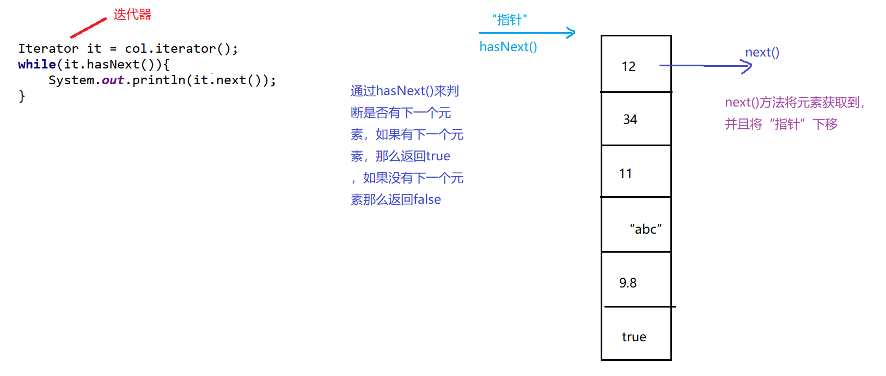

```java
package cn.com.dhc1;

import java.util.ArrayList;
import java.util.Collection;
import java.util.Iterator;

/**
 * @Auther: Evin_D
 * @Date: 2022/10/21 - 下午9:41
 * @Description: cn.com.dhc1
 * @version: 1.0
 */
public class Test02 {
    public static void main(String[] args) {
        Collection col1 = new ArrayList();
        col1.add(18);
        col1.add(12);
        col1.add(11);
        col1.add(17);

        // 对集合遍历 (对集合中元素进行查看)
        // 方式1: 普通for循环
        /*for (int i = 0; i < col1.size(); i++) {
            col1.
        }*/

        // 方式2: 增强for循环
        for (Object o: col1) {
            System.out.println(o);
        }
        System.out.println("==================");
        // 方式3:
        Iterator it = col1.iterator();
        while (it.hasNext()) {
            System.out.println(it.next());
        }
    }
}
```

### List接口

#### List接口的常用方法和遍历方式

```java
package cn.com.dhc1;

import java.util.ArrayList;
import java.util.Iterator;
import java.util.List;

/**
 * @Auther: Evin_D
 * @Date: 2022/10/21 - 下午9:55
 * @Description: cn.com.dhc1
 * @version: 1.0
 */
public class Test03 {
    public static void main(String[] args) {
        /**
         * List接口中常用方法:
         * 增加: add(int index, E element)
         * 删除: remove(int index), remove(Object o)
         * 修改: set(int index, E element)
         * 查看: get(int index)
         * 判断:
         */
        List list = new ArrayList<>();
        list.add(13);
        list.add(17);
        list.add(6);
        list.add(-1);
        list.add(2);
        list.add("abc");
        System.out.println(list);
        list.add(3, 66);
        System.out.println(list);
        list.set(3, 77);
        System.out.println(list);
        list.remove(2);
        System.out.println(list); // 在集合中存入的是Integer类型数据的时候, 调用remove方法调用的是: remove(int index)
        list.remove("abc");
        System.out.println(list);
        Object o = list.get(0);
        System.out.println(o);

        // List集合遍历:
        // 方式1: 普通for循环
        for (int i = 0; i < list.size(); i++) {
            System.out.println(list.get(i));
        }
        System.out.println("======================");
        // 方式2: 增强for循环
        for (Object obj : list) {
            System.out.println(obj);
        }
        System.out.println("======================");
        // 方式3: 迭代器
        Iterator it = list.iterator();
        while (it.hasNext()) {
            System.out.println(it.next());
        }
    }
}
```

#### ArrayList实现类（JDK1.7）

1. 在idea中切换JDK的方法：


2. ArrayList实现List接口的失误：
集合创始人 承认了这个失误，但是在后续的版本中没有删除，觉得没必要：


3. 底层重要属性：

在JDK1.7中：在调用构造器的时候给底层数组elementData初始化，数组初始化长度为10：

对应内存：
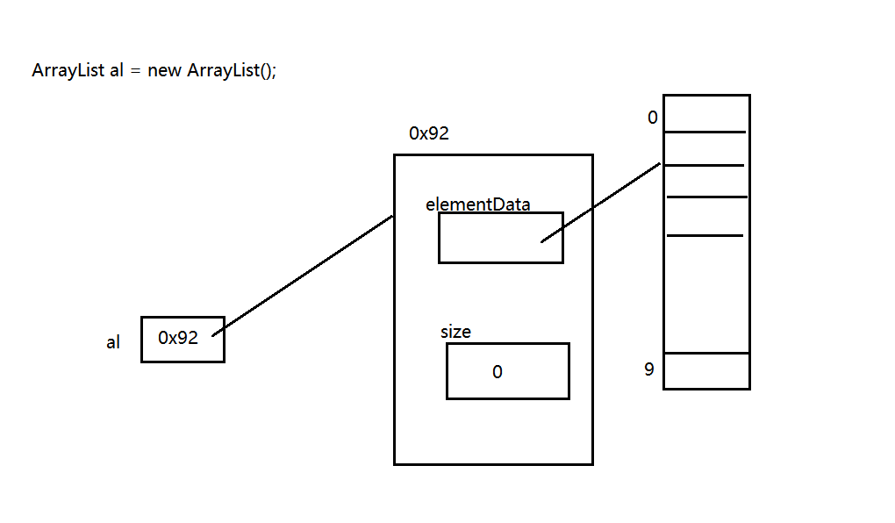

调用add方法：
```java
  ArrayList al = new ArrayList();
  System.out.println(al.add("abc"));
  System.out.println(al.add("def"));
```

当数组中的10个位置都满了的时候就开始进行数组的扩容，扩容长度为 原数组的1.5倍：


